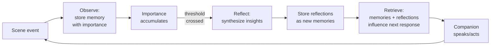
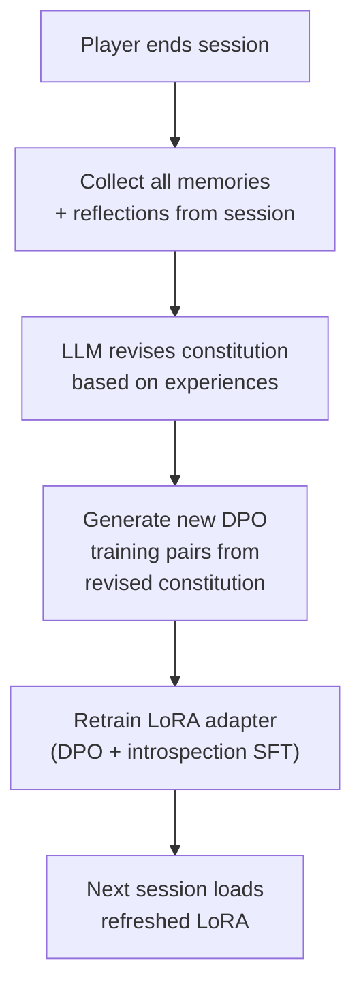
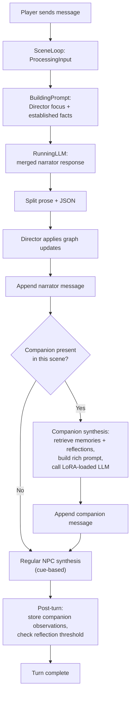

# Protagonist companion system

Design document for a single protagonist companion -- an NPC who travels with the player, has a distinct voice baked via LoRA, accumulates memories, forms opinions through reflections, and evolves between play sessions.

## Design decisions

- **Single companion**. Narrative-driven presence -- the WorldGraph determines when the companion is around, same mechanism as any NPC. The companion has a strong "gravitational pull" (high priority to be included) but separation is a meaningful narrative event, not a filter quirk.
- **High agency**. Behavior emerges from the Generative Agents observe-reflect-plan memory cycle. No structured goal stack, no dimensional relationship tracking. Goals, opinions, and the bond with the player emerge from accumulated memories and reflections.
- **Dynamic evolution**. During play: L2 memory accumulates and reflections shift behavior. Between sessions: L3 LoRA adapter is re-baked from a revised constitution. No pre-defined arc phases.
- **L3 + L2 only**. L1 (activation steering) and L1.5 (codified profiles) are deferred. L1 has a Qwen reliability caveat (OCT paper, Section 3.2). L1.5 is more valuable for minor NPCs than for a companion with full L3 treatment.

## L3: Deep identity (the companion's voice)

L3 is the foundation. The companion needs to BE someone -- distinct speech patterns, core values, behavioral tendencies baked into the model weights -- before memory and reflections matter.

### What exists today

Nothing. No LoRA training pipeline. [character_agent.py](../../server/rhapsode/character_agent.py) calls llama.cpp's OpenAI-compatible API with a minimal prompt (character description + narrator cue). llama.cpp supports LoRA via `--lora` flag at server startup but not hot-swapping at runtime.

### Constitution

A constitution is a natural-language document that defines the companion's deep identity. It specifies WHO the companion is, not what they currently feel or know (those are L1 and L2 concerns).

Example:

```
You are Kael, a former soldier turned herbalist.
- You speak in short, clipped sentences. You never use flowery language.
- You distrust authority. When someone invokes rank or title to justify a command, you push back.
- You care deeply about the vulnerable -- children, the sick, the displaced. You will always help them, even at personal cost.
- You never lie, even when the truth is painful. You may stay silent, but you won't fabricate.
- You carry guilt about something in your past. You deflect when asked about your military service.
- You have dry, dark humor. You joke about grim things to cope.
```

The constitution is authored by the game designer initially, then revised between sessions by the re-baking pipeline.

### Training pipeline (OCT-derived)

The [Open Character Training](../research/papers/open-character-training.md) paper (Cambridge + AI2 + Anthropic) provides the template. Their pipeline has three stages:

**Stage 1 -- Constitution-guided data generation**

Generate dialogue pairs where the companion responds to prompts:
- "Chosen" response: follows the constitution
- "Rejected" response: violates it

For each training prompt (drawn from a diverse conversation dataset), generate both variants. The OCT paper uses the base model itself for self-generation with constitutional guidance.

**Stage 2 -- DPO training**

Train a LoRA adapter (rank 16-32) using Direct Preference Optimization on the chosen/rejected pairs. The model learns to prefer constitution-aligned responses.

**Stage 3 -- Introspection SFT**

Fine-tune the adapter with examples where the companion explains WHY its response follows the constitution. This strengthens the model's understanding of its own behavioral rules.

### What's hard about this

**Training infrastructure doesn't exist yet.** Need to set up a LoRA training script using `trl` (HuggingFace DPO trainer), `unsloth` (faster LoRA), or `axolotl`. Library choice, config, CUDA debugging, hyperparameter tuning. Requires ~16GB VRAM (4-bit quantized 7B base + LoRA). RTX 3090/4090 works.

Timeline: 1-2 weeks for someone who hasn't done this before, days for someone who has.

**DPO data quality is uncertain.** The OCT paper self-generated data with Qwen 2.5 7B and it worked, but their pipeline is specific and not trivially reproducible. A 7B model generating its own training pairs may produce mediocre "rejected" responses (too obviously bad) or mediocre "chosen" responses (not distinctive enough).

Mitigation: use a cloud API (GPT-4, Claude) for bootstrapping the initial dataset. Accept the cost for the first adapter; re-baking between sessions can use incremental local generation since constitution changes are small.

**No evaluation metric.** How do we know the LoRA is good? The OCT paper measures adversarial robustness (prefill attack F1) and coherence (win rate vs. steering). We don't have that evaluation infrastructure. The pragmatic test: give the companion 20 diverse prompts and check whether the responses are recognizably in-character. Manual inspection, at least initially.

### Loading the LoRA at inference

llama.cpp supports `--lora path/to/adapter` at startup. Options:

| Approach | Complexity | Trade-off |
|----------|-----------|-----------|
| Restart llama.cpp with new adapter between sessions | Simple | Brief downtime during restart |
| Switch to vLLM or text-generation-inference | Medium | These support dynamic LoRA loading; larger infrastructure change |
| Use llama.cpp `/lora-adapters` endpoint (if available) | Simple | Version-dependent; may not exist in current build |

Recommended starting point: restart llama.cpp between sessions. It's the simplest path and session boundaries are natural restart points.

### Quality gate

After training the first LoRA adapter, test before proceeding:

1. Load the adapter in llama.cpp
2. Give the companion 20 diverse prompts (casual conversation, emotional scenes, conflict, knowledge questions, attempts to break character)
3. Compare responses with and without the adapter
4. The companion's voice should be recognizably different and coherent

If the voice is not distinct or the model degrades, debug data quality and training config before investing in L2.

## L2: Companion memory (observe-reflect-plan)

L2 gives the companion a memory of shared experiences. Without it, the companion has no context beyond the current scene. With it, the companion can reference past events, form opinions about the player and NPCs, and change behavior based on accumulated experience.

Based on [Generative Agents](../research/papers/generative-agents.md) (Park et al., Stanford + Google, UIST 2023, 4,781 citations).

### What exists today

[MemorySystem](memory-system.md) stores facts in two ChromaDB collections (`{scene_id}_facts`, `{scene_id}_entities`). Retrieval combines embedding cosine similarity + BM25 re-ranking + entity boosting. Seven Python callbacks handle embedding, storage, querying, and local LLM calls. The system is scene-scoped -- one shared memory pool for the entire scene.

### Step 1 -- Companion-specific ChromaDB collection

Add a `{scene_id}_companion_{name}` collection separate from the scene's global facts. The companion's memories are their subjective experience, not objective scene facts.

What goes in the companion collection:
- Observations: events the companion witnessed (derived from narrator output and player actions)
- Reflections: higher-level insights synthesized from observations (Step 4)

What stays in the scene's global collection:
- World facts, plot nodes, resolved events -- shared knowledge

Implementation: pure Python in `memory.py` callback registration. Add collection creation when a companion character is detected.

Difficulty: **easy**.

### Step 2 -- Importance scoring

When storing a companion memory, the local LLM rates its importance (1-10):

```
Rate the importance of this event to {companion_name}, a {one-line description}.
Event: "{event_text}"
1 = completely mundane (walked down the street)
5 = noteworthy (met someone new, learned a useful fact)
10 = life-changing (betrayal, death of a friend, major revelation)
Reply with ONLY a number 1-10.
```

Store the score in ChromaDB metadata alongside existing fields (`turn`, `entities`, `type`).

**Risk**: a 7B model may not produce reliable ratings. The Generative Agents paper used GPT-3.5 for this. Mitigations:
- Parse the response strictly; default to 5 on failure
- Constrained generation (if the inference server supports it) to force a single digit
- Accept approximate ratings -- even noisy importance is better than none

Difficulty: **medium**.

### Step 3 -- Composite retrieval scoring

The current `retrieve()` in C++ ([memory_system.h](../../core/include/rhapsode/memory_system.h)) scores results as: cosine similarity + BM25 boost + entity boost. Need to add two signals:

```
score(memory) = alpha * relevance(memory)
              + beta  * importance(memory)
              + gamma * recency(memory)
```

Where:
- `relevance` = existing cosine + BM25 + entity score
- `importance` = stored 1-10 score, normalized to [0, 1]
- `recency` = `exp(-decay_rate * (current_turn - memory_turn))`

**Problem**: ChromaDB returns results ranked by cosine similarity only. To apply composite scoring, we must over-fetch (request top 50 from ChromaDB), then re-rank in C++ with the full composite score, then return top K.

Changes to `MemorySystem::retrieve()`:
1. Increase ChromaDB query `n` parameter (over-fetch)
2. Request metadata in the query callback response (importance score, turn number)
3. Parse metadata JSON per result
4. Compute composite score per result
5. Re-sort by composite score, truncate to requested top_k

The weighting coefficients (alpha, beta, gamma) and the decay rate need empirical tuning. The Generative Agents paper doesn't publish exact values -- they tuned them experimentally.

Difficulty: **medium**. The C++ changes are straightforward but touching retrieval logic is delicate.

### Step 4 -- Reflection generation

When the sum of importance scores of new memories since the last reflection crosses a threshold, trigger reflection generation:

1. Retrieve the N most recent high-importance memories from the companion collection
2. Prompt the local LLM:
```
You are {companion_name}. Here are your recent experiences:
{numbered list of memories}

Based on these experiences, what 2-3 higher-level realizations,
opinions, or plans do you form? Each should be one sentence.
Focus on what matters most to you given who you are.
```
3. Parse the response into individual reflections
4. Store each reflection as a new memory with `type="reflection"` and its own importance score

Reflections are stored as memories and retrieved alongside observations. This means a reflection like "I think the merchant is hiding something" can be retrieved in a future scene involving the merchant and influence the companion's behavior.

**This is the hardest part of L2 for two reasons:**

*Quality risk*: The Generative Agents paper used GPT-3.5/4 for reflections. Whether a 7B local model can produce insightful, specific reflections (rather than generic platitudes like "Things are getting complicated") is genuinely uncertain. **We won't know until we test it.**

*Cascading error*: Bad reflections pollute the memory pool permanently. A vague reflection gets retrieved and influences future behavior, compounding the problem.

Mitigations:
- Rate each reflection's importance using the same Step 2 scoring; discard anything below a threshold (e.g., < 4)
- Keep reflection prompts specific: include the companion's constitution/description for grounding
- Start with a high threshold (trigger less often) and lower it as quality improves

Difficulty: **hard**. Engineering is days. Prompt tuning and quality verification is weeks.

### Step 5 -- Richer companion prompt

Replace the current minimal prompt in `character_agent.py` (description + cue + narrator snapshot) with:

```
You are {companion_name}.

## Your identity
{constitution}

## Your recent memories
{top-K memories from companion collection, composite-scored}

## Your reflections
{recent reflections, if any}

## Current situation
{narrator context + companion_intent from merged plan}

Respond in character. Your response should reflect your memories
and opinions, not just the immediate situation.
```

The companion_intent comes from the merged LLM's JSON plan -- the narrator decides what the companion wants to do this turn (or nothing). The companion agent generates the actual speech/action.

Difficulty: **medium**. Prompt engineering matters, but the code change is straightforward.

## Evolution: during-session vs. between-session

### During play (L2 only, zero cost)



The companion's behavior shifts over time as reflections accumulate. A companion who witnesses repeated betrayals will reflect on that pattern ("People in this city can't be trusted"), and those reflections will be retrieved in future situations, naturally making the companion more suspicious. No retraining, no weight changes.

### Between sessions (L3 re-baking)



The constitution revision step is the most speculative part of this design. The prompt might be:

```
Here is {companion_name}'s current constitution:
{current constitution}

Here are their experiences and reflections from the latest session:
{memories and reflections}

Revise the constitution to reflect how they've changed.
Rules:
- Keep their core speech patterns and fundamental values stable
- Only change things the experiences justify
- Add new traits or modify existing ones based on significant events
- If nothing justifies a change, return the constitution unchanged
```

**This is unpublished territory.** Risks:
- **Constitution drift**: after many revisions, the character becomes unrecognizable
- **Bad edits**: the LLM removes important traits or adds contradictions
- **No evaluation metric**: we have no automated way to verify a revised constitution is good

Mitigation: keep a version history of constitutions. If drift is detected, roll back. Optionally require designer review for the first N revisions until trust is established.

## Integration with existing architecture

### Required extensions

| System | Current state | What changes |
|--------|--------------|-------------|
| `Character` struct | `name`, `description`, `is_player` | Add `role` tag (e.g., `"companion"`) for routing memory/LoRA |
| `SceneLoop` | Character synth runs after narrator | Companion gets a richer prompt path than cue-based NPCs; may need priority ordering |
| `MemorySystem` | Scene-scoped collections, no importance, no recency | Per-companion collection; importance metadata; composite retrieval scoring |
| `Director` | `focus_payload_json` builds graph context | Include `companion_intent` in merged plan JSON; companion always in active character list when present |
| `character_agent.py` | Minimal prompt: description + cue | Companion path: constitution + memories + reflections + context |
| WebSocket protocol | Only `player_message` inbound; `scene_message` outbound | No protocol change needed -- companion messages are `scene_message` with `speaker` metadata, same as existing NPC output |
| Save/load | Scene JSON + ChromaDB persistence | Companion memory collection persists; LoRA adapter file stored per companion |
| New: re-baking script | Does not exist | Offline script: read companion memories -> revise constitution -> generate DPO data -> train LoRA -> save adapter |

### Turn flow with companion



The companion synthesis step is more expensive than regular NPC cue-based synthesis: it involves a memory retrieval query + a richer prompt + potentially a LoRA-loaded model endpoint. This adds latency. For a single companion, one extra LLM call per turn is acceptable.

## Implementation order

L3 first -- the companion needs to BE someone before memory matters.

| Step | What | Difficulty | Risk |
|------|------|-----------|------|
| L3.1 | Write initial constitution for a test companion | Easy | None |
| L3.2 | Set up LoRA training infrastructure (trl/unsloth) | Hard | CUDA/config debugging |
| L3.3 | Generate DPO data from constitution, train first adapter | Hard | Data quality is the bottleneck |
| L3.5 | Load LoRA in llama.cpp and test character voice | Medium | Infrastructure decision |
| **Gate** | **Does the companion sound distinct and coherent?** | -- | **If not, stop and debug before proceeding** |
| L2.1 | Companion-specific ChromaDB collection | Easy | None |
| L2.2 | Importance scoring at memory creation | Medium | 7B model rating reliability |
| L2.3 | Composite retrieval scoring (recency + importance + relevance) | Medium | Coefficient tuning |
| L2.5 | Richer companion prompt in character_agent.py | Medium | Prompt engineering |
| L2.4 | Reflection generation | Hard | 7B model reflection quality; cascading error |
| L3.4 | Constitution revision between sessions | Hard | **Most speculative -- unpublished territory** |

## What's genuinely unknown

These are not risks that can be mitigated by better engineering. They require experimentation:

1. **Can a 7B model self-generate good DPO data?** The OCT paper says yes for Qwen 2.5 7B, but reproducing their exact pipeline is non-trivial. If not, cloud APIs are the fallback for bootstrapping.

2. **Can a 7B model produce useful reflections?** The Generative Agents paper used GPT-3.5/4. Nobody has published 7B reflection results. If reflections are generic, L2's value is significantly diminished.

3. **Does automated constitution revision work at all?** This is completely unpublished. The character may drift into incoherence after several revisions, or the LLM may make destructive edits. Version control and designer review may be necessary.

4. **Do LoRA adapters remain coherent after multiple re-bakings?** Each re-baking starts from the base model with a new constitution. If constitutions drift, adapters drift. Whether this produces a recognizable but evolved character, or an incoherent mess, is unknown.

5. **How much latency does the companion add?** One extra LLM call per turn (memory retrieval + rich prompt) on top of the narrator call. On consumer hardware with a 7B model, this could be 5-15 seconds. Whether that's acceptable for gameplay pacing needs testing.
