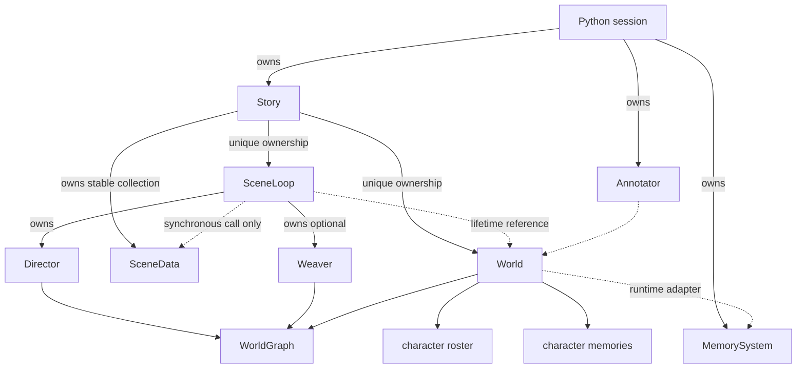

# C++ runtime data model

The runtime has one native aggregate, Story. Story exclusively owns durable World state,
World-free per-storyline records, and the executor that advances them.

There is no SceneData-to-World edge, no World-to-SceneData edge, and no native runtime manager or
service hierarchy.

## World

World owns the durable state for one Story:

- WorldGraph storage;
- character roster and scene-ID membership;
- character-memory map;
- a borrowed MemorySystem adapter;
- the runtime-only reflection callback.

The graph, roster, and memory containers are private. World exposes const roster/memory reads,
explicit membership and character operations, and graph access for Director, Weaver, and graph
inspection tools.

World enforces the invariants that span its roster and memories:

- character entry creates a configured memory when required;
- membership moves and removals update Character scene IDs;
- death clears every membership;
- perception routing and reflection operate over the complete memory map;
- rollback prunes graph nodes, dynamically created characters, and orphaned memories.

World no longer stores lifecycle operations. Fork, merge, conclude, and exit decisions belong to
Story because only Story owns the SceneData collection.

## SceneData

`SceneData` is an aggregate containing only per-storyline state:

- ID, title, and system prompt;
- narrator and dialogue histories;
- TextDownsampler value state;
- turn index;
- driving intention, charge, and scheduler timestamp.

It contains no World pointer, runtime callback, lifecycle method, character operation, query,
undo, or persistence method. It is architecturally plain data, though not a strict C++ POD because
its value members are non-trivial.

Story retains SceneData in `vector<unique_ptr<SceneData>>` so references returned to callers remain
stable across collection growth. This is exclusive, not shared, ownership.

## Story

Story is the orchestration and complete-state boundary:

- exclusively owns World, SceneData records, and SceneLoop;
- owns active-scene and scheduler bookkeeping;
- creates, merges, concludes, and selects storylines;
- applies accepted lifecycle verdicts directly;
- routes graph/mind/history tools;
- coordinates undo across one SceneData and World;
- loads scenarios and owns complete save/load/delete operations.

World uses stable `unique_ptr` storage so SceneLoop's World reference remains valid through Story
moves and save loads. Save loading mutates the existing World allocation rather than rebinding the
runtime.

Implementation remains split by reason to change:

| File | Responsibility |
|---|---|
| `story.cpp` | ownership, scenario loading, collection/lifecycle operations, tools, undo |
| `story_advance.cpp` | player/off-stage sequencing, lifecycle callbacks, memory synchronization |
| `story_serialization.cpp` | World, SceneData, and manifest persistence |

## SceneLoop and graph services

SceneLoop is constructed with Story's World. It owns Director by value and creates an optional
Weaver when Weaver callbacks are configured. Both services reference `World::graph()` by design.

The only execution APIs borrow one SceneData for one synchronous call and return a complete
SceneTurnResult. SceneLoop has no retained SceneData field, temporal result cache, save directory,
or public submit/drain compatibility path.

Director and Weaver remain independently bound in Python for maintained graph utilities. They are
not part of production session composition.

## Annotator and MemorySystem

Annotator reads World because named entities come from the durable roster, not from one
storyline. MemorySystem remains externally owned because its Python callbacks and ChromaDB adapter
are outside the native state model; World borrows it for synchronization.

## Persistence

The serialized format is unchanged:

- `world.json`: graph, roster, character memories, and memory ID;
- one `<scene_id>.json` blob per SceneData record;
- `story.json`: active scene, beat clock, and live scene IDs.

Only Story exposes complete persistence in production Python. SceneData has no persistence methods,
and World's file operations are internal C++ implementation mechanisms.

## Python mutation boundary

Python can read World graph, roster, and memories, but cannot replace their containers. Character
membership, death state, `join_scene()`, and `leave_scene()` are not writable from Python.

Production `WsSession` owns only Story, MemorySystem, Annotator, and a resume flag. It configures
callbacks on Story; it does not construct SceneLoop, Director, or Weaver.

## Ownership summary

| Object | Owner | Borrowed dependencies |
|---|---|---|
| Story | Python session or C++ caller | none |
| SceneData | Story | none |
| World | Story | MemorySystem |
| SceneLoop | Story | World; one call-scoped SceneData |
| Director | SceneLoop, or standalone graph caller | WorldGraph |
| Weaver | SceneLoop, or standalone graph caller | WorldGraph |
| Annotator | Python session or caller | World |
