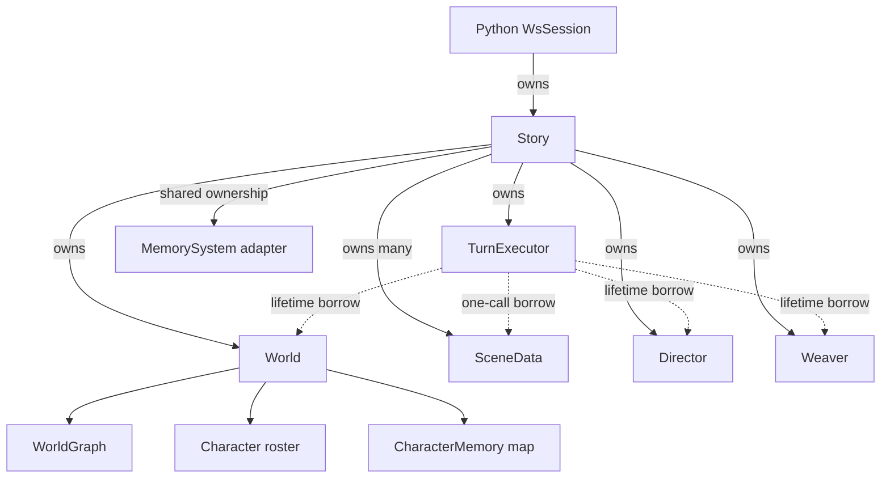

# C++ runtime data model

`Story` is the native aggregate and production facade. It owns the complete runtime for one
playthrough; the other types either own one coherent part of that state or implement a focused
operation over borrowed values.

There is no ownership cycle and no SceneData-to-World edge.

## Story

Story owns composition and cross-component invariants:

- constructs stable World, Director, Weaver, and TurnExecutor allocations;
- owns the live SceneData collection and active-scene identity;
- sequences player turns, optional off-stage turns, lifecycle application, memory synchronization,
  undo, and persistence;
- validates scene IDs and player-storyline protections;
- forwards runtime callbacks to the component that consumes them.
- exposes explicit aggregate commands, such as manual graph weaving, when maintained diagnostics
  need mutation; callers do not receive writable aliases to owned state.

Story's move constructor transfers its stable allocations. Its move assignment first destroys the
destination's borrowing TurnExecutor, Weaver, and Director, then transfers state and services. This
prevents the destination's old services from temporarily outliving the World they reference.

Story delegates mechanics to free-function modules:

| Module | Responsibility |
|---|---|
| `scenario_bootstrap` | scenario file/JSON parsing and value construction |
| `world_analysis` | graph query, mind query, and death-candidate detection |
| `read_tools` | read-tool argument parsing and dispatch over a bounded read context |
| `storyline_policy` | scheduler/lifecycle prompts, callback calls, verdict parsing, cues |
| `scene_history` | message append/snapshot/undo/query mechanics |
| `text_downsampling` | mip processing, rendering, and JSON conversion |
| `story_serialization.cpp` | save paths and complete Story persistence |

## World

World owns durable domain state:

- objective WorldGraph;
- character roster and scene membership IDs;
- subjective CharacterMemory map.

Its methods are reads or invariant-preserving mutations: roster membership, perception routing,
reflection over an explicitly supplied callback, rollback, death marking, and value JSON conversion.
World has no filesystem, scenario-document, MemorySystem, or retained callback dependency.

## SceneData

SceneData is a behavior-free value aggregate. It contains identity and display strings, narrator and
dialogue message vectors, DownsamplingState, turn index, and scheduling fields. It has no methods,
callback, service pointer, or World reference.

Python receives SceneData as a read-only view. It receives detached snapshots of Story-owned graph,
roster, character, and character-memory values. Production Python therefore cannot mutate either
scene invariants or World state through a returned reference. Validated Story operations are the
mutation boundary.

## TurnExecutor and graph services

Story owns Director and Weaver. TurnExecutor borrows them and World through constructor references;
those references cannot be rebound. It borrows one SceneData only for one synchronous call.

TurnExecutor returns `TurnResult`: scene identity, completed turn, emitted messages, and generic
created/expired node effects. DirectorOutput, WeaveResult, and expiry implementation types do not
cross the turn-execution boundary. The separate, explicit manual-weave command returns its normal
WeaveResult because that command is itself a Weaver maintenance operation.

## Runtime adapters and borrows

| Owner | Owned value | Borrow/lifetime rule |
|---|---|---|
| Story | World, SceneData, Director, Weaver, TurnExecutor | none |
| Story | shared MemorySystem handle | pybind/C++ shared ownership |
| TurnExecutor | no domain state | World/Director/Weaver live longer by declaration order |
| Narrator/scheduler call | const World/history read context and read-tool function | captures no Story; expires when the callback returns |
| Annotator | no World ownership | pybind keeps its World owner alive |

See [[architecture/scene-loop]] for transaction order and callback details.
