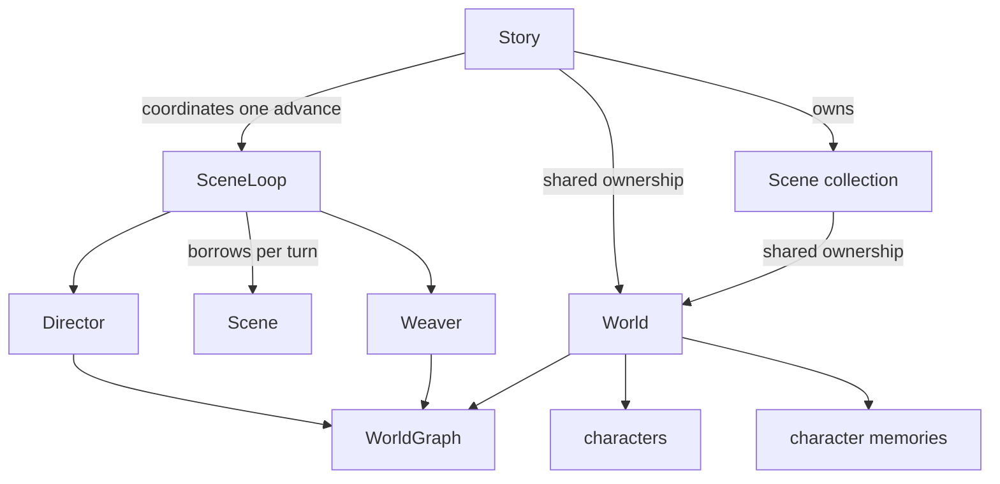

# C++ runtime data model

The runtime separates durable shared state, per-storyline state, turn execution, and Story
orchestration. The intended dependency direction is:



There is no manager or service hierarchy. Python remains the composition root for the concrete
runtime objects.

## World

`World` owns the durable substrate shared by every live Scene:

- `WorldGraph world_graph`;
- the character roster;
- the character-memory map;
- staged lifecycle operations;
- a borrowed `MemorySystem*`;
- the runtime-only reflection callback.

World owns invariants that span its containers:

- perception routing from a scene and audience to character memories;
- memory reflection;
- marking a character dead and removing every scene membership;
- lifecycle operation staging;
- World save/load.

The reflection callback is not serialized. `World::load_save()` reapplies the configured callback
to memories reconstructed from disk.

## Scene

`Scene` is one storyline projection over a shared `std::shared_ptr<World>`. It owns:

- scene identity, title, system prompt, driving intention, charge, and scheduler timestamp;
- narrator history and authored-dialogue history;
- turn index;
- the per-scene text downsampler.

Scene owns mutations whose invariant is one storyline's membership:

- `enter_character()`;
- `exit_character()`;
- `ensure_characters_present()`.

`fork()` creates a new Scene over the same World. Per-scene persistence contains the histories,
turn index, drive metadata, and downsampler; World persistence remains separate.

## Story

`Story` is the runtime aggregate for one playthrough:

- co-owns one World;
- owns all live Scenes with `unique_ptr`;
- tracks the active scene and scheduler beat clock;
- borrows one externally composed SceneLoop;
- owns scheduler, lifecycle, and downsampler callbacks;
- controls Story-backed save, load, and undo.

`Story::advance_scene()` runs the player Scene, applies lifecycle, may run one selected off-stage
Scene, synchronizes memory, and saves once. `Story::revert_active_turns()` preserves the existing
scene-local rollback algorithm and reuses the same SceneLoop.

Implementation is split by reason to change:

| File | Responsibility |
|---|---|
| `story.cpp` | ownership, scene collection, lifecycle application, read tools, undo entry |
| `story_advance.cpp` | player/off-stage execution, scheduler/lifecycle callbacks, memory sync |
| `story_serialization.cpp` | Story manifest and World/per-scene save, load, delete |

## SceneLoop and SceneTurnResult

`SceneLoop` executes one scene turn and returns plain data:

```cpp
struct SceneTurnResult {
    std::string scene_id;
    int completed_turn;
    std::vector<SceneMessage> outputs;
    DirectorOutput director;
    WeaveResult weave;
    std::vector<ExpiryOp> expiry;
};
```

The primary `run_player_turn()` and `run_autonomous_turn()` calls borrow a Scene only for the
call. They always detach it before returning or rethrowing. The compatibility submit/drain API
remains available to standalone callers.

See [[architecture/scene-loop]] for sequencing, rollback, and background behavior.

## Director and Weaver

Director and Weaver each retain a borrowed reference to one WorldGraph. `uses_graph()` exposes
identity checks; SceneLoop rejects mismatched runtime wiring before mutation.

The bindings keep the graph alive for both objects. SceneLoop bindings likewise keep loaded Scenes,
Director, and Weaver alive for compatibility calls.

## Annotator

`Annotator` borrows World rather than Scene because annotation reads the durable roster. Retiring
or rebuilding a Scene therefore does not invalidate annotation.

## Persistence

Story persistence consists of:

- `world.json`: graph, roster, and character memories;
- one `<scene_id>.json` blob per live Scene;
- `story.json`: active scene, beat clock, and live scene IDs.

Serialized formats were not changed by the runtime dependency refactor. Runtime callbacks,
`MemorySystem*`, pending lifecycle operations, and borrowed execution objects are not serialized.

## Python mutation boundary

Python retains the existing read properties:

- `World.world_graph`, `World.characters`, `World.character_memories`;
- the same three forwarding reads on Scene.

Whole-container assignment is rejected. This prevents a live Director or Weaver from being detached
from the graph and prevents roster/memory replacement from bypassing World invariants. Legitimate
mutations use graph methods, Scene character operations, and World/Story operations.

## Ownership summary

| Object | Owner | Borrowed dependencies |
|---|---|---|
| Story | Python session or C++ caller | SceneLoop |
| Scene | Story or standalone caller | none; shares World |
| World | Story and Scenes | MemorySystem |
| SceneLoop | Python session or standalone caller | per-turn Scene, Director, optional Weaver |
| Director | Python session or caller | WorldGraph |
| Weaver | Python session or caller | WorldGraph |
| Annotator | Python session or caller | World |
