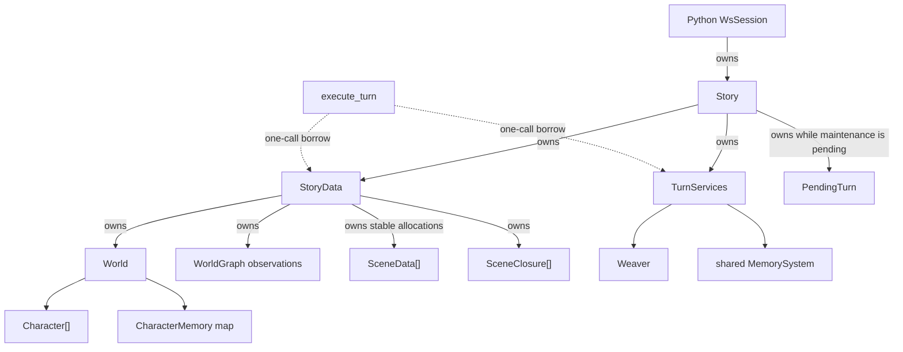

# C++ runtime data model

The runtime uses composition and explicit data flow. `Story` owns two aggregate values and passes
them to free operations. No orchestration class inherits from another, and no turn object retains a
reference to live story state.

## Ownership graph



The `unique_ptr<SceneData>` elements keep scene addresses stable for the existing C++ API. They do
not create a second owner or a scene-to-Story back-reference.

## Owned aggregates

### `StoryData`

`StoryData` holds the values that describe a playthrough:

| Field | Meaning |
|---|---|
| `world` | Roster, scene membership, life status, and character memories |
| `observations` | Non-authoritative shared narrative graph |
| `scenes` | Live scene records with stable allocation |
| `scene_closures` | Compact records for concluded scenes and merged-away forks |
| `active_scene_id` | Scene receiving player input |
| `turn_clock` | Cross-scene scheduling clock |
| `transaction_version` | Monotonic version for committed turn and lifecycle mutations |

The transaction version is not a content hash. Post-turn graph maintenance, downsampling, and service
state do not each advance it.

A `SceneClosure` is either a concluded storyline (`merged_into` empty) or a fork that was merged
away (`merged_into` names the surviving scene). Merge archives the retired fork's visible transcript
there so `Story::render_transcript` can still print it after the live `SceneData` is erased.

### `TurnServices`

`TurnServices` holds execution dependencies and runtime state:

- model, narrator, delivery, scheduler, lifecycle, reflection, and downsampling callbacks;
- history window (the Python `resume` argument to `set_history_window` is ignored);
- temporary storyline-board text;
- the stateful `Weaver` service;
- shared `MemorySystem` ownership;
- save-directory configuration.

It contains no `World*`, `SceneData*`, or `WorldGraph*`. `Weaver` receives the graph explicitly for
each operation.

### `Story`

`Story` is the composition root. Its only owned state is `StoryData`,
`TurnServices`, and an optional private `PendingTurn`. It exposes setup, queries, lifecycle commands,
turn sequencing, undo, and persistence. Python `Story.world()` returns a detached snapshot
(`world_snapshot`); C++ `Story::world()` is the live roster.

`Story` does not contain scene algorithms, scheduling algorithms, graph-application logic, or a
turn-executor object. Those operations accept explicit data arguments.

## Turn values

| Type | Lifetime | Purpose |
|---|---|---|
| `TurnInput` | One call | Player/autonomous kind, scene ID, exact input text |
| `TurnResult` | Return value | Committed outputs, delivery failures, graph effects, post-turn index |
| `PendingTurn` | Between `advance_player` and `complete_turn` | Scene, exact player input, post-turn index |

There are no `TurnWork`, `PreparedTurn`, or `CompletedSceneTurn` wrapper layers. Candidate World,
scene, prompt, narrator result, and output values are local variables inside `execute_turn`.

## Functional modules

| Module | Responsibility |
|---|---|
| `turn_pipeline.*` | Stage, commit, deliver, and observe one narrative turn |
| `story_data_ops.*` | Scene lookup, summaries, frozen reads, cast resolution, scheduling selection |
| `story_lifecycle.*` | Fork, merge, conclude, exit, synthesize story-so-far, and apply parsed lifecycle decisions |
| `graph_plan.*` | Apply parsed node transitions/additions to an explicit observation graph |
| `scene_history.*` | Append, order, query, revert, and format visible transcript (including fork/merge notes) |
| `story_serialization.cpp` | Convert between the live split representation and the old save shape |

`apply_graph_plan` is stateless. `Weaver` remains a class because it owns a callback, random generator,
interval, stop flag, and expiry queue. `MemorySystem` remains a class shared with Python integration.

## World and observation compatibility

A live `StoryData` does not keep its observation graph inside `World`. The split is:

```text
StoryData::world         = coded roster and character state
StoryData::observations  = fallible shared narrative observations
```

`World` still serializes a graph and `state_version` for compatibility with existing standalone C++
and Python callers. `import_world` moves those fields out when a Story is created or loaded.
`snapshot_world` copies them back into a detached World for saving and Python inspection. The live
Story never exposes a mutable `World&`.

## Mutation rules

- `execute_turn` is the only narrative-turn entry point for both player and autonomous turns.
- Lifecycle commands mutate `StoryData` through named free functions and advance the transaction
  version when they change authoritative state.
- Read tools operate on copied snapshots and retain no live pointers after their lease closes.
- Graph application receives only `WorldGraph&`; it has no access to Story, scenes, or coded World
  mutation methods.
- Python receives copied SceneData and World values. Native mutation goes through `Story` commands.

## Limitations

- `StoryData` is an aggregate but not trivially copyable because scene allocations use `unique_ptr`.
- `story_data_ops.*` groups several small read/policy helpers; splitting it further would add module
  boundaries without removing ownership or authority.
- Post-turn semantic mutations do not share the turn transaction or a durable checkpoint.
- Compatibility fields in standalone `World` duplicate the live Story representation at save and
  binding boundaries.

## See also

- [[architecture/scene-loop]]
- [[architecture/system-overview]]
- [[architecture/plot-graph]]
- [[architecture/memory-system]]
