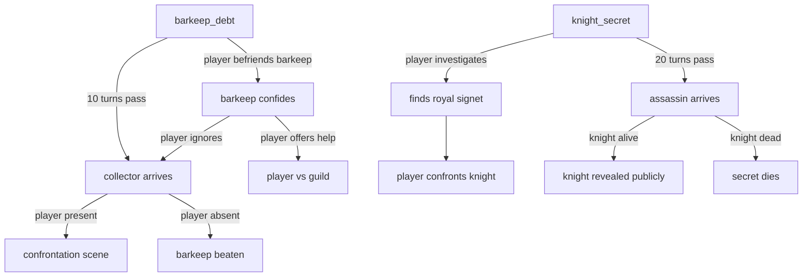
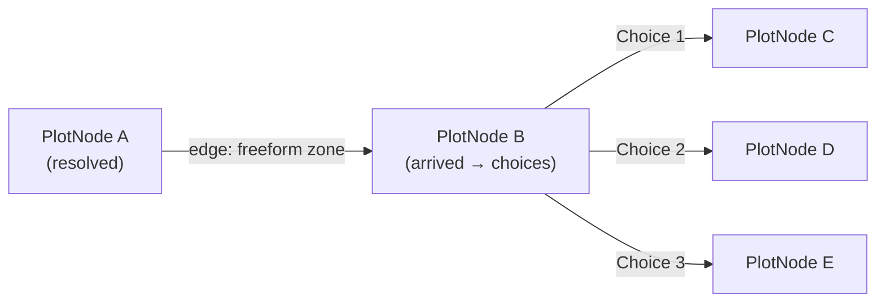

# Plot graph

The plot graph is the core narrative data structure in Rhapsode. It is a **directed acyclic graph of latent plot nodes** that the Director traverses deterministically, while the LLM renders the results into prose.

The `PlotGraph` is owned by `Session` — not by any individual `Scene`. Multiple concurrent `SceneLoop`s (interactive and background) share the same graph. Transitions committed by any loop are recorded by `GitStore` with the originating `scene_id` so the history is readable across all scenes.

## What is a plot node?

A plot node is a fact about the world that *could* become dramatically relevant. It sits dormant until a trigger fires.

Examples:

- "The barkeep owes money to the thieves' guild"
- "The knight is secretly the missing prince"
- "The village well has been poisoned"

A plot node is not a plot beat. It is a **loaded spring**. The player's actions (or the world clock) release it.

## The graph

Plot nodes are nodes. Edges are triggers. The Director walks the graph each turn.



Each node has:

- **State**: `dormant`, `foreshadowed`, `active`, `resolved`
- **Trigger conditions**: player action, turn count, world condition, another plot node resolving
- **Prompt context**: what to inject into the LLM prompt when this plot node is foreshadowed or active (directional hints, not prose — see [[literature-review#IBSEN]])
- **Consequences**: world state mutations when the plot node activates or resolves
- **Knowledge state**: who knows what — `player_known`, `npc_known`, `hidden` (see [[#Knowledge state and revelation timing]])
- **Stall budget**: maximum turns a plot node can remain `active` before the Director force-advances or escalates (see [[literature-review#IBSEN]])
- **Type**: `secret`, `conflict`, `clock`, `consequence`, `object`, `event`, `rule` (extended from CFPG's taxonomy — see [[literature-review#CFPG]])

Edges fire when their trigger condition is met. The Director checks all edges each turn. No LLM call is needed to traverse the graph -- it is pure deterministic logic.

## Auto-merging

When the Director activates a plot node, it checks whether any other `active` node shares characters or locations. If so, the plot node lines have **collided** -- and the Director automatically spawns a **merge node**.

Example: `barkeep_debt` leads to "collector arrives at tavern." `knight_mystery` leads to "assassin arrives at tavern." If both activate around the same time, the Director detects the collision (same location) and creates a merge node: "collector and assassin both at the tavern."

The merge node:

- Has both colliding nodes as parents
- Combines their prompt context (the LLM gets a richer, more chaotic scene)
- May have its own consequences (the collision itself changes the world)

The LLM doesn't need to know about the merge operation. It just receives a denser context and renders the collision naturally in prose.

## Revert

The player can **revert to the last node** -- undo the most recent plot node transition and replay from an earlier state.

This requires a **transition log**: an ordered list of state changes.

```
TransitionEntry {
    turn:       int
    node_id:    string
    old_state:  enum
    new_state:  enum
}
```

Reverting walks the log backwards to the target turn, undoing each transition (restoring `old_state`). History and memory are also rolled back to that turn -- messages after the revert point are discarded.

This is the VCS "revert" operation: `HEAD` moves back, and the future becomes open again. Reverted nodes return to their prior state (typically `dormant` or `foreshadowed`), and the player gets a second chance to make different choices.

## The version control analogy

The plot graph behaves like a version control system:

| VCS concept | Plot graph equivalent |
|---|---|
| Branch | Possible future that hasn't happened yet (dormant plot node) |
| Commit | Plot node state that has been activated (irreversible under normal play) |
| Merge | Separate plot node lines collide (auto-detected by shared characters/locations) |
| Revert | Player undoes recent transitions, replays from earlier state |
| HEAD | Current world state -- the set of all active and resolved plot nodes |
| Log | Transition log -- ordered list of all state changes, enables revert |

Scenarios define the initial graph. Player actions and the world clock advance HEAD. Resolved plot nodes are immutable history (unless reverted). Dormant plot nodes are the space of possible futures.

## The Prophet is the graph

The "Prophet" concept from [[narrative-philosophy]] is not a separate agent. It is the graph itself.

- **Sealed predictions** = dormant nodes with trigger conditions. The system knows they exist; the player doesn't.
- **Foreshadowing** = when a plot node transitions from `dormant` to `foreshadowed`, the Director injects subtle hints into the prompt context. Not "tell the player X" but "the atmosphere should carry unease" or "this character's generosity feels performative."
- **Payoff** = when a foreshadowed plot node activates, the player experiences the dramatic moment. The signs were there all along -- because the system was seeding them.
- **Ambiguity** = some plot nodes have edges labeled with conditions that are genuinely uncertain. The system doesn't know which branch will fire until the player acts. This is the Hamlet quality.

## Two loops

The Director runs two loops against the plot graph:

### Player-facing loop

What we have now: player acts, the Director checks which edges fire, world responds. This is synchronous with the SceneLoop.

### World-background loop

Between player turns (or on a turn counter), the Director advances off-screen plot nodes. Things happen when the player isn't watching:

- The thieves' guild sends a collector. The barkeep can't pay. He's desperate.
- The assassin reaches the city gates. She asks about the knight.
- The well water starts making people sick.

The player discovers these changes through interaction, not exposition. They walk into the tavern and the barkeep has a black eye. They hear rumors in the market. The world reveals itself through detail, not narration.

## Plot nodes as Foreshadow-Trigger-Payoff triples

Informed by CFPG ([[literature-review#CFPG]]), each plot node is formalized as an **(F, T, P) triple**:

- **F (Foreshadow)**: the setup or anomaly that creates a "causal debt" — something the player notices but cannot yet explain. Injected via `foreshadow_ctx`.
- **T (Trigger)**: the prerequisite condition that must hold before the payoff becomes actionable. This is the edge trigger predicate — the gating mechanism that prevents premature payoffs.
- **P (Payoff)**: the resolution event. Injected via `active_ctx` when the plot node transitions to `active`.

The trigger gate is what separates **premature payoff** (spoiling suspense) from **missing payoff** (logical inconsistency). A plot node stays `dormant` or `foreshadowed` until T is satisfied — only then does P enter the Director's prompt context.

This maps cleanly to our state machine:

| State | F-T-P status |
|-------|-------------|
| `dormant` | F registered, T not checked, P suppressed |
| `foreshadowed` | F injected as hint, T monitored each turn, P suppressed |
| `active` | T satisfied, P injected into prompt as explicit constraint |
| `resolved` | P realized in generated text, triple removed from active set |

## Knowledge state and revelation timing

Each plot node carries a **knowledge state** — who knows what — inspired by Branigan's disparities of knowledge ([[literature-review#Suspenseful Stories]]):

| Field | Meaning |
|-------|---------|
| `player_known` | The player has encountered evidence of this plot node |
| `npc_known` | Specific NPCs aware of this plot node (list of character IDs) |
| `hidden` | The plot node exists in the graph but no one in-world knows yet |

The Director uses knowledge state as a **revelation timing lever**:

- **Dramatic irony** (player knows, character doesn't): the player sees the trap before the NPC walks into it. Creates dread and suspense.
- **Surprise** (character knows, player doesn't): revelation upon discovery. Creates shock.
- **Default policy**: prefer dramatic irony over surprise — empirically, clue insertion (foreshadowing before payoff) is statistically significant for suspense (p<0.05 in Xie & Riedl 2024).

The knowledge state is updated when:
- The Director injects `foreshadow_ctx` → `player_known` becomes true
- An NPC witnesses or is told about the plot node → added to `npc_known`
- A `hidden` plot node's trigger fires → transitions based on who is present

## The generation pipeline

The plot graph is **not hand-authored**. It is LLM-generated and Director-maintained.

The LLM composes the raw dramatic material. The Director (the rhapsode -- see [[narrative-philosophy#1. The Director is a rhapsode -- an arranger, not a puppeteer]]) extracts and arranges it into structured graph nodes.

```
World state + memory + current graph
        |
        v
   LLM (free text -- unconstrained creative output)
   "The barkeep has been losing sleep. He borrowed
    heavily from Vex, the guild fence, to keep the
    tavern running after the drought. Vex is patient
    but her lieutenant Korr is not -- he's been
    pressing for repayment. Meanwhile, the knight
    Sir Aldric drinks alone every night, speaking to
    no one. The locals whisper he arrived the same
    week the royal courier went missing..."
        |
        v
   Director / extraction pass
   Parse the free text into structured nodes:
   - barkeep_debt (characters: barkeep, Vex, Korr)
   - knight_mystery (characters: Aldric, courier)
   - triggers, foreshadowing, connections
        |
        v
   Plot graph (updated with new nodes)
```

### Three moments when generation happens

**Scenario initialization.** When a scenario starts, the LLM reads the world setup (characters, locations, setting) and generates an initial set of plot nodes. This happens once, before the player starts.

**Periodic world-building.** Every N turns, the Director asks the LLM to look at the current world state + memory and generate new plot nodes. New dormant nodes enter the graph. The world deepens over time rather than exhausting its initial content.

**Reactive spawning.** When a major plot node resolves (a secret is revealed, a character dies, a faction is defeated), the Director asks the LLM to generate consequences. One resolution spawns new plot nodes, keeping the world alive.

### Why free text, not structured output

The LLM's creative output is **unconstrained prose**, not JSON. This is deliberate:

- Free text produces richer, more surprising dramatic material than filling in a schema
- The extraction step is a separate concern -- a second LLM call with a tight prompt, or even a smaller/cheaper model
- The extractor validates against existing world state (no duplicate plot nodes, no phantom characters)
- If extraction fails, the raw text is discarded -- no corrupt graph state

### The LLM's two roles

The LLM is used twice, for fundamentally different purposes:

1. **Composer** -- generates raw dramatic material (free text, creative, unconstrained)
2. **Performer** -- renders the current world state into prose for the player (constrained by prompt context from the Director)

The Director sits between these two uses. It never calls the LLM itself at runtime to make structural decisions. It only structures what the LLM has already imagined.

## Player traversal: edges and nodes

The player's relationship to the plot graph is spatial: they are always **on an edge**, traveling toward a plot node. This determines the input mode.

### On an edge (freeform)

While traveling an edge, the player has full freeform input. They talk, explore, investigate, fight — all "read actions" that don't mutate the graph. The LLM simulates the world freely. The plot graph doesn't care about these actions because they don't change the destination.

### At a node (constrained choice)

When the player arrives at a plot node, the Director presents **constrained choices** — an adaptive number of options (typically 2-4), each mapping to an outgoing edge. This is the "write action": the player's selection transitions the graph to the next state.

The choices are generated by the LLM (composer role) but grounded in the graph's available edges. The graph says "these are the possible transitions"; the LLM says "here's how to phrase them so the player agonizes."



### Adaptive choice count

The number of choices at a node is not fixed globally. It depends on the plot node's outgoing edge count, which is determined by the generation pipeline (authored or LLM-generated). Some nodes may have 2 stark binary options; others may have 4-5 nuanced alternatives.

## The multi-dimensional problem

The plot graph is not a single linear chain. At any moment, the player may have multiple concurrent plot node threads:

- **PlotNode A**: The Baron's secret (active, approaching a decision point)
- **PlotNode B**: The missing shipment (active, still developing)
- **PlotNode C**: Romance with the innkeeper (latent, simmering)
- **PlotNode D**: The war in the north (background, ticking clock)

The player is simultaneously on edges in multiple plot node lines. A single action might be a "read" in one dimension but a "write" in another.

This is fundamentally harder than a visual novel (one active storyline at a time) or a traditional branching narrative (a single tree).

### Open question: how to handle multi-dimensional arrival

When the player reaches a node in one plot node dimension while other plot nodes are still mid-edge, several strategies are possible:

**Per-plot-node serialization.** The Director manages pacing so that plot nodes reach decision points one at a time, giving the player breathing room. If two plot nodes are converging, the Director slows one (delays surfacing) or accelerates the other (forces an early choice). This is the arranger role — managing *when* things surface to avoid collisions.

**Composite choice points.** When multiple plot nodes converge on the same moment (same characters, same location, same stakes), the Director merges them into a single composite decision. The choices span multiple plot node dimensions simultaneously. Example: "The Baron demands your answer about the secret, but the messenger just arrived with news about the missing shipment. Do you: (1) Confront the Baron now, (2) Excuse yourself to read the message, (3) Use the messenger's arrival as leverage."

**Independent queuing.** Each plot node independently tracks its own decision point. When plot node A reaches its node, the player gets choices for A while B, C, D continue in freeform. The UI shows "PlotNode A demands a decision" while everything else proceeds.

The right answer is likely a combination. The Director serializes when possible, merges when plot nodes genuinely collide, and queues as a fallback. This is a design area that needs prototyping to resolve.

## Why the Director doesn't use the LLM for structure

The LLM is bad at:

- **Consistency** -- it forgets what it predicted 20 turns ago
- **Timing** -- it can't reliably count turns or track parallel events
- **Secrecy** -- it tends to either blurt secrets or be uselessly vague
- **Determinism** -- same prompt can yield different structural decisions

The LLM is good at:

- **Imagination** -- generating rich dramatic landscapes from a world setup
- **Prose** -- rendering a world state into vivid, contextual narrative
- **Improvisation** -- filling in details that the graph doesn't specify
- **Dialogue** -- making characters feel alive within their constraints

So: the LLM imagines and performs. The graph holds structure. The Director arranges. This is the [[narrative-philosophy#1. The Director is a rhapsode -- an arranger, not a puppeteer|rhapsode principle]] in practice.

## Scenario authoring

A scenario provides the initial world state. The plot graph is then generated from it:

```json
{
  "title": "The Dusty Flagon",
  "system_prompt": "You are the narrator of a fantasy RPG...",
  "characters": [...],
  "locations": [...],
  "seed_messages": [...]
}
```

At initialization, the LLM reads this setup and generates the initial plot nodes as free text. The Director extracts them into graph nodes. The scenario author designs the *world* -- the characters, their relationships, the setting. The LLM discovers the *dramatic potential*. The Director structures it.

## Debuggability

The plot graph is fully inspectable at any time. You can visualize:

- Which plot nodes are dormant, foreshadowed, active, resolved
- Which edges are close to firing
- What the world clock shows
- What prompt context the Director is currently injecting

This is a radical improvement over Talemate's Director, where narrative decisions are opaque LLM outputs that cannot be inspected, reproduced, or debugged.

## Resolved questions

1. **Dynamic plot nodes** -- Yes. New plot nodes are spawned at runtime via the generation pipeline (periodic world-building + reactive spawning). The graph grows over the course of a session.
2. **Authoring** -- Scenarios are not hand-authored plot node graphs. The author designs the world (characters, locations, relationships). The LLM generates the dramatic potential. The Director structures it.
3. **Fortune tracker** -- Rejected. There is no numeric arc tracker. The arc emerges from accumulated memory + active plot nodes. See [[narrative-philosophy#Why there is no fortune tracker]].

## Open questions

1. **Trigger language**: how do we express "player befriends barkeep"? Keyword matching? LLM classification of player intent? A small dedicated model?
2. **Extraction robustness**: how does the extraction step handle ambiguous or inconsistent LLM output? Retry? Partial extraction? Human review queue?
3. **Plot node templates**: reusable patterns ("character has a secret," "faction conflict," "ticking clock") that the extraction step could match against?
4. **Visual editor**: the plot graph is the natural candidate for a visual inspection/editing tool. A node editor where each node is a plot node and edges are triggers.
5. **Serialization**: the graph must be saveable (for session save/load). Format? Separate from world state or embedded?
6. **Multi-dimensional arrival**: when the player reaches decision points in multiple plot node lines simultaneously, how should the Director prioritize, serialize, or merge them? See [[#The multi-dimensional problem]].
7. **Freeform edge-breaking**: what happens when a freeform action on an edge invalidates the destination node? (e.g., the player murders the Baron while on the edge leading to "Confront the Baron"). Does the Director prevent it, adapt the graph, or force an early arrival at the node?
