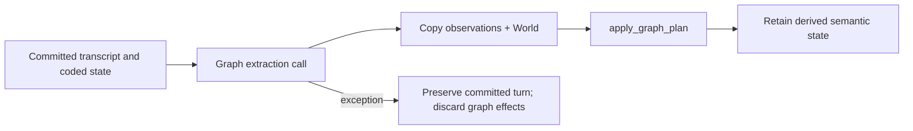

---
sources:
  - core/include/rhapsode/node.h
  - core/include/rhapsode/world_graph.h
  - core/src/node.cpp
  - core/src/world_graph.cpp
  - core/src/world_graph_serialization.cpp
  - core/include/rhapsode/graph_plan.h
  - core/src/graph_plan.cpp
  - core/include/rhapsode/weaver.h
  - core/src/weaver.cpp
  - core/src/weaver_work_queue.cpp
  - core/src/turn_pipeline.cpp
  - core/src/turn_pipeline_narrator.cpp
  - core/include/rhapsode/story_data.h
last_updated: 2026-08-23
confidence: verified
tier: semantic
related:
  - "[[architecture/system-overview]]"
  - "[[architecture/scene-loop]]"
  - "[[architecture/memory-system]]"
  - "[[architecture/monologue-streams]]"
tags:
  - cpp-core
  - design
---

# Plot graph

`WorldGraph` stores fallible narrative observations and their relationships. It supports retrieval,
context construction, and semantic maintenance. A graph node is not permission to
change coded world state.

## Data model

`Node` contains:

| Field | Meaning |
|---|---|
| `id` | Stable graph-local identifier |
| `fact` and `type` | Extracted narrative assertion and broad category |
| `state` | Dormant, foreshadowed, or active prompt state |
| `valid_until` | `-1` while live; otherwise the superseding turn |
| `foreshadow_ctx`, `active_ctx` | Optional generation context |
| `entities` | Named subjects used for chaining and retrieval |
| `trigger`, `arc_position` | Optional narrative annotations |
| `related_to` | Serialized predecessor IDs |
| `created_at` | Originating turn |
| `weight` | Pressure used by character-mind nodes, not factual confidence |

“Resolved” is accepted as an input compatibility term. Internally, validity is represented by
`valid_until`, while `NodeState` remains a three-value prompt state.

`EdgeData` contains weight, creation turn, active state, and kind. Recognized kinds include timeline
chains, evidence links, and tensions.

## Storage and traversal

`WorldGraph` uses a Boost bidirectional adjacency list plus an ID-to-vertex index. It provides node
lookup, active/expired iteration, relation updates, bounded neighbor traversal, connected-component
threads, entity groups, rollback by turn, and JSON/DOT serialization.

`add_node_chained` links a new node to the newest live predecessor for each shared entity. Edge
direction is normalized by creation turn and ID. Duplicate edges between the same pair are rejected.

Connected components are navigation aids, not causal proofs. Edge kinds and weights are also
fallible metadata.

## Turn placement

`extract_graph_observations` runs after the turn commit. It asks the narrator callback for
`transitions` and `new_nodes`, then passes them to `apply_graph_plan` with a copied graph.

Successful observations replace the graph portion of live state. The
committed scene is restored from its copy. World extract does not copy nodes into character minds.

Failure clears reported graph effects and leaves the committed turn intact. Graph extraction does not
run character-death detection.

## Graph-plan application

`apply_graph_plan` applies parsed graph operations; it does not call the model.

- A transition changes prompt state or sets `valid_until`.
- A new node receives a runtime ID and creation turn.
- Entity chaining connects the node to live predecessors.
- The return value lists new and expired nodes for memory synchronization.

The function retains no graph pointer and cannot access Story, SceneData, or mechanical World
operations. `GraphPlanResult` returns the new and expired nodes used by later memory synchronization.

## Weaver

`Weaver` is a stateful maintenance service over graph edges and validity:

- a periodic edge audit can connect, disconnect, or reweight sampled nodes;
- an expiry queue groups live nodes by entity;
- an LLM can identify older facts superseded by newer facts;
- graph analysis reports live nodes, active edges, and orphans.

`process_post_turn` runs Weaver work after the turn transaction. Weaver failures are caught, but its
post-turn mutations do not share that rollback boundary.

`Weaver` owns only its callback, interval, random generator, stop flag, and expiry queue. Each method
receives the observation graph explicitly; the service is not bound to one graph address.

## Character-memory interaction

World extract does not copy `new_nodes` into character minds. After the take commits, the pipeline
slices last-three-turn narration from the scene and passes that string into Perception. Each on-stage
NPC overwrites its own `perception_` string; monologue copies that string and never reads narration.
See [[architecture/monologue-streams]].

## Authority rule

The graph may:

- supply fallible context to a model;
- stay off character minds (perception is written separately);
- organize related observations;
- influence semantic retrieval and scheduling context;
- be rebuilt or reindexed.

The graph may not directly:

- mark a character dead;
- create or remove roster members;
- move a character between scenes;
- commit transcript messages;
- certify that prose caused a coded consequence.

Coded changes require explicit World or Story mutation paths. Future consequence-first work must use
a typed turn decision, not infer mechanics from graph text.

## Design rationale

The graph is useful for lossy semantic access, but extraction errors are unavoidable. Treating it as
mechanical truth turned an unverified model interpretation into a world mutation. Post-commit,
non-mechanical observations keep the retrieval value while containing that failure class.

A separate semantic graph remains preferable to forcing every narrative claim into a rigid world
ontology. The trade-off is that later prompts can still be biased by false or stale observations.

## Impact

- `turn_pipeline.cpp` can commit player-visible output before observation extraction.
- `MemorySystem` may index new node IDs, but the transcript remains the raw evidence source.
- `CharacterMemory` can receive perceptions without treating them as authoritative world facts.
- Replay and checkpoint work can rebuild the graph without changing coded mechanics.

## Limitations

- Observation nodes lack mandatory source-message references.
- Graph extraction can still contaminate later generation through retrieval and perception.
- Weaver expiry is model-authored and runs outside the turn transaction.
- Live `StoryData` stores observations separately from coded `World`; standalone World values still
  carry a graph slot for save and Python compatibility.
- Deleting and rebuilding the graph has not passed a long sequential contamination test.

## See also

- [[architecture/system-overview]]
- [[architecture/scene-loop]]
- [[architecture/memory-system]]
- [[architecture/monologue-streams]]
