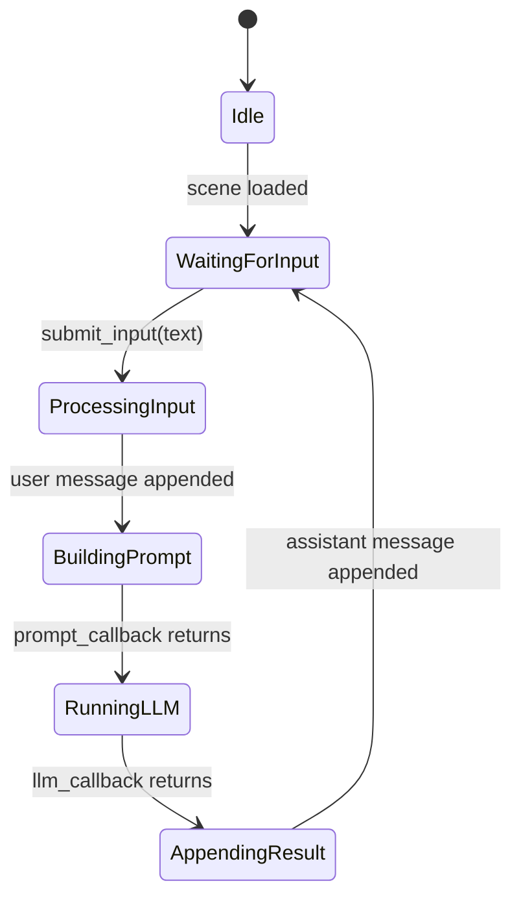

# SceneLoop

## MVP stance

- **SceneLoop** is implemented in **C++** as an explicit **finite state machine**.
- It is **not** the Talemate-style visual graph (composite modules, triggers, async error boundaries).
- A general DAG runtime is deferred — see [[decisions/ownership-split]] and [[architecture/stack]].

## State diagram



## States

| State | Description | Trigger to next |
|-------|-------------|-----------------|
| `Idle` | No scene loaded. Loop does nothing. | `load_scene(scene)` -> `WaitingForInput` |
| `WaitingForInput` | Scene active, waiting for player text. | `submit_input(text)` -> `ProcessingInput` |
| `ProcessingInput` | Appends user `SceneMessage` to history. | Automatic -> `BuildingPrompt` |
| `BuildingPrompt` | Invokes the registered **prompt callback** (Python). Passes history snapshot + scenario metadata. Receives back a messages list. | Callback returns -> `RunningLLM` |
| `RunningLLM` | Invokes the registered **LLM callback** (Python) with the prompt messages. Receives assistant text. | Callback returns -> `AppendingResult` |
| `AppendingResult` | Appends assistant `SceneMessage` to history. Fires a "turn complete" notification. | Automatic -> `WaitingForInput` |

## C++ class sketch

```cpp
namespace rhapsode {

enum class LoopState {
    Idle,
    WaitingForInput,
    ProcessingInput,
    BuildingPrompt,
    RunningLLM,
    AppendingResult
};

using PromptCallback = std::function<std::string(const std::vector<SceneMessage>&, const Scene&)>;
using LLMCallback = std::function<std::string(const std::string& prompt)>;
using TurnCompleteCallback = std::function<void(const SceneMessage& assistant_msg)>;

class SceneLoop {
public:
    void load_scene(Scene& scene);
    void submit_input(const std::string& text);

    LoopState state() const;

    void set_prompt_callback(PromptCallback cb);
    void set_llm_callback(LLMCallback cb);
    void set_turn_complete_callback(TurnCompleteCallback cb);

private:
    void advance();

    LoopState state_ = LoopState::Idle;
    Scene* scene_ = nullptr;
    PromptCallback prompt_cb_;
    LLMCallback llm_cb_;
    TurnCompleteCallback turn_complete_cb_;
};

} // namespace rhapsode
```

### Key design points

- `submit_input()` transitions from `WaitingForInput` through all stages back to `WaitingForInput` synchronously (for MVP). The Python callbacks block until they return.
- `advance()` is private — the loop drives itself once `submit_input()` kicks it off.
- `TurnCompleteCallback` is how the Python/FastAPI layer knows to push the response to the WebSocket client.

## pybind11 callback registration

On the Python side, the server registers callbacks before accepting player input:

```python
from rhapsode._core import Scene, SceneLoop

loop = SceneLoop()
loop.load_scene(scene)

def build_prompt(history: list, scene_obj) -> str:
    # Assemble messages from history + scenario metadata
    return prompt_text

def run_llm(prompt: str) -> str:
    # Call Gemini/OpenAI, return assistant text
    return response_text

def on_turn_complete(msg):
    # Push to WebSocket
    ...

loop.set_prompt_callback(build_prompt)
loop.set_llm_callback(run_llm)
loop.set_turn_complete_callback(on_turn_complete)

# When player sends text:
loop.submit_input(player_text)
```

## Why defer the graph

A production-grade node graph engine includes async execution, nested graphs, event triggers, and editor round-trips — **months** of work. Topological sort is the easy part.

- Optional **visual node editor** only after the loop and memory path are stable.
- If FSM/stages remain sufficient, a general DAG may never be required.
