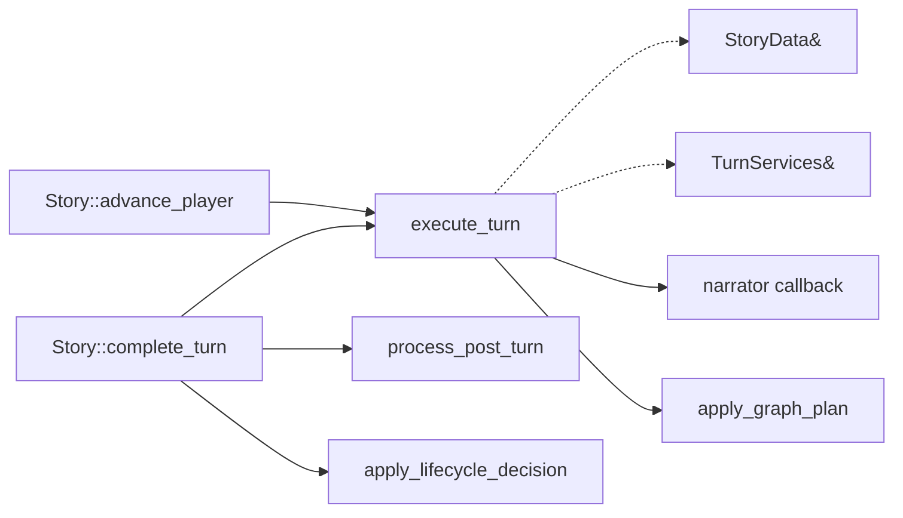

# Turn execution

Rhapsode has one narrative-turn function:
`execute_turn(StoryData&, TurnServices&, const TurnInput&)`. `TurnInput::Kind` selects player or
autonomous input; both paths use the same staging and commit logic. `Story` sequences this function
with later maintenance but does not forward through another executor object.

## Direct call structure

`advance_player` rejects a new input while a prior turn still awaits `complete_turn`. After a
successful commit it stores only the scene ID, exact player input, and post-turn index in
`PendingTurn`.

## One `execute_turn` call

The implementation order in `core/src/turn_pipeline.cpp` is:

1. Resolve the requested live scene.
2. Snapshot World, observations, the live scene, and the storyline board in a local `TurnRollback`.
   Generation mutates copies; an exception restores those snapshots from the destructor.
3. Build a `ReadToolLease` from a copy of World, observations, every live scene, and scene summaries.
4. Append the exact input to the candidate scene. Autonomous input is labeled `director_cue`; player
   input is labeled `player`.
5. Build narrator instructions (stage craft plus the speech/cast JSON schema) and turn state
   (who is on this stage with voice, who is not, other live threads, story so far, then the last
   attributed Player / Narrator / character spans from history **and** dialogue). Increment
   `turn_index` and run the narrator retry path.
6. Apply accepted cast additions to the candidate World.
7. Stage narrator prose and formatted character messages in the candidate scene and `TurnResult`.
8. Move the candidate World and scene into `StoryData`, advance the version once, and disarm rollback.
9. Notify the output callback. Notification failures are recorded; the committed turn is not replayed.
10. Extract and apply non-authoritative graph observations on working copies.
    The graph call (`GRAPH_UPDATE`) sees only this take's prose and speech. Live World and
    observations are replaced only if that call succeeds.

An exception before step 8 restores World, observations, scene, version, and storyline board. This is
an in-process turn transaction, not crash-safe persistence.

## Snapshot reads

`make_frozen_story_read_tools` creates owned copies before generation. The callback may dispatch:

| Tool | Source |
|---|---|
| `query_graph` | Frozen `StoryData::observations` |
| `query_mind` | Frozen `StoryData::world` |
| `query_history` | Frozen narrator/history buffer |
| `query_transcript` | Frozen merged history and attributed-dialogue buffers |
| `list_scenes` | Frozen scene summaries |

`ReadToolLease::close` invalidates copied callback handles. The callback cannot become a long-lived
pointer into Story state.

The native `query_transcript` result preserves exact message content, role, speaker, scene, turn,
ordinal, and `message_ref`. The default narrator beat already uses that attributed timeline (last
16 spans). The Python tool schema still does not advertise `query_transcript`; keyword
`query_history` remains history-buffer only.

## Message identity

Committed turn messages carry:

| Metadata | Value |
|---|---|
| `turn` | Scene-local turn being completed |
| `turn_ordinal` | Input `0`, narrator `1`, characters `2...` |
| `message_ref` | `<scene>:v<transaction-version>:<kind>:<ordinal>` |
| `scene_kind` | `player`, `director_cue`, `narrator`, or `character` |
| `speaker` | Character identity on attributed dialogue |

References are deterministic within a committed turn and need no mutable global ID counter.

## Observation step

Graph extraction runs after transcript and coded-state commit. It copies World and observations,
asks the narrator callback for `transitions` and `new_nodes`, then calls the stateless
`apply_graph_plan` function on those copies. Nodes stay on the world ledger. Scene is not copied;
extract reads the committed scene.

On success, those copies replace the live World and observations. On failure they are discarded;
the committed turn survives. The graph-application function cannot access Story, SceneData, or
mechanical World methods.

The observation step is derived semantic work. It does not increment the transaction version and is
not part of an all-or-nothing save transaction.

## `complete_turn`

`Story::complete_turn` consumes `PendingTurn` and then performs:

1. graph weaving and expiry;
2. perceptions: `format_narration_window` (last 3 turns, 1800-char suffix) is computed once from the scene; empty window skips perception and monologue. Otherwise `poll_perceptions` when ready+submit are set (`apply_ready_perceptions` then claim if `perception_turn_ < turn`), otherwise blocking `update_perceptions`;
3. character monologues: `poll_monologues` when ready+submit are set (`apply_ready_monologues` then claim if `perception_turn_ >= turn` and `monologue_turn_ < turn`), otherwise blocking `update_monologues`;
4. text downsampling;
5. lifecycle decision request and deterministic application;
6. turn-clock advancement;
7. selection and execution of up to two off-stage scene turns;
8. saving when configured.

Every selected off-stage scene calls the same `execute_turn` function with
`TurnInput::Kind::Autonomous`, then receives its own maintenance pass. A failure in one off-stage turn
is logged and does not replay the player turn.

## Present authority

The live path remains narrator-authored:

- the narrator produces prose and `speech_turns`;
- character lines are not separate actor calls;
- cast operations are validated operations, not a general consequence declaration;
- graph nodes remain observations rather than mechanical facts.

The transaction structure contains several failure modes but does not establish long-horizon story
reliability.

## Limitations

- Output delivery occurs after commit and before graph extraction; clients must treat delivery errors
  as retryable notification failures, not failed turns.
- Maintenance and saving occur after the turn transaction and can fail independently.
- Narrator retry validation checks the existing enumerated plan shape, not semantic truth or character
  quality.
- No sequential evaluation shows that the current path preserves voice or causality for 100 or 300
  player turns.

## Implementation files

| File | Role |
|---|---|
| `core/src/turn_pipeline.cpp` | `execute_turn`: copy, prompt, commit, deliver, observe |
| `core/src/turn_pipeline_narrator.cpp` | Narrator retry, cast apply, graph extraction |
| `core/src/turn_pipeline_post_turn.cpp` | Weaver, monologues, downsampling after commit |
| `core/src/story_advance.cpp` | `advance_player` / `complete_turn` spine |
| `core/src/story_lifecycle.cpp` | Fork, merge, conclude, and synthesize story-so-far |

## See also

- [[architecture/system-overview]]
- [[architecture/cpp-data-model]]
- [[architecture/pragmatic-turn-transaction-refactor]]
