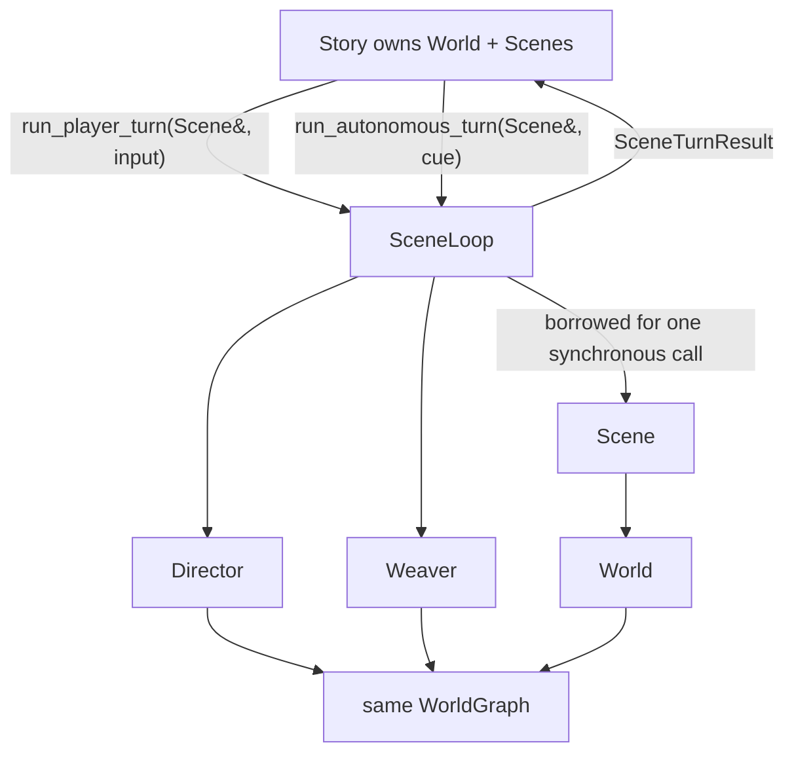

# SceneLoop

`SceneLoop` executes one scene turn. `Story` coordinates the larger Story advance: one player
scene turn, optional off-stage scene turn, lifecycle application, memory synchronization, and one
whole-Story save.

## Runtime boundary



The primary Story path supplies a `Scene&` for each call. The loop joins prior background work,
validates that Director and Weaver use that Scene's graph, executes the turn, joins the new
background work, returns one result, and detaches the Scene on success or failure.

```cpp
struct SceneTurnResult {
    std::string scene_id;
    int completed_turn;
    std::vector<SceneMessage> outputs;
    DirectorOutput director;
    WeaveResult weave;
    std::vector<ExpiryOp> expiry;
};
```

The older `load_scene` / `submit_input` / `join_background` / `last_*` API remains for
standalone compatibility. Story does not use its temporal result caches.

## Turn sequence

1. Join the preceding background job.
2. Snapshot history, dialogue, downsampler, turn index, World, resume state, and compatibility
   outputs.
3. Append the player input or autonomous cue.
4. Build the narrator instructions and turn-state prompt.
5. Call the narrator and split prose from the JSON plan.
6. Apply the plan through Director, retrying rejected plans with a restored World snapshot.
7. Apply resolved cast presence through Scene.
8. Emit narrator output, route new facts through World, emit authored NPC dialogue, and confirm
   possible deaths.
9. Dispatch background work.
10. For `run_*_turn`, join it, assemble `SceneTurnResult`, and detach the Scene.

NPC dialogue is stored in the dialogue history and returned in display outputs, but it is not added
to narrator history.

## Failure contract

A failed player or autonomous turn restores the complete snapshot: prose histories, turn index,
downsampler, shared World, pending lifecycle operations, compatibility result state, resume flag,
and loop state. A rejected narrator attempt restores the World before the rewrite call.

A graph-affinity mismatch fails before input or state mutation. The loop never silently rebinds a
Director or Weaver to another graph.

## Background work

The background future captures the exact Scene, Weaver, completed turn, and formatted graph context
for that turn. It does not capture `SceneLoop*`. Work order remains:

1. full or local Weaver pass;
2. expiry queue drain;
3. character-memory reflection;
4. history downsampling.

`join_background()` is the sole completion/stop boundary and transfers `BackgroundResult` into
the compatibility result fields. Scene switching, loop destruction, Story load, and Story undo join
before crossing a lifetime boundary.

## Ownership and persistence

- Story owns Scenes and co-owns their shared World.
- SceneLoop borrows Scene, Director, and optional Weaver.
- Director and Weaver borrow the same WorldGraph; bindings keep that graph alive.
- Story-backed execution is persisted only by Story after the full advance.
- `SceneLoop::set_saves_dir()` remains for standalone compatibility.
- `Story::revert_active_turns()` joins work, applies the existing scene-local rollback algorithm,
  marks the next prompt as resumed, and saves without rebuilding the loop.

## Implementation files

| File | Responsibility |
|---|---|
| `scene_loop.cpp` | public/compatibility API, transaction rollback, foreground sequencing, output and death confirmation |
| `scene_loop_narrator.cpp` | prompt construction, narrator call/retry, response parsing, cast and speech validation |
| `scene_loop_background.cpp` | graph context, async dispatch, stop/join, background result transfer |
| `story_advance.cpp` | player/off-stage sequencing, scheduler/lifecycle callbacks, memory synchronization |

The former public `scene_loop_support.h` and `scene_loop_support.cpp` helper module was removed;
its parser and cast helpers are private implementation details.

## Python composition

`server/rhapsode/session.py` constructs Story, Director, Weaver, Annotator, and SceneLoop. It binds
callbacks and invokes `Story.advance_scene()` in an executor. Undo calls
`Story.revert_active_turns()`; it does not replace SceneLoop.

## Deliberately unchanged behavior

The refactor does not decide the known questions around named player speech resolution, exhausted
narrator retries, the unused `LoopState::Weaving` value, newly created memory callback wiring, or
multi-scene undo semantics. Those require separate behavioral changes.
