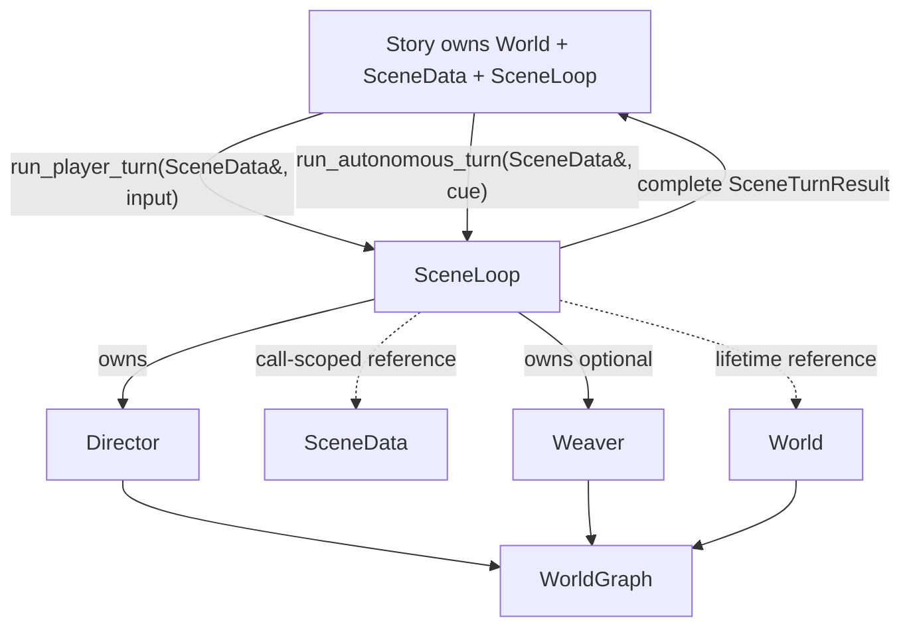

# SceneLoop

SceneLoop executes one complete turn. Story coordinates the larger advance: player turn,
lifecycle verdict, optional off-stage turn, memory synchronization, and complete persistence.

## Runtime boundary



SceneLoop receives World in its constructor. It retains no SceneData pointer between calls. There
is no `load_scene`, submit/drain API, runtime service setter, persistence path, or temporal result
cache.

```cpp
struct SceneTurnResult {
    std::string scene_id;
    int completed_turn;
    std::vector<SceneMessage> outputs;
    DirectorOutput director;
    WeaveResult weave;
    std::vector<ExpiryOp> expiry;
};
```

## Turn sequence

1. Snapshot the selected SceneData, World, and resume flag.
2. Append player input or the autonomous director cue.
3. Build narrator instructions and turn state from SceneData plus const World reads.
4. Call the narrator and split prose from the JSON plan.
5. Apply the plan through the owned Director.
6. On rejection, restore World and request a corrected plan.
7. Resolve cast presence through World membership operations.
8. Emit narrator and dialogue output and route new facts through World.
9. Confirm possible deaths and prepare the owned Weaver's expiry queue.
10. Run weave, expiry, reflection, and downsampling in one background future.
11. Join that future and return one complete SceneTurnResult.

NPC dialogue remains separate from narrator history. The output ordering and retry count are
unchanged.

## Failure contract

If foreground execution fails, SceneLoop stops any expiry drain, joins an existing background
future, restores SceneData and World snapshots, restores the resume flag, returns to Idle, and
rethrows the original exception.

Director and Weaver graph affinity is guaranteed by construction: SceneLoop creates both from the
same World supplied by Story. Runtime graph mismatch checks and Python lifetime wiring are no
longer needed in the production path.

## Background boundary

The future captures reference wrappers for the exact World, SceneData, and optional Weaver used by
the call. It does not capture SceneLoop. Work order remains:

1. full or local weave;
2. expiry queue drain;
3. character-memory reflection;
4. history downsampling.

`run_*_turn()` always joins before returning, including exception paths. Therefore Story load,
undo, lifecycle changes, and destruction never cross an active background borrow.

The downsampler callback is passed into processing for that call. SceneData and TextDownsampler do
not retain Python callbacks.

## Ownership and persistence

- Story exclusively owns SceneLoop, World, and SceneData records.
- SceneLoop owns Director and optional Weaver.
- SceneLoop borrows World for its lifetime and SceneData only during one call.
- Story alone performs complete persistence after an accepted advance or undo.
- SceneLoop contains no save directory or file operation.

## Implementation files

| File | Responsibility |
|---|---|
| `scene_loop.cpp` | synchronous transaction, foreground sequencing, output, death confirmation |
| `scene_loop_narrator.cpp` | prompt construction, narrator call/retry, plan/cast/speech validation |
| `scene_loop_background.cpp` | call-scoped async weave, expiry, reflection, and downsampling |
| `story_advance.cpp` | player/off-stage sequencing, lifecycle, scheduler, memory synchronization |

## Python composition

SceneLoop is not bound as a production Python class. `server/rhapsode/session.py` configures
callbacks on Story and invokes `Story.advance_scene()` in an executor. Standalone Director and
Weaver bindings remain available for graph inspection and maintenance tools.

## Deliberately unchanged behavior

This refactor preserves narrator prompts, retry count, dialogue semantics, lifecycle precedence,
save schema, turn output ordering, and the existing scene-local undo algorithm. Multi-scene undo
semantics remain a separate design question.

## Proposed replacement

SceneLoop is currently a synchronous-call boundary wrapped around immediately joined background
work, and its result exposes Director and Weaver types. The proposed
[runtime architectural decoupling plan](../episodes/2026-07-21-runtime-architectural-decoupling-plan.md)
would replace it with a genuinely synchronous TurnExecutor and a generic TurnResult. This section
describes proposed work, not current implementation.
