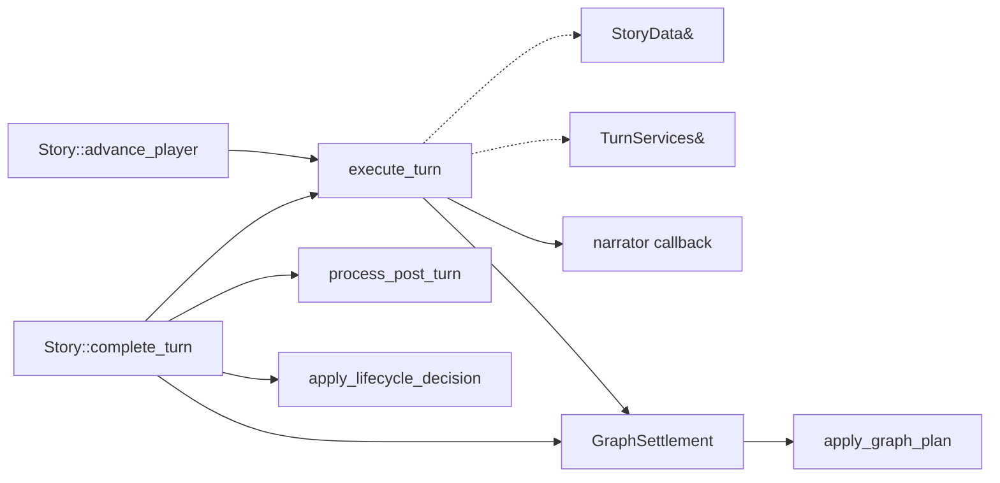

# Turn execution

Rhapsode has one narrative-turn function:
`execute_turn(StoryData&, TurnServices&, const TurnInput&)`. `TurnInput::Kind` selects player or
autonomous input; both paths use the same staging and commit logic. `Story` sequences this function
with later maintenance but does not forward through another executor object.

## Direct call structure

`advance_player` rejects a new input while a prior turn still awaits `complete_turn`. After a
successful commit it stores the scene ID, exact player input, and deferred graph settlement in
`PendingTurn`.

## One `execute_turn` call

The implementation order in `core/src/turn_pipeline.cpp` is:

1. Resolve the requested live scene.
2. Snapshot World, observations, the live scene, and the storyline board in a local `TurnRollback`.
   Generation mutates copies; an exception restores those snapshots from the destructor.
3. Build a `ReadToolLease` from a copy of World, observations, every live scene, and scene summaries.
4. Append the exact input to the candidate scene. Autonomous input is labeled `director_cue`; player
   input is labeled `player`.
5. Build narrator instructions and turn state, then run the narrator retry path.
   Instructions: author contract (player input is declaration, not outcome; the world
   stays in motion; baseline-first character play; silence is a legal take), then optional
   `Scene style` from `scene.system_prompt`, then format/schema. Turn state: on-stage
   roster with voice, latest monologue line as `On their mind` when present, off-stage
   names, other live threads, story so far, then the last attributed Player / Narrator /
   character spans from history **and** dialogue. Increment `turn_index` onto this beat
   (fresh scenes are `-1`, so the first beat is 0). After commit, `turn_index` is that
   last committed beat, not the next empty slot.
   Speech validation rejects Player cues and a mute cast only when the player input
   names a present NPC. An empty `speech_turns` list is otherwise legal.
6. Apply accepted cast additions to the candidate World.
7. Stage narrator prose and formatted character messages in the candidate scene and `TurnResult`.
8. Move the candidate World and scene into `StoryData`, advance the version once, and disarm rollback.
9. Notify the output callback. Notification failures are recorded; the committed turn is not replayed.
10. Return a `GraphSettlement` containing the scene/turn/version identity, this take's prose and
    plan, and the frozen read-tool lease. No graph model call runs in `execute_turn`.

An exception before step 8 restores World, observations, scene, version, and storyline board. This is
an in-process turn transaction, not crash-safe persistence.

## Snapshot reads

`make_frozen_story_read_tools` creates owned copies before generation. The callback may dispatch:

| Tool | Source |
|---|---|
| `query_graph` | Frozen `StoryData::observations` |
| `query_mind` | Frozen `StoryData::world` |
| `query_history` | Frozen narrator/history buffer |
| `query_transcript` | Frozen merged history and attributed-dialogue buffers |
| `list_scenes` | Frozen scene summaries |

`ReadToolLease::close` invalidates copied callback handles. The callback cannot become a long-lived
pointer into Story state.

The native `query_transcript` result preserves exact message content, role, speaker, scene, turn,
ordinal, and `message_ref`. The default narrator beat already uses that attributed timeline (last
16 spans). The Python tool schema still does not advertise `query_transcript`; keyword
`query_history` remains history-buffer only.

## Message identity

Committed turn messages carry:

| Metadata | Value |
|---|---|
| `turn` | Scene-local turn being completed |
| `turn_ordinal` | Input `0`, narrator `1`, characters `2...` |
| `message_ref` | `<scene>:v<transaction-version>:<kind>:<ordinal>` |
| `scene_kind` | `player`, `director_cue`, `narrator`, or `character` |
| `speaker` | Character identity on attributed dialogue |

References are deterministic within a committed turn and need no mutable global ID counter.

## Observation step

Graph extraction is the first step of `complete_turn`, after the server has delivered output and sent
`status: ready`. The settlement validates its scene, turn, and transaction version before calling the
model. It then copies World and observations, asks the narrator callback for `transitions` and
`new_nodes`, and calls the stateless `apply_graph_plan` function on those copies. Nodes stay on the
world ledger. Scene is not copied; extraction reads the committed scene and the deferred callback
retains the turn's frozen read snapshot.

On success, and only if the transaction version is still current, those copies replace the live
World and observations. Stale or failed work is discarded; the committed turn survives. The
graph-application function cannot access Story, SceneData, or mechanical World methods.

The observation step is derived semantic work. It does not increment the transaction version and is
not part of an all-or-nothing save transaction.

## `complete_turn`

`Story::complete_turn` consumes `PendingTurn` and then performs:

1. settle graph observations and synchronize their memory effects;
2. harvest ready perception/monologue (newest slot first) and catch-up-submit monologue if `perception_turn_ > monologue_turn_`;
3. graph weaving and expiry;
4. perceptions: `format_narration_window` (last 3 turns, 1800-char suffix). Empty window skips the new perception send. Otherwise async `submit_perceptions` into `slot[head]` (kill occupant), or blocking `update_perceptions` then `update_monologues`;
5. `end_mind_turn`: increment each on-stage character’s perception and monologue heads (`head = (head+1)%4`), even if that type skipped a send;
6. text downsampling;
7. lifecycle decision request and deterministic application;
8. turn-clock advancement;
9. selection and execution of up to two off-stage scene turns;
10. saving when configured.

Expiry drains batch up to eight disjoint entity groups and 80 live nodes per model call, under a
conservative prompt-size budget. Priority groups remain first. Overlapping groups are split across
calls to preserve serial semantics, and responses can expire only an older active node through a
newer node from the same group.

Each mind type is a 4-slot ring per character. Poll walks from `head` backwards and applies only the newest ready result; older done or in-flight jobs for that type are dropped. A late monologue uses `slot_for(perception_turn_)`, not `scene.turn_index` as a slot index. `Story.poll_minds` harvests and catch-up-sends; it does not increment heads and does not submit new perception.

Every selected off-stage scene calls the same `execute_turn` function with
`TurnInput::Kind::Autonomous`, then receives its own maintenance pass. A failure in one off-stage turn
is logged and does not replay the player turn.

## Present authority

The live path remains narrator-authored:

- the narrator produces prose and `speech_turns`;
- character lines are not separate actor calls;
- latest monologue lines enter the beat as private context (`On their mind`); they are not
  spoken and do not run a second actor call;
- cast operations are validated operations, not a general consequence declaration;
- graph nodes remain observations rather than mechanical facts.

The transaction structure contains several failure modes but does not establish long-horizon story
reliability.

## Limitations

- Output delivery occurs after commit and before graph extraction; clients must treat delivery errors
  as retryable notification failures, not failed turns.
- Maintenance and saving occur after the turn transaction and can fail independently.
- Narrator retry validation checks plan shape and the addressed-NPC speech rule, not semantic truth
  or character quality. The mind feed is one-turn lagged and empty on a fresh scene.
- No sequential evaluation shows that the current path preserves voice or causality for 100 or 300
  player turns.

## Implementation files

| File | Role |
|---|---|
| `core/src/turn_pipeline.cpp` | `execute_turn`: copy, prompt, commit, deliver, defer observation |
| `core/src/narrator_prompt.cpp` | Beat instructions, scene-style injection, turn-state mind feed |
| `core/src/turn_pipeline_narrator.cpp` | Narrator retry, cast apply, graph extraction |
| `core/src/turn_pipeline_post_turn.cpp` | Weaver, monologues, downsampling after commit |
| `core/src/story_advance.cpp` | `advance_player` / graph settlement / `complete_turn` spine |
| `core/src/story_lifecycle.cpp` | Fork, merge, conclude, and synthesize story-so-far |

## See also

- [[architecture/system-overview]]
- [[architecture/cpp-data-model]]
- [[architecture/pragmatic-turn-transaction-refactor]]
