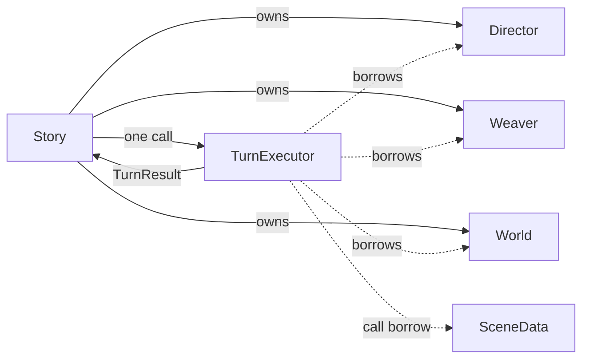

# Turn execution

`TurnExecutor` executes one synchronous, rollback-capable turn. It is not a loop and does not own
runtime composition, policy, persistence, external memory, or SceneData.

## Boundary



Director and Weaver must use the injected World's graph. Construction rejects a graph mismatch,
and there are no rebinding setters.

## Transaction order

1. Reject re-entry and snapshot SceneData, World, and resume state.
2. Append the player input or autonomous cue.
3. Build narrator instructions and turn state.
4. Invoke the narrator with a call-scoped read-tool function.
5. Parse and validate the merged prose/plan response.
6. Apply Director graph changes; on rejection, restore World and retry.
7. Resolve cast, emit narration/dialogue, and route perceptions.
8. Detect and confirm deaths.
9. Run post-turn work synchronously: weave, expiry, reflection, downsampling.
10. Return generic effects and emitted messages.

An RAII execution guard owns the re-entry flag, including while snapshots are being copied. An
exception restores the snapshots and leaves the executor reusable. Post-turn failures remain
non-fatal, matching the pre-refactor behavior.

## Callback boundary

Narrator, scheduler, and lifecycle callbacks receive a read function with this logical shape:

```cpp
string read_tool(string name, string args_json);
```

Story creates it for one callback call from a `ReadToolContext` containing only const World/history
borrows, the scene ID, and pre-serialized live-storyline summaries. The callback captures no Story.
Python adapters do not capture Story, and retained use after the call throws
`Read tool callback is no longer active`. C++ dispatches only the existing read tools: graph, mind,
history, and live-storyline summaries.

`storyline_policy` builds a plain BeatSummary containing the completed narration and dialogue. Its
`other_storylines` payload excludes the scene being judged. The lifecycle callback may inspect the
same read tools before returning a plain LifecycleDecision; contradictory terminal/fork/exit
combinations are rejected before Story applies anything.

Fork and merge use the narrator callback outside normal turn execution to synthesize continuity.
Both validate the response before changing scenes or membership. Conclusion makes no extra LLM
call: Story records the completed beat as a compact closure, expires the fork-owned intention, and
retires the scene. See the implemented
[storyline lifecycle continuity plan](../episodes/2026-07-22-storyline-lifecycle-continuity-plan.md).

## Result boundary

`TurnResult` contains only stable public values:

- `scene_id` and `completed_turn`;
- output SceneMessages;
- created and expired Nodes.

Story uses those effects to synchronize MemorySystem. It does not know Director or Weaver result
types.

## Concurrency

Turn execution is synchronous. There is no internal future or background reference capture. The
FastAPI layer may place the complete `Story.advance_scene()` call on a worker thread so the event
loop remains responsive; that does not change native ownership or operation order.
