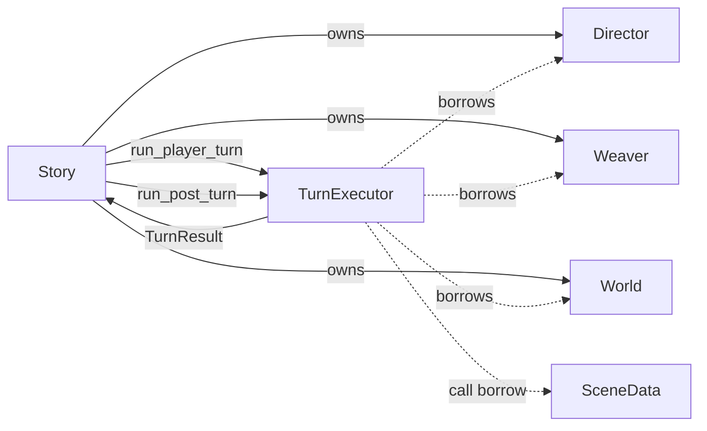

# Turn execution

`TurnExecutor` executes the **player beat**: one synchronous, rollback-capable narrator transaction
through expiry-queue rebuild. It does not own runtime composition, policy, persistence, external
memory, or SceneData. **Post-turn** (weave → expiry drain → reflection → downsample) is a separate
public call that Story runs after the beat.

## Terms

| Term | Code meaning |
|------|----------------|
| Player beat | `execute_turn` / `run_player_turn` through expiry-queue rebuild (no `run_post_turn`) |
| Post-turn | `TurnExecutor::run_post_turn`: weave → expiry drain → reflection → downsample |
| Story turn | player beat → post-turn → lifecycle → `note_advanced` → off-stage → save |

`Story::advance_player` runs the beat and holds a pending turn. `Story::complete_turn` finishes the
Story turn (post-turn is its first step, not its name).

## Boundary



Director and Weaver must use the injected World's graph. Construction rejects a graph mismatch,
and there are no rebinding setters.

## Transaction order

Player beat (inside `TurnExecutor`):

1. Reject re-entry and snapshot SceneData, World, and resume state.
2. Append the player input or autonomous cue.
3. Build narrator instructions and turn state.
4. Invoke the narrator with a call-scoped read-tool function.
5. Parse and validate the merged prose/plan response.
6. Apply Director graph changes; on rejection, restore World and retry.
7. Resolve cast, emit narration/dialogue, and route perceptions.
8. Detect and confirm deaths; rebuild the expiry queue. Set `post_turn_index` and return.

Story then runs post-turn and the rest of the Story turn:

9. `run_post_turn` (weave, expiry, reflection, downsampling) — failures remain non-fatal.
10. Lifecycle, `note_advanced`, off-stage steps, optional save.
11. Return emitted messages (player outputs from the beat; merge outputs from off-stage if any).

An RAII execution guard owns the re-entry flag, including while snapshots are being copied. An
exception restores the snapshots and leaves the executor reusable.

## Callback boundary

Narrator, scheduler, and lifecycle callbacks receive a read function with this logical shape:

```cpp
string read_tool(string name, string args_json);
```

Story creates it for one callback call from a `ReadToolContext` containing only const World/history
borrows, the scene ID, and pre-serialized live-storyline summaries. The callback captures no Story.
Python adapters do not capture Story, and retained use after the call throws
`Read tool callback is no longer active`. C++ dispatches only the existing read tools: graph, mind,
history, and live-storyline summaries.

`storyline_policy` builds a plain BeatSummary for the scene that just stepped, plus a full
board of live storyline rows (`recent_narration` for lifecycle only; `list_scenes` keeps the
short `last_narration`). The lifecycle callback returns an ordered op list
(`merge` / `conclude` / `fork` / `exit`) that may target any storyline; Story applies each op
independently after revalidation (merge first). Forks are restricted to the just-advanced scene.
The scheduler may pick up to two off-stage scenes per turn, with a staleness starvation guard.

Fork and merge use the narrator callback outside normal turn execution to synthesize continuity.
Both validate the response before changing scenes or membership. Conclusion makes no extra LLM
call: Story records the completed beat as a compact closure, expires the fork-owned intention, and
retires the scene. See the implemented
[storyline lifecycle continuity plan](../episodes/2026-07-22-storyline-lifecycle-continuity-plan.md).

## Result boundary

`TurnResult` contains only stable public values:

- `scene_id`, `completed_turn`, and `post_turn_index` (pre-increment turn for `run_post_turn`);
- output SceneMessages;
- created and newly expired Nodes from the beat (not post-turn expiry drain).

Story uses those effects to synchronize MemorySystem. It does not know Director or Weaver result
types.

## Concurrency

Turn execution is synchronous. There is no internal future or background reference capture. FastAPI
runs `Story.advance_player()` on a worker thread, streams those outputs over the WebSocket, then
runs `Story.complete_turn()` (still on a worker) so weave/reflection/downsample can overlap with
the client reading player prose. Input stays `processing` until `complete_turn` returns; there is
no token streaming and no early `idle`.
