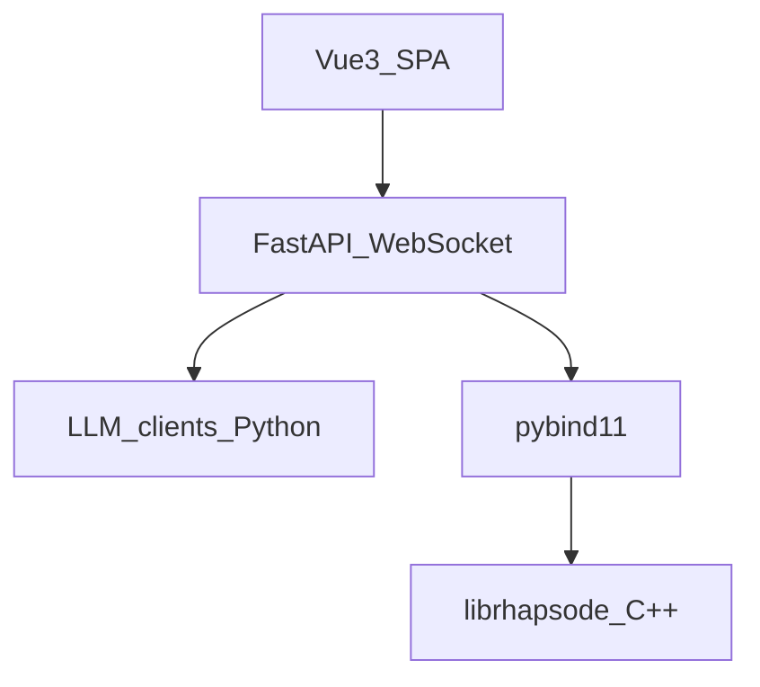

# Stack

## Layer diagram



## Layer responsibilities

| Layer | Technology | Responsibility |
|-------|------------|----------------|
| UI | Vue 3 + TypeScript | Chat view, connection state, scenario display |
| API | FastAPI + WebSocket | Session management, message ingress, push responses |
| Bridge | pybind11 | Expose `Scene`, `History`, `SceneLoop` to Python |
| Core | C++17 | Scene state, loop control, JSON serialization |
| LLM | Python SDKs / HTTP | Google Gemini (primary), OpenAI (secondary) |

**MVP+** adds a **memory** module (embeddings in Python, vectors into C++ **hnswlib** backend). Not part of first playable demo.

## Repository layout

```
Rhapsode/
├── AGENTS.md                # Wiki maintenance contract (tracked)
├── README.md                # Project readme (tracked)
├── raw/                     # Reference sources (tracked)
│   └── sources.md
├── wiki/                    # Obsidian vault (tracked)
│   ├── .obsidian/
│   ├── index.md
│   ├── architecture/
│   ├── concepts/
│   └── decisions/
├── core/                    # C++17 library: librhapsode
│   ├── CMakeLists.txt
│   ├── include/rhapsode/    # Public headers
│   │   ├── scene_message.h
│   │   ├── history.h
│   │   ├── character.h
│   │   ├── scene.h
│   │   └── scene_loop.h
│   ├── src/                 # Implementation
│   │   ├── history.cpp
│   │   ├── scene.cpp
│   │   └── scene_loop.cpp
│   └── tests/
│       └── test_scene.cpp
├── bindings/                # pybind11 module: rhapsode._core
│   ├── CMakeLists.txt
│   └── bind_rhapsode.cpp
├── server/                  # Python: FastAPI + LLM clients
│   ├── pyproject.toml
│   ├── rhapsode/
│   │   ├── __init__.py
│   │   ├── app.py           # FastAPI application factory
│   │   ├── ws.py            # WebSocket endpoint
│   │   ├── session.py       # Session state management
│   │   ├── prompt.py        # Prompt builder
│   │   └── llm/
│   │       ├── __init__.py
│   │       ├── base.py      # BaseLLMClient ABC
│   │       ├── gemini.py    # Google Gemini client
│   │       └── openai.py    # OpenAI client
│   └── scenarios/
│       └── tavern.json      # Sample scenario
├── frontend/                # Vue 3 SPA
│   ├── package.json
│   ├── vite.config.ts
│   ├── tsconfig.json
│   └── src/
│       ├── App.vue
│       ├── main.ts
│       ├── components/
│       ├── stores/
│       └── types/
└── CMakeLists.txt           # Top-level CMake (core + bindings)
```

## Build system

| Component | Tool | Command |
|-----------|------|---------|
| C++ core + bindings | CMake 3.20+ | `cmake -B build && cmake --build build` |
| Python package | pip / uv | `pip install -e ./server` (imports `rhapsode._core` from built binding) |
| Vue frontend | Vite | `cd frontend && npm install && npm run dev` |

The top-level `CMakeLists.txt` builds both `librhapsode` (static library) and the pybind11 module (`_core.pyd` / `_core.so`). The pybind11 `.so`/`.pyd` is placed where the Python package can import it (e.g. `server/rhapsode/_core.so` or installed via CMake install rules).

## Dependencies

### C++ (vendored or fetched via CMake FetchContent)

| Library | Version | Purpose |
|---------|---------|---------|
| [nlohmann/json](https://github.com/nlohmann/json) | 3.11+ | JSON serialization for Scene, History, SceneMessage |
| [pybind11](https://github.com/pybind/pybind11) | 2.12+ | C++ <-> Python bindings |
| [Catch2](https://github.com/catchorg/Catch2) | 3.x | C++ unit tests (optional, dev only) |

### Python (`server/pyproject.toml`)

| Package | Version | Purpose |
|---------|---------|---------|
| fastapi | 0.111+ | HTTP/WebSocket framework |
| uvicorn | 0.30+ | ASGI server |
| websockets | 12+ | WebSocket protocol (uvicorn dependency) |
| google-genai | latest | Google Gemini API client |
| openai | 1.x | OpenAI API client |
| pydantic | 2.x | Request/response models |

### Frontend (`frontend/package.json`)

| Package | Version | Purpose |
|---------|---------|---------|
| vue | 3.4+ | UI framework |
| pinia | 2.x | State management (WebSocket store) |
| typescript | 5.x | Type safety |
| vite | 5.x | Dev server + bundler |
