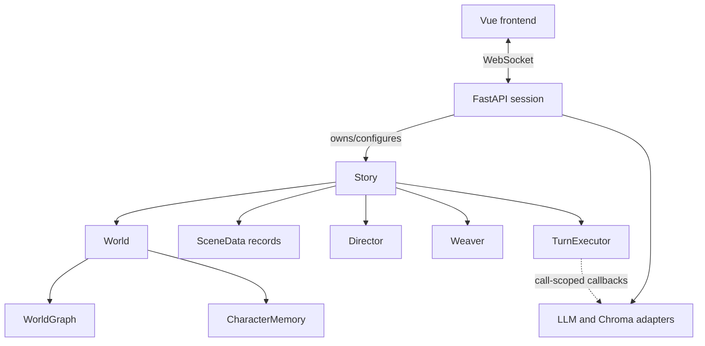

# System overview

Rhapsode is a local C++ narrative runtime wrapped by pybind11, a FastAPI WebSocket server, and a Vue
frontend. The native Story aggregate is the authoritative playthrough state and use-case boundary.

## Native runtime

- Story owns World, SceneData records, Director, Weaver, and TurnExecutor.
- World owns objective graph state, roster/membership, and character minds.
- SceneData stores behavior-free per-storyline values.
- TurnExecutor executes one synchronous transaction and returns generic effects.
- Free-function modules implement policy, queries, scenario bootstrap, history, and downsampling.

See [[architecture/cpp-data-model]] and [[architecture/scene-loop]].

## Turn flow

1. The WebSocket endpoint receives player text and calls `Story.advance_scene()` off the asyncio
   event loop.
2. Story executes the active player scene through TurnExecutor.
3. The narrator may use graph, mind, history, and storyline read tools through a call-scoped
   function.
4. Story validates and applies a lifecycle decision.
5. The scheduler may select one off-stage storyline; Story executes it through the same boundary.
6. Story synchronizes external semantic memory and persists the complete aggregate when configured.
7. Emitted SceneMessages return to the WebSocket and Vue client.

## Graph and minds

WorldGraph is the objective fact/relationship graph. Director applies the narrator's structured plan
to it. Weaver periodically repairs and expires graph relationships.

Each non-player CharacterMemory owns a subjective WorldGraph. Routed perception and reflection
populate it.

External MemorySystem/Chroma storage is an adapter owned at the Story/session boundary; World does
not depend on it.

## Engineering constraints

- one composition owner, no native manager hierarchy;
- no internal asynchronous state or immediately joined background task;
- rollback on foreground turn failure;
- non-fatal post-turn maintenance failures;
- durable JSON schema preserved across the architectural refactor;
- Python cannot rewrite invariant-bearing SceneData or World containers;
- no persistent Python callback captures of Story.

## Future design

Research pages describe richer graph triggers, companion cognition, and narrative planning. Those
ideas are not part of the current runtime ownership model unless their pages explicitly say they are
implemented.
