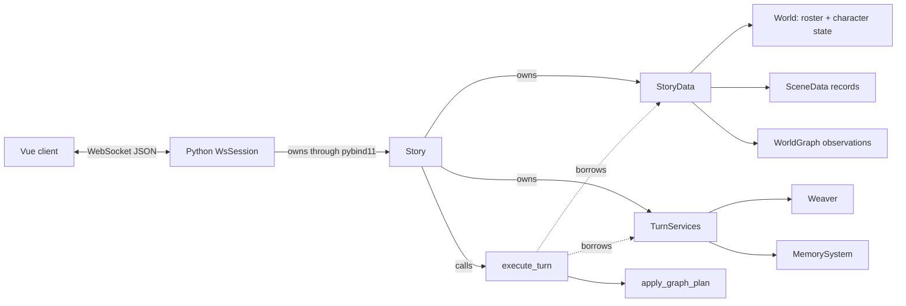

# Current executable system baseline

Rhapsode is a C++17 narrative runtime exposed through pybind11, hosted by a FastAPI WebSocket
session, and displayed by a Vue client. One native `Story` owns one playthrough. Its core dependency
shape has one public Story type, two owned aggregates, and one turn function.

## Dependency shape

`Story` is the API and composition root. `StoryData` contains playthrough data. `TurnServices`
contains callbacks, configuration, and the stateful services used by turn operations.
`execute_turn(StoryData&, TurnServices&, TurnInput)` handles both player and autonomous narrative
turns.

The C++ core has no `TurnExecutor` class and no `Director` class. Graph updates go through
`apply_graph_plan`. Python weaves with `Story.weave_scene` and inspects graphs with `analyze_graph`;
there is no Python `Director` or `Weaver` constructor.

## Turn and maintenance boundaries

`Story::advance_player` invokes one `execute_turn` transaction. The function copies the current
`World` and active `SceneData`, appends the exact input to the candidate scene, calls the narrator,
stages output, checks `StoryData::transaction_version`, and commits the candidate World and scene.

`Story::complete_turn` performs work that is deliberately outside that transaction:

- graph weaving and expiry;
- character monologue updates;
- text downsampling;
- lifecycle decisions;
- selected autonomous scene turns;
- saving.

The split lets the server deliver the player-turn output before slower maintenance. It also means a
successful `advance_player` is not rolled back when later maintenance or saving fails.

## State and authority

| Data | Owner | Authority |
|---|---|---|
| Roster, membership, life status, character minds | `StoryData::world` | Coded state changed through World/Story operations |
| Scene transcript and scheduling state | `StoryData::scenes` | Committed playthrough record |
| Active scene, closures, turn clock | `StoryData` | Story lifecycle state |
| Observation nodes and edges | `StoryData::observations` | Fallible semantic state; no direct mechanical authority |
| Callbacks, Weaver queue, timing, history window | `TurnServices` | Runtime service state, not story evidence |

The observation graph is physically separate from the live `World`. A standalone `World` still has a
graph slot and `state_version` field so old saves and the historical Python `World` API remain
compatible. `import_world` extracts those compatibility fields into `StoryData`; `snapshot_world`
reattaches them only when saving or returning a detached Python snapshot.

## Read boundary

Every model tool callback receives a `ReadToolLease` over a copied snapshot of World, observations,
all live scenes, and scene summaries. The lease expires after the call. A retained callback cannot
read future live state.

The native dispatcher supports graph, mind, history, attributed transcript, and scene-list queries.
The production narrator schema currently advertises graph, mind, history, and scene-list queries;
`query_transcript` remains a tested but unadvertised path.

## Graph observations

After the turn commit, a separate model call extracts graph transitions and new nodes.
`apply_graph_plan` is a stateless function over an explicit `WorldGraph&`.

Successful nodes may seed character perceptions. Extraction failure restores the committed World,
scene, and prior observations while preserving the committed transcript.

This boundary prevents graph output from directly killing a character or rewriting the committed
turn. It does not prove the graph harmless: retrieval, perceptions, and later generation can still be
biased by an incorrect observation.

## Compatibility surface

- Python still calls `Story.advance_player()` and `Story.complete_turn()`.
- Python scene and World access returns detached values; it cannot mutate the live `StoryData`.
- Old saves still store graph and version fields inside `world.json` and load through the compatibility
  conversion.
- Eval `story.txt` is `Story::render_transcript()`: live Main/Off-stage scenes, `[Fork]`/`[Merge]`
  notes on the parent timeline, archived `## Fork — id (merged into …)` closures, and `## Concluded`
  closures.

## Limitations

- The narrator still authors prose, character dialogue, and live cast suggestions in one response.
- Characters do not yet own their final lines.
- Consequences are not declared before prose.
- The transaction version covers committed turn/lifecycle mutations, not every derived graph,
  summary, or service update.
- `complete_turn` and multi-file saves have no all-or-nothing checkpoint.
- Native tests establish mechanical behavior and containment, not 100- or 300-turn narrative
  reliability.

## See also

- [[architecture/scene-loop]]
- [[architecture/cpp-data-model]]
- [[architecture/pragmatic-turn-transaction-refactor]]
- [[architecture/python-server]]
