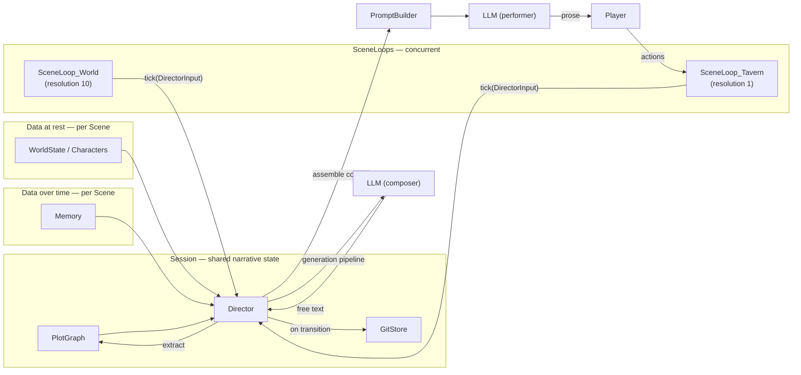
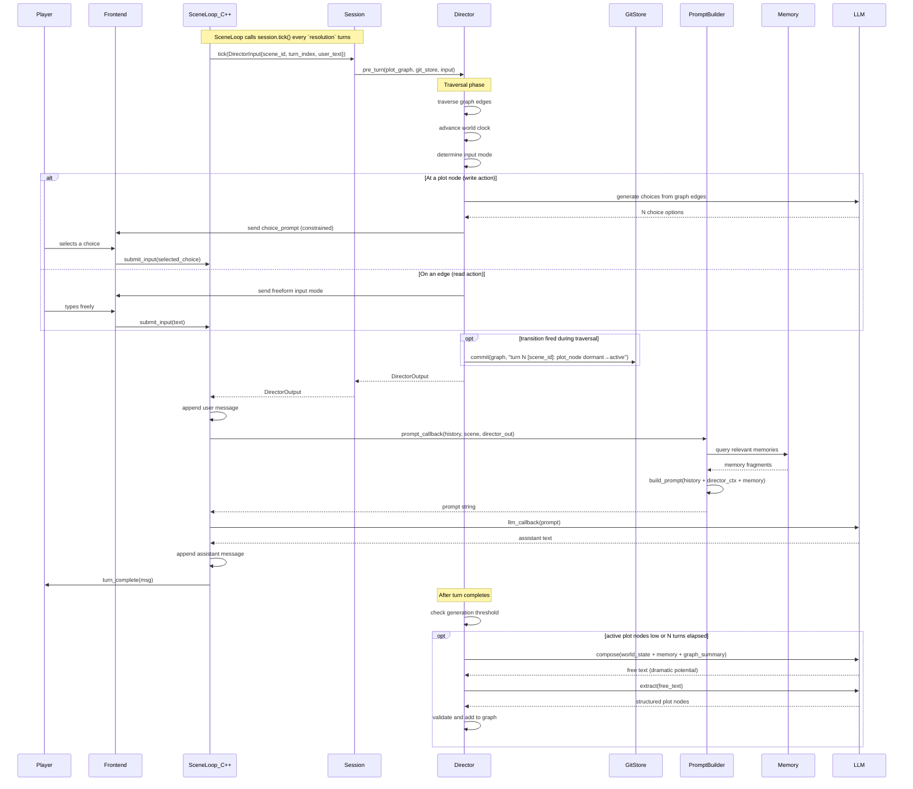

# System overview

Engineering summary of the Rhapsode architecture. This document translates the narrative philosophy ([[narrative-philosophy]]) into concrete subsystems, data structures, and control flows.

## Architecture layers



### Session — the shared narrative container

`Session` is the top-level C++ object. It owns:

- **`PlotGraph`** — the DAG of plot nodes (shared across all scenes)
- **`GitStore`** — libgit2-backed persistence and history of the graph
- **`Director`** — deterministic control loop that traverses the graph

Multiple `SceneLoop` instances (each driving a `Scene`) share one `Session`. A `SceneLoop` calls
`session.tick(DirectorInput)` each turn; the `Session` serialises access with a mutex and delegates
to `Director::pre_turn`. Each scene has a **`resolution`** parameter: `resolution = 1` means the
Director ticks every turn (interactive scenes); `resolution = N` means it ticks once every N turns
(background world scenes running asynchronously at a slower cadence).

This architecture is the foundation for concurrent scenes — a tavern scene driven by player input
and a world scene advancing NPC agendas in the background can share the same plot node graph without
conflicting.

### 1. World State (data at rest)

Characters, locations, relationships, facts. Stored as structured data (C++ structs, JSON serialization).

Already built: `Scene`, `Character`, `History`, `SceneMessage`.

`Scene` is now a **local view** — it holds the history and characters for one location/context.
It does not own the `PlotGraph`. Shared narrative structure lives in `Session`.

### 2. Memory (data over time)

The emotional backbone. Three layers:

| Layer | Contents | Lifespan |
|---|---|---|
| Raw recent | Last N messages, verbatim | Current context window |
| Summarized archive | Compressed older history | Permanent, grows over time |
| Vector store | Embedded event chunks, scored by importance | Permanent, queried by similarity |

Input to every LLM call via the prompt builder. Ensures the world remembers what happened and what it meant.

#### Importance scoring

Every memory entry receives an **importance score** (float, 0.0 to 1.0) at write time. The score affects:

- **Retrieval priority** -- higher-importance entries rank above lower-importance ones at equal similarity distance
- **Decay resistance** -- low-importance memories can be pruned or further compressed over time; high-importance ones persist at full detail

Three sources contribute to the score:

| Source | Mechanism | Example |
|---|---|---|
| **Plot graph** | Plot node activation/resolution tags associated events as high-importance | "barkeep killed" = 0.9 |
| **Turn dynamics** | Director detects structural signals (new character, betrayal, death, revelation) | "first encounter with the knight" = 0.7 |
| **LLM assessment** | During the generation pipeline (not during player turns), the LLM rates which recent events were significant | "the player's mercy was a turning point" = 0.8 |

Default score for ordinary dialogue is 0.3. The importance score is **write-once** -- it doesn't change after the memory is stored. This keeps the memory system simple and deterministic.

#### Retrieval strategy

Memory retrieval combines three signals, following Generative Agents ([[literature-review#Generative Agents]]):

| Signal | Mechanism |
|---|---|
| **Recency** | Exponential decay from last access (biases toward recent context) |
| **Importance** | The write-time importance score (biases toward significant events) |
| **Relevance** | Embedding cosine similarity to the retrieval query |

All three are normalized and combined. The retrieval query is the Director's assembled context for the current turn (active plot nodes + world state), following RecurrentGPT's plan-as-retrieval-query pattern ([[literature-review#RecurrentGPT]]).

#### Short-term memory rewrite

The "raw recent" layer has a **fixed token budget**. Each turn, the LLM rewrites the working summary with explicit instructions to drop stale facts and add new ones — not simple truncation, but active compression. This follows RecurrentGPT's bounded STM rewrite pattern.

#### Per-NPC memory

NPCs maintain **subjective memory slices** — they remember what they witnessed or were told, not objective truth. This enables secrets, unreliable narrators, and information asymmetry. Memory propagation happens through NPC dialogue (social diffusion), following Generative Agents.

Not yet built. Next major implementation target.

### 3. Plot Graph (narrative state machine)

A directed acyclic graph where nodes are **plot nodes** -- latent facts about the world that could become dramatically relevant.

#### Node structure

```
PlotNode {
    id:               string
    type:             enum (secret, conflict, clock, consequence, object, event, rule)
    state:            enum (dormant, foreshadowed, active, resolved)
    description:      string
    characters:       list[string]
    foreshadow_ctx:   string       // injected into prompt when foreshadowed (hints, not prose)
    active_ctx:       string       // injected into prompt when active (directional constraint)
    trigger:          Trigger      // the T in the F-T-P triple
    consequences:     list[Mutation] // world state changes on activation/resolution
    knowledge:        KnowledgeState
    stall_budget:     int          // max turns in active state before force-advance
    placeholders:     map[string, string | null]  // named slots resolved at runtime
}

KnowledgeState {
    player_known:     bool
    npc_known:        list[string] // character IDs aware of this plot node
    hidden:           bool         // exists in graph but unknown in-world
}
```

#### Edge structure

```
Edge {
    source:    plot_node_id
    target:    plot_node_id
    trigger:   Trigger
}

Trigger = one of:
    PlayerAction { tags: list[string] }
    TurnCount    { threshold: int }
    WorldCondition { predicate: string }
    PlotNodeState { plot_node_id: string, state: enum }
```

The graph is **mutable at runtime** -- new nodes are added by the generation pipeline. Traversal is `O(edges)` per turn. Pure data structure, no LLM involvement.

Not yet built. Implementation target after memory.

### 4. Director (control loop)

The rhapsode. Arranges LLM-generated fragments into coherent narrative experience. See [[narrative-philosophy#1. The Director is a rhapsode -- an arranger, not a puppeteer]].

Four operations per turn, always in this order:

1. **Traverse** -- walk all edges, fire any whose trigger condition is met, update node states
2. **Advance world clock** -- tick turn-based triggers, run background loop for off-screen events
3. **Determine input mode** -- check if the player has arrived at a plot node requiring a write action (constrained choices) or is mid-edge (freeform). See [[narrative-philosophy#6. The interface is part of the dramaturgy — read actions vs. write actions]].
4. **Assemble context** -- collect prompt fragments from all `foreshadowed` and `active` nodes, pass to prompt builder. If constrained-choice mode, also generate choice options grounded in available graph edges.

Periodically invokes the **generation pipeline** (see below).

#### Literature-informed additions

The following mechanisms are adopted from the literature review ([[literature-review]]):

**Stall budgets.** Each `active` plot node has a maximum turn count before the Director force-advances or escalates. Prevents indefinite stalling on unresolved plot nodes. Adopted from IBSEN's 9-turn cap.

**Knowledge-state scheduling.** The Director uses per-plot-node knowledge state (`player_known`, `npc_known`, `hidden`) to decide revelation timing. Default policy: prefer dramatic irony (player knows before character) over surprise reveals. See [[plot-graph#Knowledge state and revelation timing]].

**Narrowing policy.** When multiple resolution paths exist for a plot node, close the easiest/most obvious ones first to build pressure. The remaining options feel progressively more desperate. Adopted from Suspenseful Stories' rational ordering heuristic.

**Motivation check.** Before the Director arranges an NPC action through the plot graph, it can validate plausibility: "given this character's memory and personality, is the motivation for this action established?" This is a lightweight alignment gate between Director intent and simulator believability. Adopted from StoryVerse.

**Supersession vs. contradiction.** When evaluating freeform player actions against graph state, the Director distinguishes "the world legitimately changed" (update facts, trim validity) from "this is inconsistent" (block or repair). Adopted from FACTTRACK's dual-threshold approach.

#### Five rules for keeping the world interesting

The Director enforces these mechanical properties to ensure the story never goes flat:

**1. Minimum plot node floor.** The Director maintains a minimum count of `active` + `foreshadowed` plot nodes (e.g. 3). When the count drops below the threshold, the generation pipeline fires immediately -- not on a timer, but on demand. The world should never be at rest.

**2. Timescale balance.** Active plot nodes should span multiple timescales:

| Timescale | Horizon | Effect |
|---|---|---|
| Immediate | This turn | Urgency -- the stranger reaches for a knife |
| Short-term | 5-10 turns | Pressure -- the guild's deadline approaches |
| Long-term | 30+ turns | Weight -- the kingdom edges toward civil war |

If all plot nodes cluster at one timescale, the generation pipeline should bias new plot nodes toward the missing horizons.

**3. NPC autonomy.** NPCs have goals and act on them off-screen via the world-background loop. When the player encounters an NPC, they are mid-action, not standing around waiting. The barkeep is trying to solve his debt. The knight is planning to flee. The assassin is gathering information. This is free drama -- the player walks into situations already in motion.

**4. Disproportionate consequences.** Small player actions should cascade into unexpected outcomes. The generation pipeline prompt includes guidance: "Consider how recent player actions, even minor ones, could have unexpected consequences." The player buys a drink for a stranger -- that stranger turns out to be the guild leader's daughter. The player ignores a rumor -- three turns later, the thing the rumor warned about happens.

**5. Reputation propagation.** Player actions spread through NPC awareness via memory. Events tagged with the player as actor are propagated to relevant NPCs. The prompt builder includes world context like "the barkeep has heard that you helped the merchant." This creates a feedback loop: the player's actions change how the world treats them, which creates new dramatic situations.

Not yet built. Implementation target after plot graph.

## Control flow per turn



## Generation pipeline

The plot graph is LLM-generated and Director-maintained. See [[plot-graph#The generation pipeline]] for full detail.

Summary:

1. **Compose** -- LLM reads world state + memory + current graph summary, writes free text describing new dramatic potential. Creative, unconstrained.
2. **Extract** -- second LLM call (or cheaper model) parses the free text into structured plot nodes. Validates against world state (no duplicates, no phantom characters).
3. **Insert** -- validated nodes are added to the plot graph as dormant plot nodes.

Three triggers for generation:

| Trigger | When |
|---|---|
| Scenario initialization | Once, before the player starts |
| Periodic world-building | Every N turns |
| Reactive spawning | After a major plot node resolves |

The pipeline is **lossy by design**. If extraction fails, the raw text is discarded. The system degrades to "fewer new plot nodes" rather than "broken graph."

## Engineering constraints

1. **The Director never calls the LLM synchronously during a player turn.** Graph traversal and context assembly are deterministic. The generation pipeline runs asynchronously between turns.
2. **The plot graph is serializable.** `PlotGraph::to_json()` / `from_json()` must round-trip cleanly. The `GitStore` commits `plot_nodes.json` on every transition.
3. **Trigger evaluation is a predicate engine.** Not free-form NLP. Start with simple tag-based matching for player actions, upgrade later.
4. **The generation pipeline is lossy.** Failed extraction = discarded text, not corrupt state.
5. **Each subsystem is independently testable.** Memory without plot graph. Plot graph without Director. Director without generation pipeline. Layer by layer, like the C++ core was built.
6. **Session is the unit of concurrency.** Multiple `SceneLoop`s share one `Session`. The `Session::tick()` method acquires a mutex before calling `Director::pre_turn`, keeping graph writes single-threaded. Loop cadence (resolution) is set per-loop; Python manages the async scheduling of loops.
7. **`Scene` is a view, not a container.** `Scene` holds only local state (`History`, `Characters`). `PlotGraph`, `GitStore`, and `Director` live in `Session`.

## Implementation roadmap

| Phase | What | Depends on |
|---|---|---|
| **MVP v0** (done) | SceneLoop, Scene, History, Characters, FastAPI, Vue, Gemini | -- |
| **Memory** | Event log, vector store, summary layer, memory-aware prompt builder | Existing Scene/History |
| **Plot graph + GitStore** | Plot node structs, edges, trigger predicates, `GitStore` via libgit2 | Nothing (pure data) |
| **Session** | `Session` class owning PlotGraph + GitStore + Director; `session.json` schema | Plot graph, git store |
| **Director** | Traversal, world clock, context assembly, `SceneLoop` integration with resolution tick | Session, memory, prompt builder |
| **Multi-scene** | Second SceneLoop (world scene) running at resolution > 1, Python asyncio management | Session, Director |
| **Generation pipeline** | Compose + extract LLM calls, validation, async scheduling | Director, LLM client |
| **Visual editor** | Plot graph inspection/editing UI; git log replay | Plot graph serialization, GitStore.log() |

## References

- [[narrative-philosophy]] -- the five design principles
- [[plot-graph]] -- the narrative state machine in detail
- [[scene-loop]] -- the C++ FSM (already built)
- [[coding-guidelines]] -- Karpathy: simplicity first, no speculative abstractions
- [GRRM on outlines](https://www.youtube.com/watch?v=XF1PyB5v9jI) -- "outlining is like retelling a story you've already told in shorthand"
- [GRRM architects vs gardeners](https://www.youtube.com/watch?v=nK6VoL76r3Q) -- Rhapsode is a computational gardener
- [Vonnegut shapes of stories](https://storytellingedge.substack.com/p/the-simple-shapes-of-great-stories) -- the arc emerges, it isn't tracked
