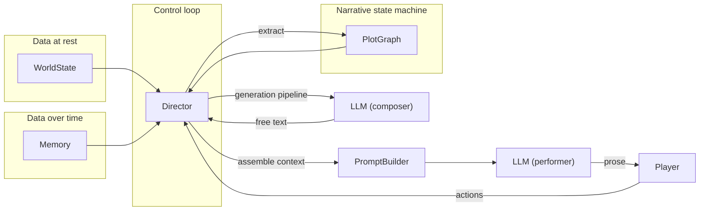
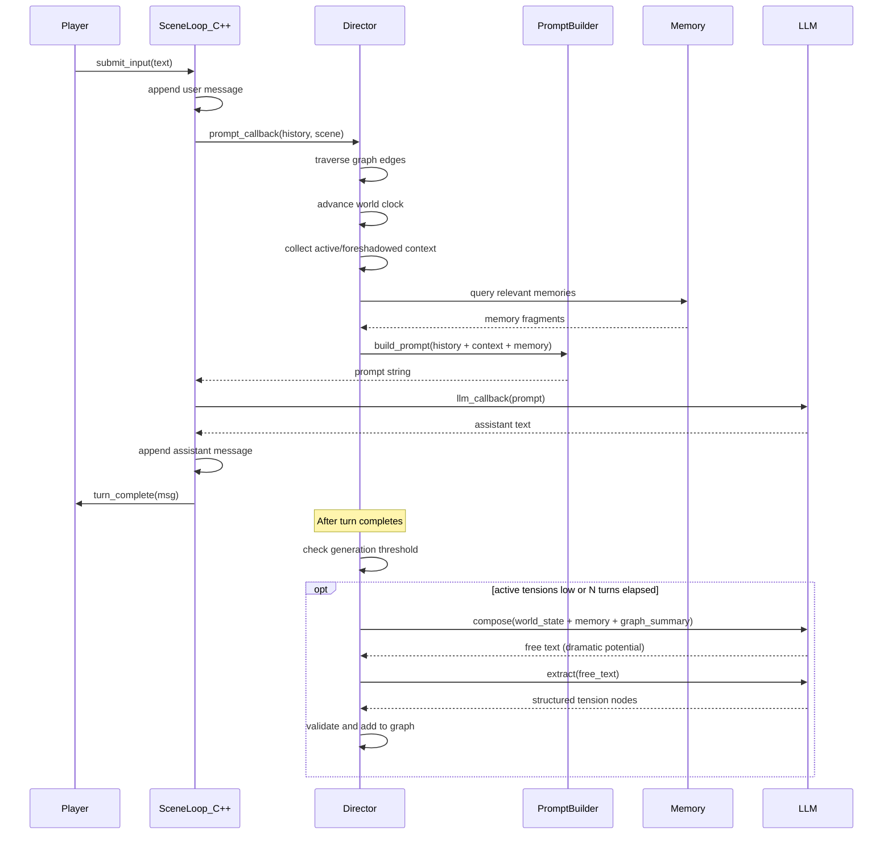

# System overview

Engineering summary of the Rhapsode architecture. This document translates the narrative philosophy ([[narrative-philosophy]]) into concrete subsystems, data structures, and control flows.

## Four subsystems



### 1. World State (data at rest)

Characters, locations, relationships, facts. Stored as structured data (C++ structs, JSON serialization).

Already built: `Scene`, `Character`, `History`, `SceneMessage`.

### 2. Memory (data over time)

The emotional backbone. Three layers:

| Layer | Contents | Lifespan |
|---|---|---|
| Raw recent | Last N messages, verbatim | Current context window |
| Summarized archive | Compressed older history | Permanent, grows over time |
| Vector store | Embedded event chunks, scored by importance | Permanent, queried by similarity |

Input to every LLM call via the prompt builder. Ensures the world remembers what happened and what it meant.

#### Importance scoring

Every memory entry receives an **importance score** (float, 0.0 to 1.0) at write time. The score affects:

- **Retrieval priority** -- higher-importance entries rank above lower-importance ones at equal similarity distance
- **Decay resistance** -- low-importance memories can be pruned or further compressed over time; high-importance ones persist at full detail

Three sources contribute to the score:

| Source | Mechanism | Example |
|---|---|---|
| **Plot graph** | Tension activation/resolution tags associated events as high-importance | "barkeep killed" = 0.9 |
| **Turn dynamics** | Director detects structural signals (new character, betrayal, death, revelation) | "first encounter with the knight" = 0.7 |
| **LLM assessment** | During the generation pipeline (not during player turns), the LLM rates which recent events were significant | "the player's mercy was a turning point" = 0.8 |

Default score for ordinary dialogue is 0.3. The importance score is **write-once** -- it doesn't change after the memory is stored. This keeps the memory system simple and deterministic.

Not yet built. Next major implementation target.

### 3. Plot Graph (narrative state machine)

A directed acyclic graph where nodes are **tensions** -- latent facts about the world that could become dramatically relevant.

#### Node structure

```
Tension {
    id:               string
    type:             enum (secret, conflict, clock, consequence)
    state:            enum (dormant, foreshadowed, active, resolved)
    description:      string
    characters:       list[string]
    foreshadow_ctx:   string       // injected into prompt when foreshadowed
    active_ctx:       string       // injected into prompt when active
    consequences:     list[Mutation] // world state changes on activation/resolution
}
```

#### Edge structure

```
Edge {
    source:    tension_id
    target:    tension_id
    trigger:   Trigger
}

Trigger = one of:
    PlayerAction { tags: list[string] }
    TurnCount    { threshold: int }
    WorldCondition { predicate: string }
    TensionState { tension_id: string, state: enum }
```

The graph is **mutable at runtime** -- new nodes are added by the generation pipeline. Traversal is `O(edges)` per turn. Pure data structure, no LLM involvement.

Not yet built. Implementation target after memory.

### 4. Director (control loop)

The rhapsode. Arranges LLM-generated fragments into coherent narrative experience. See [[narrative-philosophy#1. The Director is a rhapsode -- an arranger, not a puppeteer]].

Three operations per turn, always in this order:

1. **Traverse** -- walk all edges, fire any whose trigger condition is met, update node states
2. **Advance world clock** -- tick turn-based triggers, run background loop for off-screen events
3. **Assemble context** -- collect prompt fragments from all `foreshadowed` and `active` nodes, pass to prompt builder

Periodically invokes the **generation pipeline** (see below).

#### Five rules for keeping the world interesting

The Director enforces these mechanical properties to ensure the story never goes flat:

**1. Minimum tension floor.** The Director maintains a minimum count of `active` + `foreshadowed` tensions (e.g. 3). When the count drops below the threshold, the generation pipeline fires immediately -- not on a timer, but on demand. The world should never be at rest.

**2. Timescale balance.** Active tensions should span multiple timescales:

| Timescale | Horizon | Effect |
|---|---|---|
| Immediate | This turn | Urgency -- the stranger reaches for a knife |
| Short-term | 5-10 turns | Pressure -- the guild's deadline approaches |
| Long-term | 30+ turns | Weight -- the kingdom edges toward civil war |

If all tensions cluster at one timescale, the generation pipeline should bias new tensions toward the missing horizons.

**3. NPC autonomy.** NPCs have goals and act on them off-screen via the world-background loop. When the player encounters an NPC, they are mid-action, not standing around waiting. The barkeep is trying to solve his debt. The knight is planning to flee. The assassin is gathering information. This is free drama -- the player walks into situations already in motion.

**4. Disproportionate consequences.** Small player actions should cascade into unexpected outcomes. The generation pipeline prompt includes guidance: "Consider how recent player actions, even minor ones, could have unexpected consequences." The player buys a drink for a stranger -- that stranger turns out to be the guild leader's daughter. The player ignores a rumor -- three turns later, the thing the rumor warned about happens.

**5. Reputation propagation.** Player actions spread through NPC awareness via memory. Events tagged with the player as actor are propagated to relevant NPCs. The prompt builder includes world context like "the barkeep has heard that you helped the merchant." This creates a feedback loop: the player's actions change how the world treats them, which creates new dramatic situations.

Not yet built. Implementation target after plot graph.

## Control flow per turn



## Generation pipeline

The plot graph is LLM-generated and Director-maintained. See [[plot-graph#The generation pipeline]] for full detail.

Summary:

1. **Compose** -- LLM reads world state + memory + current graph summary, writes free text describing new dramatic potential. Creative, unconstrained.
2. **Extract** -- second LLM call (or cheaper model) parses the free text into structured tension nodes. Validates against world state (no duplicates, no phantom characters).
3. **Insert** -- validated nodes are added to the plot graph as dormant tensions.

Three triggers for generation:

| Trigger | When |
|---|---|
| Scenario initialization | Once, before the player starts |
| Periodic world-building | Every N turns |
| Reactive spawning | After a major tension resolves |

The pipeline is **lossy by design**. If extraction fails, the raw text is discarded. The system degrades to "fewer new tensions" rather than "broken graph."

## Engineering constraints

1. **The Director never calls the LLM synchronously during a player turn.** Graph traversal and context assembly are deterministic. The generation pipeline runs asynchronously between turns.
2. **The plot graph is serializable.** It must save/load with the session (JSON).
3. **Trigger evaluation is a predicate engine.** Not free-form NLP. Start with simple tag-based matching for player actions, upgrade later.
4. **The generation pipeline is lossy.** Failed extraction = discarded text, not corrupt state.
5. **Each subsystem is independently testable.** Memory without plot graph. Plot graph without Director. Director without generation pipeline. Layer by layer, like the C++ core was built.

## Implementation roadmap

| Phase | What | Depends on |
|---|---|---|
| **MVP v0** (done) | SceneLoop, Scene, History, Characters, FastAPI, Vue, Gemini | -- |
| **Memory** | Event log, vector store, summary layer, memory-aware prompt builder | Existing Scene/History |
| **Plot graph** | Tension nodes, edges, trigger predicates, graph data structure | Nothing (pure data) |
| **Director** | Traversal, world clock, context assembly, integration with SceneLoop callbacks | Plot graph, memory, prompt builder |
| **Generation pipeline** | Compose + extract LLM calls, validation, async scheduling | Director, LLM client |
| **Visual editor** | Plot graph inspection/editing UI | Plot graph serialization |

## References

- [[narrative-philosophy]] -- the five design principles
- [[plot-graph]] -- the narrative state machine in detail
- [[scene-loop]] -- the C++ FSM (already built)
- [[coding-guidelines]] -- Karpathy: simplicity first, no speculative abstractions
- [GRRM on outlines](https://www.youtube.com/watch?v=XF1PyB5v9jI) -- "outlining is like retelling a story you've already told in shorthand"
- [GRRM architects vs gardeners](https://www.youtube.com/watch?v=nK6VoL76r3Q) -- Rhapsode is a computational gardener
- [Vonnegut shapes of stories](https://storytellingedge.substack.com/p/the-simple-shapes-of-great-stories) -- the arc emerges, it isn't tracked
