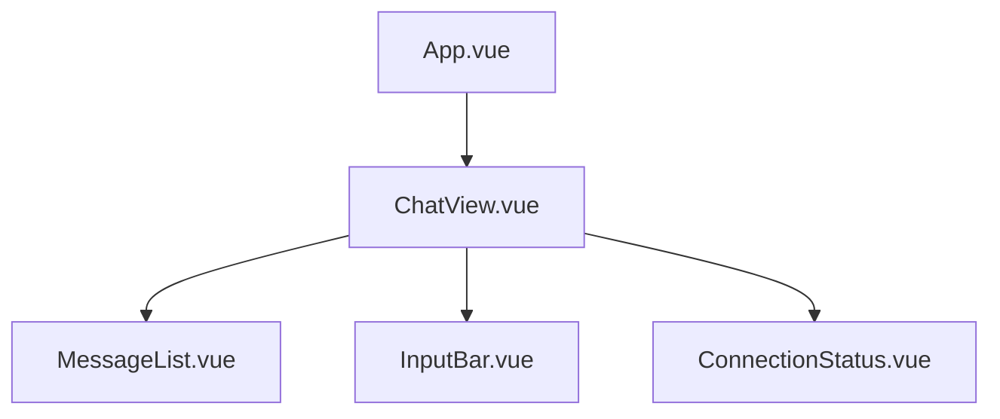

# Vue frontend

The frontend is a Vue 3 single-page application in `frontend/`. MVP scope: a single chat view with WebSocket connectivity.

## Tech stack

| Tool | Purpose |
|------|---------|
| Vue 3 (Composition API) | UI framework |
| TypeScript | Type safety |
| Pinia | State management (WebSocket store) |
| Vite | Dev server + production bundler |
| CSS (scoped) | Styling — no framework for MVP; can add Tailwind later |

## Component tree



### `App.vue`

Root component. Mounts `ChatView`. May later add a sidebar or scenario picker.

### `ChatView.vue`

Layout container. Wires the WebSocket store to child components.

- Reads `messages` from the WebSocket store and passes to `MessageList`.
- Handles the `send` event from `InputBar` by calling `wsStore.send()`.
- Displays `ConnectionStatus` based on `wsStore.state`.

### `MessageList.vue`

Props: `messages: Message[]`

Renders a scrollable list of messages. Each message is styled by role:

- `user` — right-aligned, distinct background
- `assistant` — left-aligned
- `system` — centered, muted

Auto-scrolls to bottom on new messages.

### `InputBar.vue`

Emits: `send(text: string)`

Text input with a send button. Disabled when not connected. Clears on submit. Enter key submits (Shift+Enter for newline).

### `ConnectionStatus.vue`

Props: `state: ConnectionState`

Small indicator showing WebSocket status: connecting, connected, disconnected, error. Optionally shows a reconnect button.

## TypeScript types (`types/index.ts`)

```typescript
export interface Message {
  role: "user" | "assistant" | "system";
  content: string;
  timestamp?: string;
}

export type ConnectionState =
  | "connecting"
  | "connected"
  | "disconnected"
  | "error";

export interface ServerMessage {
  type: "assistant_message" | "status" | "error";
  content?: string;
  state?: string;
  detail?: string;
}
```

## WebSocket store (`stores/websocket.ts`)

Pinia store managing the WebSocket connection lifecycle and message state.

```typescript
import { defineStore } from "pinia";
import { ref } from "vue";
import type { Message, ConnectionState, ServerMessage } from "@/types";

export const useWebSocketStore = defineStore("websocket", () => {
  const messages = ref<Message[]>([]);
  const state = ref<ConnectionState>("disconnected");
  let socket: WebSocket | null = null;
  let reconnectTimer: number | null = null;

  function connect(url = "ws://localhost:8000/ws") {
    state.value = "connecting";
    socket = new WebSocket(url);

    socket.onopen = () => {
      state.value = "connected";
    };

    socket.onmessage = (event) => {
      const data: ServerMessage = JSON.parse(event.data);
      if (data.type === "assistant_message" && data.content) {
        messages.value.push({
          role: "assistant",
          content: data.content,
        });
      }
    };

    socket.onclose = () => {
      state.value = "disconnected";
      scheduleReconnect(url);
    };

    socket.onerror = () => {
      state.value = "error";
    };
  }

  function send(text: string) {
    if (!socket || state.value !== "connected") return;
    messages.value.push({ role: "user", content: text });
    socket.send(JSON.stringify({
      type: "player_message",
      content: text,
    }));
  }

  function disconnect() {
    if (reconnectTimer) clearTimeout(reconnectTimer);
    socket?.close();
    socket = null;
    state.value = "disconnected";
  }

  function scheduleReconnect(url: string) {
    reconnectTimer = window.setTimeout(() => connect(url), 3000);
  }

  return { messages, state, connect, send, disconnect };
});
```

## Dev server

```bash
cd frontend
npm install
npm run dev     # Vite dev server, default port 5173
```

Vite proxies `/ws` to the FastAPI backend during development (configured in `vite.config.ts`):

```typescript
// vite.config.ts
import { defineConfig } from "vite";
import vue from "@vitejs/plugin-vue";

export default defineConfig({
  plugins: [vue()],
  server: {
    proxy: {
      "/ws": {
        target: "ws://localhost:8000",
        ws: true,
      },
    },
  },
  resolve: {
    alias: { "@": "/src" },
  },
});
```

## Styling approach

MVP uses **scoped CSS** in each `.vue` file. No CSS framework initially.

Design goals:
- Dark background, light text (terminal aesthetic)
- Clear visual distinction between user and assistant messages
- Responsive: works on desktop widths, no mobile optimization in v0

If a CSS framework is added later, **Tailwind CSS** is the preferred candidate.
