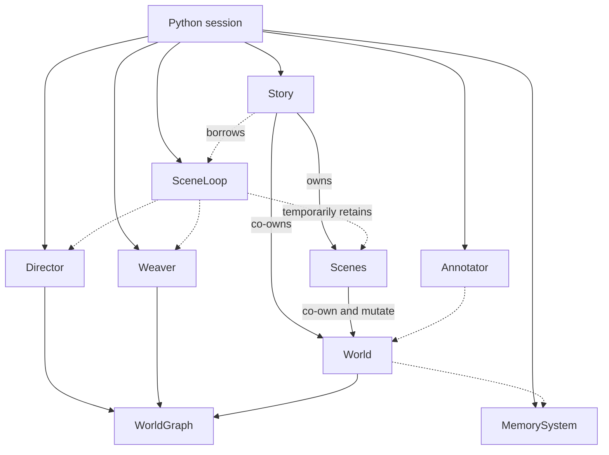
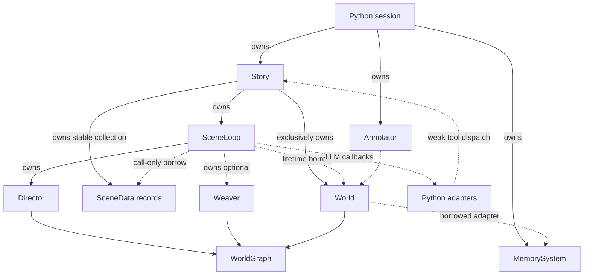

# Runtime coupling reduction plan

## Purpose

Reduce the actual runtime dependency graph, not merely split implementation files. The previous
refactor fixed temporal result coupling, unsafe background capture, persistence ordering, and
Python lifetime hazards. It did not make the complete object graph simple.

This stage removes the `Scene -> World` dependency entirely. The per-storyline record becomes
`SceneData`: World-free state owned by Story. Story coordinates a World, a stable collection of
SceneData records, and its turn runtime. World owns durable state and roster invariants; SceneLoop
executes one turn against an explicitly supplied SceneData record.

This stage does not introduce interfaces, managers, repositories, service locators,
dependency-injection machinery, or compatibility facades.

## Brief review summary

- Replace `Scene` with a World-free `SceneData` aggregate.
- Story exclusively owns World, all SceneData records, and SceneLoop.
- SceneLoop owns Director and optional Weaver, borrows World for its lifetime, and borrows one
  SceneData only during a synchronous turn call.
- World owns roster, membership, character-memory, and graph storage; Director and Weaver remain
  the explicit graph mutation services.
- Remove the unnecessary World-to-Story staged-lifecycle protocol. Story applies accepted
  lifecycle verdicts directly through World membership operations.
- Delete retained-scene submission, compatibility result caches, loop persistence, and direct
  Python composition of native runtime objects.
- Preserve prompts, retry behavior, save schemas, output payloads, mutation order, and approved
  story behavior.
- Execute in six gated phases, beginning with the missing evidence from the first plan.

## Terminology: `SceneData` is a state aggregate

`SceneData` is "plain data" architecturally, but it is not a strict C++ POD type: `std::string`,
`History`, and `TextDownsampler` are non-trivial value types. The intended declaration is an
aggregate with public state and no ownership, orchestration, persistence, or World-facing methods:

```cpp
struct SceneData {
    std::string scene_id;
    std::string title;
    std::string system_prompt;

    History history;
    History dialogue;
    TextDownsampler downsampler;
    int turn_index = 0;

    std::string driving_intention;
    float charge = 0.0f;
    int last_advanced = 0;
};
```

`SceneData` must not contain:

- a World pointer, reference, smart pointer, or accessor;
- character, graph, memory, lifecycle, undo, or save methods;
- a runtime callback or service reference;
- a custom constructor that establishes ownership or cross-object wiring.

`TextDownsampler` remains a per-scene value object, but its LLM callback moves out of stored scene
state. The callback is supplied by the runtime when processing a turn. This prevents an apparently
data-only record from retaining a Python/runtime dependency indirectly.

## Current conclusion

The production Python session currently owns and coordinates:

- Story;
- SceneLoop;
- Director;
- Weaver;
- MemorySystem;
- Annotator.

Story co-owns World with every Scene. Story borrows SceneLoop; SceneLoop borrows Director and
Weaver and temporarily retains a Scene; all graph services must be manually wired to the same
WorldGraph. Scene also performs World mutation, complete persistence, lifecycle, queries, undo,
prompt projection, and per-scene state storage.



File splitting improved locality but did not remove these object-level dependencies.

## Target structure



There is no `SceneData -> World` edge and no `World -> SceneData` edge. World knows scene identity
only as the existing string IDs carried by character membership. Story validates that IDs refer to
live SceneData records.

The weak callback from Python adapters to Story is the one intentional reverse control edge. It
supports narrator and scheduler tools without another dispatcher object.

## Responsibility map

| Current `Scene` responsibility | Target owner |
|---|---|
| per-storyline fields | `SceneData` |
| scene collection, active scene, fork/merge/conclude | Story |
| introduce/re-enter/leave/move character membership | World, addressed by `scene_id` |
| find or project a scene's cast | World read operations plus `scene_id` |
| graph and mind queries | World |
| narrator cast prompt | narrator prompt code using `const World&` and `const SceneData&` |
| history query and display timeline | Story operations over `SceneData` |
| undo | Story coordinating SceneData and World |
| scenario load | `Story::load_scenario()` |
| complete save/load/delete | Story |
| per-scene JSON encoding | private helpers in `story_serialization.cpp` |
| turn execution | SceneLoop using World and a call-scoped SceneData borrow |

Do not replace Scene with a wrapper that holds `SceneData + World`. That would preserve the old
dependency under a different name.

## Design rules

1. Delete dependencies before considering abstractions.
2. Production has one turn API: Story advance.
3. SceneData is state only and never references World or runtime services.
4. Story is the only object that coordinates World and the SceneData collection.
5. Story owns its runtime executor; the executor is destroyed before World and SceneData.
6. SceneLoop retains no SceneData pointer between synchronous `run_*_turn()` calls.
7. SceneLoop owns graph services used only during turn execution.
8. World enforces roster, membership, and character-memory invariants.
9. Director and Weaver remain explicit, authorized WorldGraph mutation services.
10. Python composes callbacks and external adapters, not native runtime lifetimes.
11. Preserve prompts, operation ordering, save schemas, output payloads, and current story behavior.
12. Any intentional API or behavioral change receives its own test and commit.

## Scope

In scope:

- replacement of Scene with SceneData;
- exclusive Story ownership of World and SceneData;
- production ownership of SceneLoop, Director, and Weaver;
- removal of retained Scene/SceneData and compatibility result caches;
- removal or migration of direct Python Scene and SceneLoop runtime use;
- private World containers with narrow roster, membership, memory, and graph access;
- removal of lifecycle-operation storage from World;
- membership mutation binding cleanup;
- one production scenario-loading and persistence path;
- removal of stored downsampler callbacks from per-scene state;
- missing lifetime, reload, result-association, Debug, and save-schema verification from the first
  plan.

Out of scope:

- interfaces for Director or Weaver;
- a runtime/service/configuration manager class;
- changing narrator prompts, retry count, final-rejection behavior, or dialogue semantics;
- redesigning the existing multi-scene undo semantics;
- running scene turns concurrently;
- redesigning MemorySystem or ChromaDB;
- removing Director or Weaver as standalone graph utilities;
- moving LLM provider logic into C++;
- replacing string scene IDs with handles or entity types;
- redesigning History or TextDownsampler beyond removing stored runtime callbacks.

## Audited callers

| Caller | Current use | Migration |
|---|---|---|
| `server/rhapsode/session.py` | constructs Story, SceneLoop, Director, and Weaver from a loaded Scene | load Story directly and configure callbacks |
| `server/test_chroma_sceneloop.py` | manual legacy SceneLoop submission | migrate to Story or archive as an obsolete diagnostic |
| `server/verify_fork.py` | creates Scene, Director, and SceneLoop for Story | use `Story::load_scenario()` and Story-owned runtime |
| `server/rhapsode/graph_views.py` | loads Scene/Story and constructs Weaver for graph maintenance | load Story directly; retain standalone Weaver utility if still required |
| C++ Scene tests | exercise mixed scene state, World mutation, persistence, and lifecycle | split assertions by Story, World, and SceneData responsibility |
| C++ SceneLoop tests | predominantly exercise legacy submit/drain API | migrate behavior coverage to Story advance or synchronous `run_*_turn()` |
| Python binding-surface tests | require the broad Scene and SceneLoop APIs | replace with the intentional Story, World, and SceneData surface |
| Python lifetime tests | characterize borrowed runtime objects | replace with Story-owned runtime and complete-session release tests |

Director and Weaver bindings may remain for explicit graph tools. SceneLoop and SceneData should
not be independently composed into the production runtime from Python.

## Phase 0 - close the first plan's evidence gaps

Add tests before changing ownership:

1. A turn with non-empty Director, Weaver, and expiry outputs associates every result with the
   correct scene ID and completed turn.
2. A runtime-bound Story can load a save and immediately execute another turn with the same runtime
   configuration.
3. Dropping one complete Python session releases Story, SceneLoop, Director, Weaver, callbacks, and
   Annotator.
4. Representative Story save JSON is captured structurally before this stage.
5. Transaction and background tests pass in both the normal preset and Debug.
6. Current scenario loading, fork membership, prompt construction, undo, timeline, graph/mind/history
   queries, and save/load behavior have named characterization tests before their owners move.

Classify every legacy Scene and SceneLoop caller as production, maintained diagnostic, or obsolete.
Do not delete an API while an unclassified caller remains.

### Exit gate

- Missing acceptance tests pass against current behavior.
- Save-schema structural fixtures are checked in.
- Debug and normal verification results are recorded.
- Caller inventory and responsibility characterization are confirmed.

## Phase 1 - make World the roster and memory mutation boundary

This phase changes encapsulation while Scene still exists, so failures are attributable to World
API migration rather than the SceneData replacement.

Make these World fields private:

- WorldGraph storage;
- character roster;
- character-memory map.

Provide stable read access:

```cpp
WorldGraph& graph();
const WorldGraph& graph() const;
const std::vector<Character>& characters() const;
const CharacterMemory* find_memory(const std::string& name) const;
```

Add only operations required by audited callers:

- introduce or re-enter a character in a named scene;
- find a living character in a named scene;
- leave one scene;
- move membership between scenes;
- clear all membership for a retired scene;
- ensure resolved living characters are present;
- create and remove character memories while preserving configuration;
- perform the existing rollback mutations used by Story undo.

Exact names should follow existing domain language. Do not create a generic repository,
`update_character()` escape hatch, public mutable container, or service layer.

Migrate existing Scene and Story code to these operations. Director and Weaver continue receiving
`World::graph()` because graph mutation is their explicit purpose; this phase does not falsely claim
that every graph edit passes through a World wrapper.

### Remove the lifecycle queue from World

`World::stage_fork`, `stage_conclude`, `stage_merge`, `stage_exit`, `take_pending_ops`, and
`clear_pending_ops` form an unnecessary World-to-Story protocol. Lifecycle verdicts are already
requested and accepted by Story after a successful turn.

Move verdict validation and application entirely into Story. Preserve the current precedence and
ordering exactly: accepted conclude/merge short-circuits, otherwise fork is applied before exit.
World supplies only the membership mutations Story needs. It does not know which SceneData records
exist and stores no pending lifecycle operations.

### Reflection behavior

When World creates a CharacterMemory, apply the stored reflection callback. This is an explicit
behavioral fix identified by the first audit. Add the failing test and commit the fix separately
from structural migration.

### Binding boundary

Remove direct Python mutation of:

- `Character.scene_ids`;
- `Character.dead`;
- `Character.join_scene()`;
- `Character.leave_scene()`.

Preserve read access where production or graph views require it.

### Exit gate

- No class outside World directly edits roster or character-memory containers.
- World stores no lifecycle operations and does not depend on Story or Scene.
- New memories inherit World reflection configuration.
- Python cannot bypass membership or death invariants.
- Director and Weaver retain stable access to `World::graph()`.
- Characterization tests and structural save fixtures remain unchanged.

## Phase 2 - make Story own the runtime

### Story ownership

Replace the borrowed `SceneLoop*` with owned runtime state. Prefer:

```cpp
std::unique_ptr<SceneLoop> loop_;
```

The pointer provides stable storage and incomplete-type convenience, not shared ownership. Remove
`Story::bind_runtime()`.

### SceneLoop ownership

SceneLoop receives World during construction:

```cpp
explicit SceneLoop(World& world);
```

It owns:

- Director by value, bound to `world.graph()`;
- optional Weaver by `unique_ptr` or `optional`, created only when Weaver callbacks are configured.

Remove `set_director()`, `set_weaver()`, and their borrowed pointer fields. Do not introduce
Director/Weaver interfaces.

World must keep a stable address through Story moves and save loads. At the SceneData conversion,
Story's current shared World ownership becomes exclusive stable ownership, preferably
`std::unique_ptr<World>`. Saves load into that existing object; they do not replace the allocation
under SceneLoop.

Declare owned fields so SceneLoop is destroyed before World and SceneData. Its destructor must join
any background job before those dependencies are destroyed.

### Configuration

Expose only the Story callback/configuration surface production uses:

- general LLM callback;
- narrator callback;
- Weaver cloud callback;
- Weaver local callback;
- history window if still required;
- scheduler and lifecycle callbacks;
- downsampler callback;
- save directory and reflection callback where currently configured.

Use direct setters or one plain callback value struct. Do not add a runtime configuration class.

### Python migration

`WsSession` stops storing Director, Weaver, and SceneLoop. Session setup constructs Story,
MemorySystem, and Annotator, then configures Story callbacks.

The expected session fields become:

- Story;
- MemorySystem;
- Annotator;
- resume flag.

### Exit gate

- Story has no borrowed SceneLoop pointer.
- SceneLoop has no borrowed Director or Weaver pointer.
- Production Python constructs no Director, Weaver, or SceneLoop.
- Graph-affinity mismatch is impossible in the Story path by construction.
- Existing Story advance, undo, load, callback-cycle, and persistence tests pass.

## Phase 3 - replace Scene with SceneData

### Add the state boundary

Create `core/include/rhapsode/scene_data.h` with the aggregate defined above. It must not include
`world.h`, `character.h`, `memory_system.h`, `director.h`, `weaver.h`, or `scene_loop.h`.

Story owns a stable collection of SceneData records. Retaining `vector<unique_ptr<SceneData>>` is
acceptable for pointer stability; the `unique_ptr` is not shared ownership. Do not add a SceneData
registry or manager.

Convert Story's shared World to exclusive stable ownership. No SceneData record receives a World
pointer during construction, fork, load, or binding.

### Move Scene behavior to its real owner

- `Scene::fork()` becomes only `Story::fork_scene()` plus World membership operations.
- character entry, exit, lookup, and cast membership use World operations with `scene_id`.
- graph and mind queries remain on World and route through Story tool dispatch.
- history query and timeline become Story operations over a selected SceneData.
- narrator cast projection receives `const World&` and `const SceneData&` explicitly.
- undo remains one Story transaction coordinating the selected SceneData and World.
- per-scene encoding/decoding becomes private Story serialization helpers.

Do not create a generic `SceneDataService`, `SceneOperations`, or compatibility Scene wrapper. Small
file-local pure helpers are acceptable where they keep Story or prompt code readable.

### Scenario loading

Replace:

```text
Story::from_scene(Scene::load_json(path))
```

with:

```text
Story::load_scenario(path)
```

The loader creates one World and one root SceneData while preserving the current scenario schema,
authored `on_stage` interpretation, graph seeding, initial memories, seed messages, and scene ID
derivation.

### SceneLoop turn boundary

The supported execution surface becomes:

```cpp
SceneTurnResult run_player_turn(SceneData& scene, const std::string& input);
SceneTurnResult run_autonomous_turn(SceneData& scene, const std::string& focus);
```

SceneLoop uses its construction-time World reference for durable operations. Every private helper
receives SceneData explicitly; there is no `scene_` field.

Migrate maintained tests and diagnostics, then remove:

- `load_scene()`;
- `submit_input()`;
- `submit_autonomous()`;
- `last_director_output()`;
- `last_weave_result()`;
- `take_last_turn_outputs()`;
- `take_completed_expiry_ops()`;
- `set_saves_dir()`;
- public `join_background()`;
- compatibility result caches and background-save state.

The background job may borrow World and the selected SceneData only within one synchronous turn.
`run_*_turn()` must join on success and every exception path before returning. After the call,
SceneLoop retains no SceneData address and no background work remains.

### Downsampler callback

Remove the stored LLM callback from TextDownsampler. Supply the configured callback explicitly when
SceneLoop processes one SceneData history. Serialization remains identical because callbacks were
never serialized.

### Delete Scene

After all production callers and characterization tests migrate, delete `scene.h`, `scene.cpp`, and
the C++ `Scene` type. Do not retain aliases or a facade that reconstructs the World dependency.

### Exit gate

- `Scene` no longer exists in production code.
- `SceneData` has no World or runtime dependency.
- Story is the sole owner and lifecycle coordinator of SceneData records.
- SceneLoop has no retained SceneData pointer and no temporal result caches.
- Each synchronous call returns one authoritative SceneTurnResult after background completion.
- Scenario, fork, cast, prompt, retry, undo, and turn-output characterization tests are unchanged.

## Phase 4 - consolidate persistence and Python boundaries

Story remains the only production owner of complete save/load/delete operations.

Keep the existing files and structures:

- `world.json` for durable World state;
- one `<scene_id>.json` blob per SceneData record;
- `story.json` for collection and active-scene metadata.

Per-scene serialization is implemented by private helpers in `story_serialization.cpp`; SceneData
itself has no save methods. World value serialization may remain an implementation mechanism, but
Python and production server code persist complete state through Story.

Audit and migrate:

- graph-view mutations that currently save one Scene directly;
- diagnostics using Scene or SceneLoop saving;
- Python exposure of Scene full-save wrappers;
- stale per-scene files when storylines are removed;
- runtime reuse immediately after Story load.

Do not change filenames, JSON fields, migration behavior, or save ordering.

### Python surface

- remove the broad `Scene` binding;
- bind SceneData only if maintained callers need to inspect per-scene state;
- expose SceneData through Story with reference-internal/read-only lifetime policy;
- do not expose a SceneData constructor for production composition unless a confirmed test utility
  requires it;
- remove the production SceneLoop binding; retain only a minimal synchronous binding if a
  maintained diagnostic is confirmed in Phase 0;
- migrate scenario creation to `Story.load_scenario()`.

Every removed Python method is listed in the binding-surface test. A compatibility facade is not
added merely to keep obsolete construction patterns alive.

### Exit gate

- Production server code loads scenarios and persists through Story only.
- A graph-maintenance endpoint cannot leave `story.json`, World, and scene blobs inconsistent.
- Structural pre/post save comparison is unchanged.
- Load reuses the same World allocation and Story-owned runtime safely.
- Python cannot independently wire SceneData, SceneLoop, Director, Weaver, and World into a session.

## Phase 5 - final dependency audit and deletion pass

Generate the actual post-refactor graph from headers, implementation calls, bindings, and
production wiring. Confirm:

- Python session owns no native turn services individually;
- Story exclusively owns World, SceneLoop, and SceneData records;
- SceneData references neither World nor runtime services;
- World references neither Story nor SceneData and stores no lifecycle queue;
- SceneLoop owns Director and optional Weaver;
- SceneLoop borrows World for its lifetime and SceneData only inside a synchronous call;
- World owns roster, membership, character-memory, and graph storage;
- Director and Weaver are the explicit direct graph mutation services;
- the weak callback to Story is the only intentional reverse control edge;
- no compatibility persistence or temporal-result path remains in production.

Delete obsolete tests, methods, comments, includes, lifetime policies, and source files only after
replacement coverage is green. Update architecture pages and binding compatibility notes.

### Exit gate

The generated dependency graph matches the target diagram, including ownership, mutation,
callback, and call-scoped borrow edges.

## Proposed commit sequence

| Commit | Change | Verification |
|---|---|---|
| 1 | Add missing result, reload-reuse, session-lifetime, save-structure, and behavior characterization tests | full normal verification |
| 2 | Run and record Debug transaction/background verification | Debug focused tests |
| 3 | Privatize World containers and add narrow read/mutation APIs | native World and state tests |
| 4 | Migrate existing Scene and Story callers to World operations | lifecycle, cast, prompt, and rollback tests |
| 5 | Remove World lifecycle staging and apply verdicts in Story | lifecycle ordering tests |
| 6 | Apply reflection configuration to newly created memories | separate failing test plus full verification |
| 7 | Remove Python membership/death mutation bypasses | binding compatibility tests |
| 8 | Add Story-owned SceneLoop beside the existing path | full verification |
| 9 | Make SceneLoop own Director and optional Weaver; migrate production session | native runtime, Python, and GC tests |
| 10 | Remove Story runtime binding and Python session runtime fields | Python surface and GC tests |
| 11 | Add SceneData and migrate Story collection/lifecycle | Story and fork tests |
| 12 | Move prompt, cast, query, undo, and scenario-loading behavior to target owners | characterization tests |
| 13 | Convert SceneLoop to call-scoped SceneData and remove legacy submit/drain APIs | transaction/background and result tests |
| 14 | Remove stored downsampler callback and pass it per turn | downsampler and callback-lifetime tests |
| 15 | Delete Scene and migrate C++/Python callers | full verification |
| 16 | Consolidate complete persistence and bindings through Story | structural save/load and graph-view tests |
| 17 | Audit final graph, update wiki, and generate local patches | full verification plus wiki lint |

Split a commit further if it mixes ownership, API removal, and behavior. Do not combine the
new-memory reflection fix with structural migration. Do not delete Scene until all replacement
coverage and callers are green.

## Verification requirements

After every production commit:

```text
verify.bat
```

Additionally:

- run transaction/background tests in Debug after runtime ownership and SceneData migration;
- run Python lifetime tests repeatedly after ownership or callback changes;
- structurally compare representative save JSON after World, SceneData, and persistence changes;
- characterize every intentional C++ and Python API removal;
- verify prompt strings or hashes around prompt-boundary changes;
- record exact native, Python, and frontend counts at each phase boundary;
- record the existing wiki-lint baseline separately from new findings.

No sleep-based concurrency tests are allowed. Use promises, futures, and deterministic barriers.

## Stop conditions

Stop and review if:

- SceneData needs a World pointer or runtime callback;
- a Scene wrapper or manager is proposed to reconnect SceneData and World;
- Story needs another manager object to own the runtime or scene collection;
- SceneLoop needs a retained SceneData after legacy APIs are removed;
- World cannot enforce roster or memory invariants without mutable container exposure;
- Python session must coordinate Director/Weaver graph identity after Phase 2;
- narrator prompt text, retry behavior, output order, lifecycle precedence, or save schema changes
  unexpectedly;
- removing a compatibility API breaks a real production caller not identified in Phase 0;
- a proposed abstraction increases the number of runtime objects or ownership edges.

## Explicitly retained dependencies

The following are intentional and should not be abstracted away:

- Story coordinates World, SceneData, and SceneLoop;
- SceneLoop borrows its Story-owned World for its lifetime;
- SceneLoop borrows one SceneData during a synchronous turn;
- Director and Weaver reference WorldGraph;
- World borrows the externally configured MemorySystem adapter;
- Annotator references World;
- Python LLM adapters weakly call Story tool dispatch.

There is intentionally no SceneData-to-World dependency.

## Settled design decisions

1. **Replace Scene with World-free SceneData.** Do not retain a Scene facade.
2. **Story owns the native runtime.** Production Python does not construct SceneLoop, Director, or
   Weaver.
3. **Keep Director and Weaver bindings only as standalone graph utilities where maintained tools
   require them.** They do not participate in session ownership.
4. **Keep MemorySystem externally owned in this stage.** Moving its Python adapter into World adds
   migration complexity without removing a significant native ownership edge.
5. **Keep the current undo behavior.** Its cross-scene semantics are characterized, not redesigned,
   in this structural stage.
6. **Treat new-memory reflection configuration as a separate behavior fix.** It receives its own
   failing test and commit.

## Completion criteria

This stage is complete when:

- production session wiring contains Story, MemorySystem, and Annotator only;
- Story exclusively owns World, SceneLoop, and stable SceneData records;
- Scene no longer exists;
- SceneData is a World-free state aggregate with no stored runtime callback;
- SceneLoop owns Director and optional Weaver;
- no borrowed raw runtime pointers connect Story, SceneLoop, Director, or Weaver as object fields;
- SceneLoop retains no SceneData and exposes no temporal result caches;
- World containers are private and roster/memory mutation passes through World methods;
- World stores no lifecycle operations;
- Python cannot mutate character membership or death state directly;
- production scenario loading and persistence flow only through Story;
- the weak Python-to-Story tool callback is the only reverse control edge;
- the actual post-refactor dependency graph matches the documented target;
- normal and Debug verification pass;
- save schemas, prompts, output payloads, operation order, and existing approved behavior remain
  unchanged.

## Implementation result - 2026-07-21

Implemented locally in commit `f279030` with a final follow-up for documentation and the
call-scoped background capture cleanup. Nothing was pushed.

The resulting graph matches the target:

- Scene was deleted and replaced by the World-free SceneData aggregate;
- Story exclusively owns stable World, SceneData, and SceneLoop allocations;
- SceneLoop owns Director and optional Weaver and retains no SceneData between calls;
- background work captures call-scoped reference wrappers and is joined before return;
- World containers are private and World stores no lifecycle queue;
- Story applies lifecycle verdicts directly and owns scenario loading, undo, and complete
  persistence;
- production Python owns Story, MemorySystem, and Annotator only;
- Scene and SceneLoop are absent from the production Python binding surface;
- TextDownsampler no longer stores an LLM callback.

Verification at completion:

- 38 C++ test cases, including prompt-byte, transaction, result-association, background, reload,
  persistence, and substrate coverage;
- 23 Python tests, including binding-surface and complete-session lifetime coverage;
- 7 frontend tests;
- C++ and frontend production builds;
- Python Ruff and frontend ESLint;
- 10 focused Debug transaction/background/load/undo tests;
- offline fork/conclude/merge diagnostic.

The native test-case count is lower than the earlier 52 because tests for deleted compatibility
APIs (`load_scene`, submit/drain caches, graph-affinity mismatch wiring) were removed. Their
supported behavior was replaced with tests for synchronous result association, owned-service graph
affinity by construction, rollback, background joining, Story runtime reuse, and the new binding
surface.

## Repository discipline

- Preserve unrelated working-tree changes.
- Use small local commits and full verification gates.
- Do not squash or rewrite existing local history.
- Generate local patches after verified commits.
- Never push to the repository.
