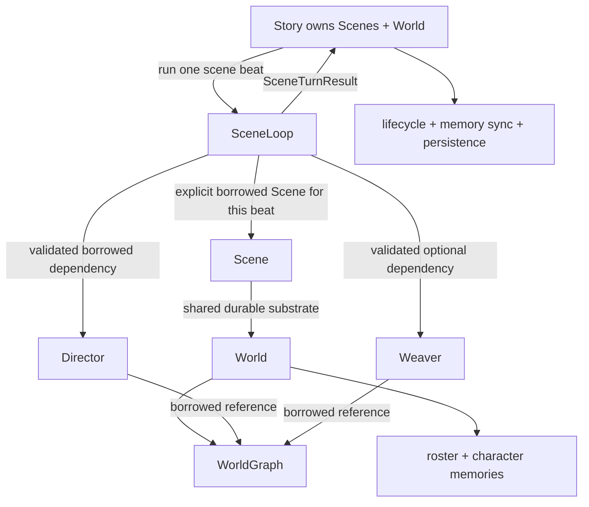
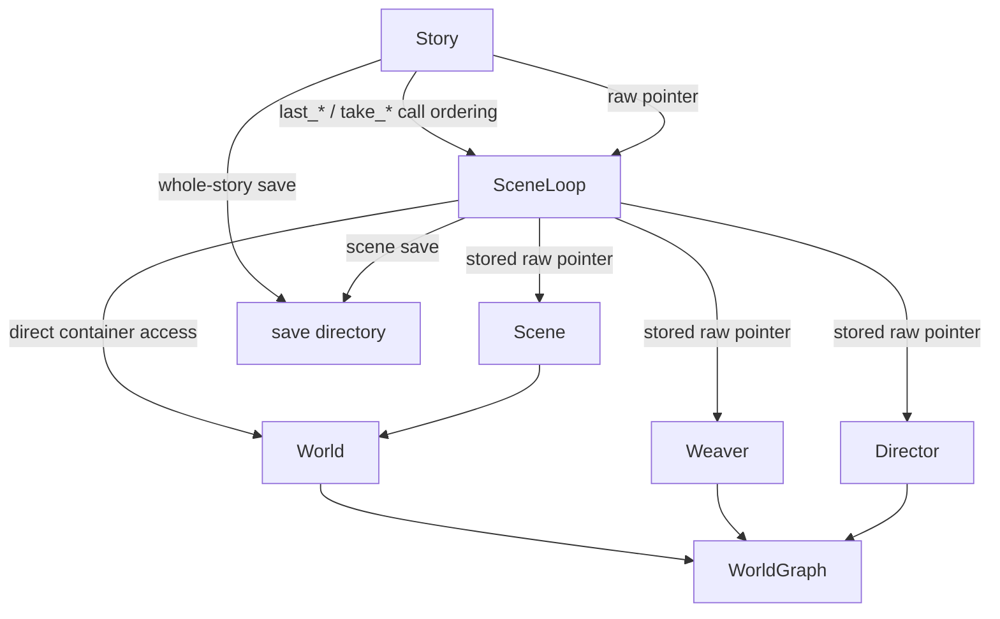

# Runtime dependency refactor plan

## Purpose

Refactor the Story/SceneLoop runtime around explicit ownership and result boundaries before splitting
the large implementation files. The objective is not smaller files by itself. The objective is this
dependency direction:



The Python session remains the composition root that constructs the concrete runtime objects. This
plan does not introduce service interfaces, manager classes, a dependency-injection framework, or a
new ownership hierarchy.

This document is the authoritative execution plan for the remaining C++ structure work in Phase 2
of [[2026-07-20-code-structure-quality-plan]]. It supersedes that roadmap's instruction to split
Story, World, and Scene immediately: the runtime boundaries in this document must be established
before those mechanical file moves.

### Terminology

- A **scene turn** is one player or autonomous input processed by `SceneLoop`, including its
  foreground result and background completion.
- A **Story advance** is one `Story::advance_scene()` operation. It coordinates one player scene
  turn, optionally one off-stage scene turn, then lifecycle, memory synchronization, and persistence.

Accordingly, `SceneTurnResult` and `run_*_turn()` belong to SceneLoop. Story implementation and file
names use *advance*, never *turn*, for the larger orchestration operation.

## Scope

In scope:

- C++ ownership and lifetime contracts among `Story`, `SceneLoop`, `Scene`, `World`, `Director`,
  `Weaver`, and `Annotator`.
- The player-beat and off-stage-beat result flow.
- Background-work capture, completion, and cancellation.
- Responsibility for perception, reflection, death state, cast membership, persistence, and undo.
- pybind11 lifetime policies and Python callback cycles.
- The eventual responsibility-based split of `story.cpp`, `scene_loop.cpp`, and
  `scene_loop_support.cpp`.

Out of scope for the structural commits:

- Changing narrator prompts, retry count, rejection text, stage logging, output order, or history
  window semantics.
- Changing serialized formats or save filenames.
- Fixing named player-character speech resolution.
- Deciding whether an exhausted narrator retry should throw or apply the last rejected attempt.
- Removing or assigning `LoopState::Weaving`.
- Redesigning multi-scene undo semantics.
- Replacing concrete `Director`/`Weaver` dependencies with interfaces.
- Running foreground and off-stage beats concurrently.

Those behavioral questions must be reviewed and tested in separate changes.

## Audited current state

### Ownership

| Object | Current owner | Retained dependencies | Contract status |
|---|---|---|---|
| `Story` | Python `WsSession` or C++ caller | `shared_ptr<World>`, `unique_ptr<Scene>`, raw `SceneLoop*` | Story/World/Scene ownership is explicit; loop lifetime is external |
| `Scene` | `Story`, standalone caller, or returned value | `shared_ptr<World>` | Stable and cycle-free |
| `SceneLoop` | Python `WsSession` or C++ caller | raw `Scene*`, `Director*`, `Weaver*`; callbacks; future | Scene and runtime affinity are not enforced |
| `Director` | Python session or C++ caller | `WorldGraph&` | Referent lifetime and graph identity are not enforced by bindings |
| `Weaver` | Python session or C++ caller | `WorldGraph&`; work queue; callbacks | Same lifetime issue; also used from the background thread |
| `World` | Co-owned by Story and Scenes | raw `MemorySystem*`; graph, roster, minds | Memory lifetime is protected in pybind; data containers remain publicly replaceable |
| `Annotator` | Python session | `Scene const&` | Depends on a retireable Scene although it only reads World roster data |

### Current runtime coupling



### Concrete findings

1. **Turn results are temporal state.** `Story::sync_beat()` reads `last_director_output()` and
   `take_completed_expiry_ops()` from `SceneLoop`; `advance_scene()` separately drains
   `take_last_turn_outputs()` before the off-stage beat can overwrite it.
2. **The retained `Scene*` can become stale.** `Story::conclude_scene()` destroys scenes and
   `Story::load_save()` rebuilds the scene collection. `advance_scene()` manually repoints the loop
   before returning because it knows the pointer can dangle.
3. **Runtime graph affinity is implicit.** `Scene`, `Director`, and `Weaver` are injected
   independently. No check proves that all three use the same `WorldGraph`.
4. **Background work captures mutable configuration.** The async lambda captures `this` and later
   reads `scene_` and `weaver_`, while writing separate result fields on the loop.
5. **The orchestrator reaches through domain owners.** `SceneLoop` iterates and mutates
   `World::characters`, `World::character_memories`, character death/membership, and mind reflection.
6. **Persistence has two owners.** The server sets the same save directory on `SceneLoop` and
   `Story`; a scene/world save occurs before Story lifecycle completion, followed by a whole-story
   save.
7. **Binding lifetimes rely on `WsSession` by convention.** Borrowed `WorldGraph`, `Scene`,
   `Director`, and `Weaver` relationships lack complete `keep_alive` policies.
8. **Callbacks form strong cycles.** Story owns callbacks that close over the Python Story object;
   the loop narrator callback also closes over Story while Story keeps the loop alive.
9. **Undo is coordinated outside the owner.** The server joins the loop, asks one `Scene` to mutate
   the shared World, saves Story, then constructs another loop.
10. **Annotator has a stale-reference risk.** It retains the initial Scene although it only needs the
    durable roster.
11. **Mind callback configuration is outside World.** Python wires callbacks only on memories that
    exist during session construction; a memory created later has no reflection callback.
12. **Python can replace invariant-bearing containers.** Bindings expose writable replacement
    properties for the graph, roster, and character-memory map while graph-bound services may be
    alive.

## Behavioral invariants

Every structural phase must preserve all of the following unless a separately approved behavioral
commit explicitly changes one:

1. A successful player submission appends one user message, one narrator message, and authored NPC
   lines to the same destinations and in the same order as today.
2. NPC dialogue remains outside narrator history and remains present in the display timeline.
3. `turn_index` changes at the same point relative to prompt construction and rollback.
4. A failed player or autonomous submission restores history, dialogue, downsampler state, World,
   pending lifecycle operations, cached outputs, and loop state.
5. Each rejected narrator attempt restores the complete World snapshot before the next attempt.
6. Existing final-attempt behavior remains unchanged during structural work, even though it is
   suspicious.
7. Active-cast handling remains presence-only: it may bring characters into a scene and never
   removes omitted characters.
8. Perception audience routing and public-beat routing remain byte-for-byte equivalent in resulting
   state.
9. Background order remains Weaver -> expiry drain -> mind reflection -> history downsampling.
10. Scene switching and destruction wait for active background work.
11. Story persistence observes completed background mutations.
12. Save schemas, migration behavior, Python-visible output payloads, and narrator tool behavior do
    not change.
13. Foreground and off-stage beats remain sequential.

## Migration strategy

The migration is additive first, substitutive second, and destructive last:

1. Add characterization coverage.
2. Add new explicit APIs beside the old APIs.
3. Migrate internal C++ callers to the new boundary.
4. Keep existing Python methods as compatibility wrappers.
5. Remove accidental helper APIs only after their behavior is covered through stable boundaries.
6. Split implementation files only after class responsibilities are settled.

Each numbered phase below is a separate review boundary. Within a phase, tests precede production
changes. A phase should normally be one to three local commits, never one repository-wide rewrite.

## Phase 0 - strengthen the behavior fence

### Add passing characterization tests

- A Story player beat followed by an off-stage beat returns only the player beat's outputs.
- Under the current required drain order, Director output, expiry output, and Weaver output remain
  associated with the scene and completed turn that produced them.
- A lifecycle decision produced by a beat is present in the final persisted Story manifest and scene
  set.
- Correctly configured Director/Weaver/Scene dependencies remain valid across Story scene switches
  and in-place WorldGraph reload.
- The Python method/property surface of runtime classes is characterized, not only module-level
  symbol names.

Do not add future-state assertions as Phase 0 tests. The following acceptance tests are introduced
with the production phase that makes them pass:

- explicit result ownership and scoped Scene detachment: Phase 1;
- annotation after retirement, graph mismatch rejection, and cycle-free Python release: Phase 4;
- callback reapplication after World reload: Phase 5;
- runtime-bound Story load and undo without loop reconstruction: Phase 6;
- rejection of invariant-bypassing full-container replacement: Phase 8.

### Preserve existing coverage

- Full-turn transaction rollback.
- Rejected-attempt World rollback.
- Background join on scene switch and destruction.
- Save-after-background ordering.
- Response parsing, cast behavior, perception routing, death-token parsing, and dialogue/history
  separation.
- Substrate and Story persistence golden tests.

### Exit gate

`verify.bat` passes with no production behavior changes. Any discovered bug is recorded but not fixed
inside Phase 0.

## Phase 1 - create an explicit scene-turn result

### New internal C++ value

```cpp
struct SceneTurnResult {
    std::string scene_id;
    int completed_turn = 0;
    std::vector<SceneMessage> outputs;
    DirectorOutput director;
    WeaveResult weave;
    std::vector<ExpiryOp> expiry;
};
```

This is plain data, not a service or manager.

### New Story-facing operations

```cpp
SceneTurnResult run_player_turn(Scene& scene, const std::string& input);
SceneTurnResult run_autonomous_turn(Scene& scene, const std::string& cue);
```

Both public operations delegate to one private `run_turn(Scene&, text, autonomous)` implementation.
It reuses the current proven sequence but binds the Scene only for the dynamic extent of the call:

1. Join any preceding background work before binding the supplied Scene.
2. Establish the same waiting/input state that `load_scene(scene)` establishes today.
3. Submit player input or the autonomous cue through the existing transaction.
4. Join this turn's background work.
5. Assemble and consume one complete `SceneTurnResult`.
6. Unconditionally clear the bound `Scene*` and return the loop to its detached idle state before
   returning or rethrowing.

Use a scope guard so the Scene is detached on every exception path. Story may apply lifecycle and
destroy the completed Scene immediately after the method returns; no loop operation may retain or
dereference it after that point.

### Single result ownership

Maintain one internal completed-turn value rather than independent authoritative caches. The new
`run_*_turn()` path consumes that complete value exactly once. The legacy API remains an adapter over
the same value:

- `last_director_output()` and `last_weave_result()` observe their fields;
- `take_completed_expiry_ops()` and `take_last_turn_outputs()` consume their respective fields;
- submitting another legacy turn replaces the previous completed value exactly as the existing
  caches are replaced today.

The new synchronous API and the legacy drain API are alternative consumption modes for a turn. A
caller must not mix them for the same turn; after `run_*_turn()` consumes a result, legacy getters
must report the documented empty/default state rather than stale data.

### Migrate Story

- Replace `point_loop_at()` plus `submit_*()` plus `join_background()` with the appropriate
  `run_*_turn()` operation.
- Change `sync_beat(Scene*, ...)` to accept `SceneTurnResult const&` and obtain the completed turn and
  graph changes from that value.
- Capture player-facing outputs from the player result, not mutable state retained by the loop.
- Use `result.scene_id` when applying post-beat lifecycle decisions.

### Compatibility

Keep `load_scene`, `submit_input`, `submit_autonomous`, `join_background`, `last_director_output`,
`last_weave_result`, `take_completed_expiry_ops`, and `take_last_turn_outputs` unchanged for existing
Python and standalone callers that use the legacy submission path. Their existing observation and
consumption order remains supported.

Do not bind `SceneTurnResult` to Python yet; `Story::advance_scene()` remains the server API and still
returns `vector<SceneMessage>`.

### Exit gate

Story no longer reads `SceneLoop` result caches or depends on drain order. Player/off-stage output,
memory sync, lifecycle ordering, and persistence tests remain unchanged. On every success and
exception path, the Story-facing synchronous API returns with no retained `Scene*`.

## Phase 2 - make background work self-contained

### Private result

```cpp
struct BackgroundResult {
    WeaveResult weave;
    std::vector<ExpiryOp> expiry;
};

std::future<BackgroundResult> background_future_;
```

### Dispatch contract

At dispatch, copy or capture the exact stable inputs:

- `Scene*` for the beat being completed;
- `Weaver*` selected for that beat;
- completed turn number;
- formatted graph context;
- whether the run is full or local.

The async lambda must not capture `this`. It may mutate only the captured Scene/World and Weaver that
belong to that beat, and it returns `BackgroundResult` instead of writing `bg_weave_result_` and
`bg_expiry_ops_`.

`join_background()` remains the single cancellation/completion boundary and transfers the returned
data into the compatibility result state.

### Important sequencing constraint

The foreground transaction must still join the previous background run before taking its snapshot.
Do not move snapshot creation earlier.

### Exit gate

- No background lambda captures `SceneLoop*`.
- `bg_weave_result_` and `bg_expiry_ops_` are removed.
- Existing blocking-switch, blocking-destruction, stop, rollback, and save-order tests pass.

## Phase 3 - restore World and Scene mutation boundaries

### World-owned operations

Move the current loops, initially text-identically, behind narrow methods:

```cpp
void World::route_perceptions(const std::string& scene_id,
                              const std::vector<Node>& nodes,
                              int turn);

void World::reflect_perceptions(int turn);

bool World::mark_character_dead(const std::string& name);
```

Responsibilities:

- `route_perceptions` owns the relationship between roster membership and character-memory keys.
- `reflect_perceptions` owns the relationship between a character description and its mind.
- `mark_character_dead` owns the invariant that a dead character belongs to no scene.

### Scene-owned operation

```cpp
void Scene::ensure_characters_present(
    const std::vector<std::string>& canonical_names);
```

Narrator code continues to parse, loosely match, and validate names. It passes canonical resolved
names to Scene. Scene alone changes per-scene membership. Omitted characters are not removed.

### Do not move

- Narrator-specific name matching into World.
- LLM confirmation into `World::mark_character_dead`.
- Story lifecycle decisions into SceneLoop.

### Exit gate

`SceneLoop` no longer directly edits character membership, death state, or the character-memory map.
The exact cast, perception, reflection, and death-state tests pass.

## Phase 4 - make runtime affinity and lifetime enforceable

### Graph identity

Add non-mutating checks:

```cpp
bool Director::uses_graph(const WorldGraph& graph) const noexcept;
bool Weaver::uses_graph(const WorldGraph& graph) const noexcept;
```

Before appending input, `run_*_turn()` verifies:

- Director exists and uses `scene.world().world_graph`.
- Weaver is either absent or uses the same graph.

Mismatch must fail before any history, turn counter, graph, or output mutation. Do not silently rebind
services because that would hide construction errors and Weaver queue affinity.

### Binding lifetime policies

Add `keep_alive` relationships for:

- `Director(WorldGraph&)`
- `Weaver(WorldGraph&)`
- the revised `Annotator(World const&)`
- `SceneLoop::load_scene()` compatibility use
- `SceneLoop::set_director()`
- `SceneLoop::set_weaver()`

Keep `Story::bind_runtime()` lifetime protection, but stop repeatedly rebinding newly constructed
loops during undo.

### Annotator

Change Annotator's retained dependency from `Scene const&` to `World const&`. Its character matching
already reads only the durable roster. This makes annotation independent of scene retirement and
scene collection rebuilds.

### Callback cycles

Change narrator and scheduler callback factories to capture a weak Story reference, or add an
explicit shutdown operation that clears every Story/loop callback before session release. Prefer the
weak-reference solution if pybind Story objects support it reliably; prove it with a garbage-
collection test.

### Exit gate

- Incorrect graph wiring fails deterministically before mutation.
- Temporary Python graph/scene wrapper variables cannot invalidate live runtime objects.
- Releasing a session releases Story, loop, callbacks, Director, Weaver, and Annotator.

## Phase 5 - put runtime configuration with its data owner

### Character reflection callback

Add World-level configuration that applies to the memories it owns:

```cpp
void World::set_reflection_llm_callback(LLMCallback callback);
```

First migration commit:

- Store the callback on World as non-serialized runtime configuration.
- Apply it to the same existing memories currently configured by Python.
- Reapply it to every reconstructed memory after `World::load_save()` replaces the memory map.
- Replace Python's direct map iteration with the World method.

Separate behavioral commit, after approval:

- Apply the stored callback to memories created later by `Scene::enter_character()`.
- Add a test proving that a newly introduced NPC can reflect routed perceptions.

The second item fixes an existing omission and therefore must not be hidden inside the structural
move.

### Downsampler callback

Keep this callback on Story because it is configuration applied to each per-scene downsampler when a
scene is advanced. Make the application explicit immediately before `run_*_turn()` rather than as a
side effect of retaining a Scene pointer in the loop.

### Exit gate

Python no longer reaches into the character-memory map to configure engine behavior. Existing-memory
reflection behavior is unchanged.

## Phase 6 - establish Story as the persistence and undo boundary

### Story-driven persistence

For `Story::advance_scene()`:

1. Complete the player `SceneTurnResult`.
2. Sync memory and apply player-beat lifecycle.
3. Complete at most one selected off-stage `SceneTurnResult`.
4. Sync memory and apply off-stage lifecycle.
5. Save the complete Story once.

Remove `loop.set_saves_dir(SAVES_DIR)` from Story-backed server construction. Retain
`SceneLoop::set_saves_dir()` for standalone compatibility during this project.

Add a persistence test whose beat creates or retires a scene and whose background work mutates the
graph. The persisted World, scene blobs, and Story manifest must all describe the same final state.

### Undo entry point

Add:

```cpp
int Story::revert_active_turns(int count);
```

Initial implementation preserves today's behavior:

1. join any active loop work;
2. call the existing active Scene rollback logic;
3. mark the next prompt as resuming;
4. persist Story;
5. reuse the same SceneLoop.

Migrate the WebSocket undo handler to this one call and remove `_rebuild_loop()`.

Moving the current algorithm does not endorse its multi-scene semantics. A separate design must
decide whether undo is per-scene, per-beat, or whole-Story before changing rollback results.

### Story load

If a runtime is bound, `Story::load_save()` must join it before replacing the scene collection. With
explicit per-turn Scene arguments, no loop repoint is needed afterward.

### Exit gate

- Story-backed execution has exactly one persistence owner.
- No partial Story state is intentionally saved mid-turn.
- Undo and load cannot leave retained pointers to destroyed Scenes.
- Standalone SceneLoop saving remains covered and unchanged.

## Phase 7 - split implementation files after responsibilities settle

### SceneLoop

```text
core/src/scene_loop.cpp
    public configuration and compatibility API
    submit transaction and rollback
    run_player_turn / run_autonomous_turn
    top-level foreground scene-turn sequencing
    accepted plan application
    output and dialogue emission
    perception delivery and death confirmation sequencing

core/src/scene_loop_narrator.cpp
    prompt construction
    narrator invocation and retry
    response parsing
    cast and speech validation
    speech-cue extraction

core/src/scene_loop_background.cpp
    graph-context formatting
    dispatch and cancellation
    background future completion
    compatibility result transfer
```

Delete:

```text
core/src/scene_loop_support.cpp
core/include/rhapsode/scene_loop_support.h
```

`SpeechCue`, merged-response parsing, affirmative-response parsing, message creation, and other
helpers become private implementation details. Tests that currently require the support header must
cover the same behavior through public turn or World/Scene APIs before deletion.

### Story

```text
core/src/story.cpp
    construction, ownership, scene collection, lifecycle application, read tools

core/src/story_advance.cpp
    player and optional off-stage scene-turn sequencing
    scheduler and lifecycle callback invocation
    memory synchronization

core/src/story_serialization.cpp
    load, save, delete, manifest handling
```

These are implementation splits for the same classes. Do not add facade, manager, repository, or
service objects.

### Exit gate

- Every moved block is behaviorally identical to the preceding green commit.
- Public Python behavior and serialized formats are unchanged.
- `scene_loop_support` no longer exists.
- Each translation unit has one primary reason to change.

## Phase 8 - enforce World and Scene mutation boundaries

Production Python currently reads but does not replace the complete `world_graph`, `characters`, or
`character_memories` containers. After confirming scripts and tests:

1. Characterize the Python method/property surface, including write behavior.
2. Add explicit mutation methods where a legitimate caller exists.
3. Make full-container properties read-only or deprecate their setters.
4. Remove duplicate forwarding mutation paths from Scene when callers can use `scene.world()`.

This phase changes public API capability and must not be combined with the SceneLoop/Story migration.
It is nevertheless required to complete the target ownership model: World and Scene do not truly own
their invariants while callers can replace the complete graph, roster, or mind map without
validation. Preserve existing read access and property names where possible; remove or deprecate only
unvalidated full-container replacement.

### Exit gate

- Production Python uses explicit mutation operations rather than container replacement.
- A live Director or Weaver cannot be invalidated or semantically detached by a binding property
  assignment.
- Character roster and mind-map replacement cannot bypass World invariants.
- Binding compatibility changes are documented independently from the structural refactor.

## Proposed commit sequence

| Commit | Change | Required verification |
|---|---|---|
| 1 | Characterize current result ordering, lifecycle persistence, valid same-World wiring, and binding surface | Full `verify.bat` |
| 2 | Add `SceneTurnResult`, scoped Scene binding, and single-consumer `run_*_turn()` | Native tests + full verification |
| 3 | Migrate Story sequencing and memory sync to explicit results | Native tests + full verification |
| 4 | Return `BackgroundResult` from the future; remove async `this` capture | Background-focused tests + full verification |
| 5 | Move perception/reflection/death invariants into World | Focused state tests + full verification |
| 6 | Move resolved cast membership mutation into Scene | Cast/retry tests + full verification |
| 7 | Add graph-affinity checks and pybind lifetime policies | Native + Python lifetime tests + full verification |
| 8 | Move Annotator to World and break Python callback cycles | Python GC/annotation tests + full verification |
| 9 | Move existing reflection callback configuration to World | Reflection tests + full verification |
| 10 | Make Story the sole persistence owner in Story-backed execution | Persistence/lifecycle tests + full verification |
| 11 | Add Story undo entry point; stop rebuilding SceneLoop | Undo/resume tests + full verification |
| 12 | Extract `scene_loop_background.cpp` | Full verification |
| 13 | Extract `scene_loop_narrator.cpp`; delete support module | Full verification |
| 14 | Extract `story_advance.cpp` and `story_serialization.cpp` | Full verification |
| 15 | Replace invariant-bypassing binding setters with validated mutation boundaries | Binding compatibility tests + full verification |
| 16 | Update architecture wiki and regenerate the local patch series | Wiki lint recorded; no push |

Commit boundaries may be made smaller if a diff mixes more than one invariant. They must not be
made larger for convenience.

## Verification requirements

After every production commit:

```text
verify.bat
```

At minimum this must continue to cover:

- native build and all Catch2 tests;
- Python byte-compilation, pytest, and Ruff;
- frontend tests, ESLint, and production build.

Additional focused checks for this project:

- Run scene-loop transaction/background tests under both Debug and the normal verification preset
  when changing lifetime or async code.
- Run the Python lifetime tests repeatedly to catch reference-cycle regressions.
- Compare representative pre/post save JSON structurally, ignoring only formatting.
- Confirm the Python module symbol test and method/property compatibility test after binding changes.
- Record the exact test counts and any existing wiki-lint baseline in every implementation log entry.

## Stop conditions

Stop the current phase and investigate before proceeding if any of the following occurs:

- Narrator prompt text, retry prompt text, rejection order, or output metadata changes unexpectedly.
- A turn result cannot be associated with exactly one scene and completed turn.
- A background operation needs to consult the loop's current Scene after dispatch.
- Story must read a `last_*` field from SceneLoop after Phase 1.
- A proposed owner cannot implement an invariant without reaching back into its caller.
- A test requires sleeps rather than promises/futures or deterministic synchronization.
- A structural diff changes save schema, binding names, or lifecycle semantics.
- A change would require a manager/interface hierarchy solely to move code.

## Known behavioral follow-ups

Track these separately from the structural project:

1. Named player characters are not recognized by speech validation because the resolver excludes
   player characters.
2. The final rejected narrator attempt is currently returned and applied after retry exhaustion.
3. `LoopState::Weaving` is bound publicly but never assigned.
4. Newly created character memories do not receive the configured reflection callback.
5. Shared-World rollback driven by one scene-local turn index is not a defined multi-scene undo
   model.

Each requires its own expected-behavior decision, failing test, implementation, and release note.

## Repository discipline

- Preserve unrelated working-tree changes.
- Never rewrite or squash the existing local history as part of this project.
- Generate local patches after verified commits.
- Never push to the repository.
- Update this page's status and implementation record after each completed phase.

## Completion criteria

This project is complete when:

- Story sequences turns through explicit `SceneTurnResult` values.
- SceneLoop does not retain a Story-owned Scene across Story operations in the primary runtime path.
- Background work does not capture SceneLoop.
- World and Scene own their state invariants.
- Director/Weaver graph affinity and Python lifetimes are enforced.
- Story alone controls Story-backed persistence and undo orchestration.
- Python bindings cannot replace invariant-bearing World/Scene containers without validation.
- `scene_loop_support` is gone.
- SceneLoop and Story implementation files reflect the settled responsibilities.
- All prior behavior, serialized formats, and Python server outputs remain verified.
