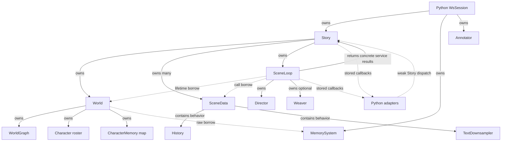
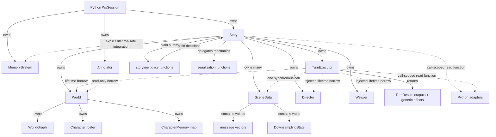

# Runtime architectural decoupling plan

## Purpose

Finish the architectural decoupling that the ownership refactor began.

The previous stage removed ambiguous ownership, deleted Scene, made SceneData independent of
World, and gave Story exclusive ownership of the native runtime. Those changes were necessary,
but they concentrated behavior in Story, SceneLoop, and World instead of completing responsibility
separation.

This plan reduces that behavioral, infrastructure, and temporal coupling while preserving the
existing game. It does not redesign narrative behavior, lifecycle semantics, undo semantics,
prompts, save files, or user-visible output.

## Honest current conclusion

The current ownership graph is clean. The responsibility and call graphs are not.

- Story owns the right objects but also implements lifecycle policy, scheduling policy, tool
  dispatch, scenario loading, undo, persistence, callback configuration, and advance sequencing.
- SceneLoop is a one-turn transaction executor, not a loop. It also implements prompt assembly,
  narrator retries, plan validation, cast resolution, output emission, death confirmation,
  weaving, reflection, downsampling, rollback, and a nominal background thread.
- World protects important state invariants but also implements queries, death detection, scenario
  parsing, filesystem persistence, reflection callback ownership, and a raw MemorySystem borrow.
- SceneTurnResult exposes Director and Weaver implementation types to Story.
- Python narrator and scheduler callbacks retain a weak reference to Story and call back into it.
- SceneData has no World edge, but it embeds History and TextDownsampler behavior and Python can
  directly rewrite invariant-bearing fields.

Approximate implementation concentration at the time of this audit:

| Type | Source lines | Member definitions | Main concern |
|---|---:|---:|---|
| Story | 800 | 42 | aggregate root plus policy, I/O, tools, configuration, and orchestration |
| SceneLoop | 682 | 21 | transaction boundary plus most turn algorithms and temporal machinery |
| World | 574 | 26 | domain state plus queries, runtime adapters, bootstrap, and file I/O |

Line counts are evidence of concentration, not design targets. Completion is judged by dependency
and responsibility boundaries, not by forcing files below an arbitrary size.

## Agreed problems and required responses

| Problem | Required architectural response |
|---|---|
| Story is becoming a god object | Retain ownership and use-case coordination; move policy parsing, query algorithms, bootstrap parsing, and serialization mechanics out |
| SceneLoop is not a loop | Rename it TurnExecutor, make Story inject its graph services, and limit it to one synchronous transaction |
| World mixes state and services | Retain state and invariant-preserving domain operations; remove filesystem, query formatting, stored runtime adapters, and scenario parsing |
| SceneTurnResult leaks internals | Return generic turn effects rather than DirectorOutput, WeaveResult, or ExpiryOp |
| Background work has temporal coupling | Remove the immediately joined async job and run post-turn work synchronously in the same preserved order |
| World borrows MemorySystem by raw pointer | Remove MemorySystem from World; make integration an explicit Story/runtime-boundary dependency with enforced lifetime |
| Python creates a behavioral callback cycle | Pass a call-scoped read-tool function into narrator and scheduler calls; adapters retain no Story reference |
| SceneData is not behavior-free and is mutable from Python | Store value state only, move algorithms out, and make invariant-bearing Python properties read-only |

Every row is a completion criterion. None is an optional cleanup item.

## Preservation contract

The refactor must preserve:

- narrator instruction bytes and turn-state content;
- narrator retry count, rejection ordering, and World restoration between retries;
- user, narrator, and authored-dialogue output order and metadata;
- cast resolution, dynamic character creation, perception routing, and death confirmation;
- weave/local-weave selection, expiry ordering, reflection, and downsampling order;
- lifecycle precedence: conclude or merge short-circuits; otherwise fork precedes exit;
- player-scene protection, off-stage selection behavior, and beat-clock updates;
- rollback and existing scene-local undo behavior;
- `world.json`, per-scene JSON, and `story.json` names, fields, and migration behavior;
- C++ and Python behavior used by production and maintained diagnostics;
- the frontend WebSocket payload and protocol.

Thread identity of post-turn callbacks is proposed as non-contractual. The current async task is
immediately joined and provides no overlap. Phase 0 must verify that no callback uses thread-local
state or requires a distinct worker thread before synchronous conversion. If such a dependency is
found, stop and review rather than silently changing it.

## Non-goals

Do not introduce:

- abstract `IStory`, `IWorld`, `ITurnExecutor`, or repository interfaces;
- a dependency-injection container, service locator, event bus, or generic command bus;
- managers whose only purpose is to move existing methods to another object;
- a compatibility SceneLoop alias after the rename;
- a StoryState wrapper merely to reduce Story's field count;
- a literal C++ POD requirement for string/vector-bearing data;
- narrative, scheduling, lifecycle, persistence, or undo redesign.

The desired SceneData is a behavior-free value aggregate, not a trivially copyable C++ POD.

## Current dependency graph



The reverse callback is not an ownership cycle, but it is a long-lived behavioral dependency.

## Target dependency graph



The Python adapter may call the supplied read function while the native callback is active. It
does not capture Story, retain the function, or create a persistent reverse object edge.

## Final responsibility map

### Story

Story remains the aggregate root, native composition root, and public production facade. It may:

- own World, SceneData records, Director, Weaver, and TurnExecutor;
- validate active-scene and storyline lifecycle mutations;
- coordinate player turn, accepted lifecycle decision, optional off-stage turn, memory sync, and
  save;
- coordinate undo across SceneData and World;
- expose complete scenario and persistence use cases;
- expose read-tool dispatch as the aggregate query entry point;
- forward runtime configuration to the component that owns it.

Story must not implement:

- scheduler or lifecycle prompt text and JSON parsing;
- graph/mind query search and JSON formatting algorithms;
- scenario JSON parsing details;
- World or SceneData JSON encoding details;
- narrator prompt, response parsing, validation, or post-turn algorithms.

Public Story methods may remain stable while delegating mechanics. A facade method is not a god
object responsibility when it enforces the aggregate boundary and delegates the implementation.

### TurnExecutor

TurnExecutor replaces SceneLoop. It owns the one-turn transaction:

1. snapshot SceneData and World;
2. append input;
3. request and validate narration;
4. apply accepted graph and cast effects;
5. emit outputs and route perceptions;
6. run post-turn operations in the preserved order;
7. return one complete generic TurnResult;
8. restore snapshots on a foreground failure.

Story injects World, Director, and Weaver into TurnExecutor's constructor. TurnExecutor borrows all
three for its lifetime and validates at construction that both services reference the injected
WorldGraph. It cannot replace or rebind them. This keeps Director and Weaver independently owned,
testable graph services while making their lifetime and graph affinity unambiguous.

TurnExecutor does not own policy, persistence, scheduler, lifecycle, MemorySystem, Story, graph
services, or a background task.

Prompt assembly, response splitting, and plan/cast/speech validation should be pure functions with
plain inputs and outputs. Do not create a NarratorManager class. Introduce a stateful narrator
object only if Phase 1 proves it owns an independent lifetime or invariant.

### World

World remains a domain aggregate rather than a passive struct. It may own state and provide the
operations required to preserve invariants across graph, roster, membership, and character minds.

World must not:

- retain MemorySystem or another external runtime adapter;
- open, create, delete, or name files;
- format narrator tool JSON;
- parse a complete scenario document;
- retain Python/LLM callbacks.

Reflection may remain a World operation because it coordinates owned minds, but the LLM callback
must be supplied for that call rather than retained in World or CharacterMemory. Query algorithms,
death-candidate scanning, and scenario seeding become free functions over explicit World inputs;
state changes still use World invariant-preserving operations.

### SceneData

SceneData becomes a behavior-free value aggregate. The proposed shape is:

```cpp
struct DownsamplingState {
    std::vector<MipLevel> levels;
    int summarized_up_to = 0;
};

struct SceneData {
    std::string scene_id;
    std::string title;
    std::string system_prompt;
    std::vector<SceneMessage> history;
    std::vector<SceneMessage> dialogue;
    DownsamplingState downsampling;
    int turn_index = 0;
    std::string driving_intention;
    float charge = 0.0f;
    int last_advanced = 0;
};
```

History and downsampling operations become namespace-level functions over explicit state. Existing
JSON remains unchanged. This is not a literal C++ POD because strings and vectors are non-trivial;
the architectural requirement is no hidden behavior, callback, ownership, or runtime dependency.

### Policy and serialization modules

`storyline_policy` receives plain `SceneSummary`/`BeatSummary` values plus the configured callback
and returns plain selections or `LifecycleDecision`. It never owns, borrows, or mutates Story,
World, or SceneData.

Serialization functions encode/decode World and SceneData values and perform the existing file
operations. Story remains the public complete-save boundary. No repository class is introduced.

## Dependency rules

1. Ownership flows from Python session to Story and external adapters, then from Story to native
   runtime state.
2. World never depends on Story, SceneData, TurnExecutor, MemorySystem, Python, or filesystem
   paths.
3. SceneData never depends on World or a behavior/service type.
4. TurnExecutor never depends on Story, persistence, scheduler, lifecycle, or MemorySystem; it
   borrows Story-owned World, Director, and Weaver through constructor injection.
5. Story never consumes DirectorOutput, WeaveResult, ExpiryOp, or another executor-internal type.
6. Policy functions receive copies/plain views and return decisions; they never mutate aggregates.
7. Python callbacks do not retain Story or a native read function.
8. Every borrow has an owner visible in the same composition graph and a deterministic lifetime.
9. Direct graph mutation remains limited to World invariant operations, Director, Weaver, and
   maintained graph utilities.
10. No phase may add more long-lived runtime ownership edges than it removes.

## Phase 0 - freeze observable behavior and audit thread assumptions

Before structural edits, record the current passing gates and add missing characterization tests.

Required evidence:

- narrator instructions retain length 4016 and FNV-1a `0x15c41a86a90a0eed`;
- prompt turn-state fixtures cover player and off-stage scenes;
- operation-order test records narration, Director, output, perception, dialogue, death, weave,
  expiry, reflection, downsampling, memory sync, lifecycle, scheduler, and save;
- foreground failure restores SceneData, World, resume state, and output association;
- post-turn failures retain the current logged/non-fatal behavior;
- narrator retry restores World and preserves rejection order;
- structural save fixture covers all three save-file kinds and legacy dialogue migration;
- Python callback and object-lifetime tests cover a complete session, load, undo, and destruction;
- Python mutation-surface tests record which SceneData fields are currently writable;
- callback implementations are audited for thread-local or distinct-thread assumptions;
- current Release, Debug, Python, frontend, lint, and diagnostic counts are recorded.

Do not add sleep-based tests. Use deterministic call logs, promises, and barriers only where a
thread contract must be observed.

### Exit gate

- The behavior contract is executable.
- Thread identity is either confirmed irrelevant or explicitly brought back for review.
- No production code changes are mixed into the baseline commit.

## Phase 1 - make the turn boundary truthful

### Rename without compatibility residue

Rename:

- `SceneLoop` to `TurnExecutor`;
- `scene_loop.h/.cpp` to `turn_executor.h/.cpp`;
- narrator and post-turn implementation files consistently;
- `SceneTurnResult` to `TurnResult`.

Do not keep aliases, deprecated headers, or duplicate bindings. SceneLoop is not a production
Python type, so maintained native callers and tests migrate directly.

The rename alone is not the architectural change. In the same phase, delete the false loop state
and temporal machinery once the synchronous replacement is covered.

### Move graph-service ownership to Story

Before deleting the old boundary, make Story own stable Director and Weaver allocations alongside
World and TurnExecutor. The intended construction is:

```cpp
class Story {
    std::unique_ptr<World> world_;
    std::vector<std::unique_ptr<SceneData>> scenes_;
    std::unique_ptr<Director> director_;
    std::unique_ptr<Weaver> weaver_;
    std::unique_ptr<TurnExecutor> executor_;
};

TurnExecutor(World& world, Director& director, Weaver& weaver);
```

Stable allocations preserve injected references through Story moves and save loads. Declaration
order ensures TurnExecutor is destroyed before Weaver, Director, scenes, and World. Constructor
validation rejects a Director or Weaver bound to a different graph.

There are no `set_director`, `set_weaver`, attach, detach, or rebinding operations. Story forwards
Weaver callback and interval configuration directly to its owned Weaver.

Story always owns a Weaver object, but TurnExecutor must preserve the current activation semantics:
post-turn weaving/expiry is active only after the equivalent of the current optional Weaver being
created. Setting the cloud callback, local callback, or interval activates it. Merely constructing
Story must not add weave analysis, expiry queue processing, logging, or callback calls to turns
that currently have no Weaver. Represent this with explicit Weaver/configuration state rather than
optional ownership or a nullable injected pointer.

### Remove fake background execution

Replace the immediately joined `std::future<BackgroundResult>` with a synchronous post-turn
function. Preserve:

1. full/local weave selection;
2. expiry drain;
3. World reflection;
4. downsampling;
5. logging and non-fatal post-turn exception policy.

There must be no `std::async`, background reference capture, stop flag used only for cross-thread
shutdown, or join method after this phase. Weaver's stop mechanism may remain only if a maintained
standalone caller genuinely uses it.

### Seal the result

Replace concrete service results with generic effects:

```cpp
struct TurnEffects {
    std::vector<Node> created_nodes;
    std::vector<Node> expired_nodes;
};

struct TurnResult {
    std::string scene_id;
    int completed_turn = 0;
    std::vector<SceneMessage> outputs;
    TurnEffects effects;
};
```

Director rejections and Weaver graph-analysis diagnostics remain internal and may be logged. If a
maintained diagnostic needs them, expose a diagnostic function on Director/Weaver rather than
leaking them through every Story turn.

Story memory synchronization consumes only created and expired nodes. Deduplicate expired nodes by
ID if Director and Weaver report the same node, preserving the current first-seen order.

### Exit gate

- No SceneLoop symbol or file remains.
- TurnExecutor has one synchronous run boundary and no temporal state API.
- Story includes no Director or Weaver result type beyond owning and configuring those services.
- Story owns Director and Weaver; TurnExecutor only borrows constructor-injected references.
- Graph-affinity mismatch is rejected at construction and runtime rebinding is impossible.
- All Phase 0 order, rollback, prompt, and result-association tests pass.

## Phase 2 - reduce TurnExecutor to transaction coordination

Extract algorithms that do not own state into focused free-function modules:

- narrator prompt construction;
- merged-response splitting;
- active-cast and speech validation;
- narrator revision prompt construction;
- graph-seed context formatting;
- output-message construction.

Keep transaction control in TurnExecutor:

- snapshots and rollback;
- retry loop, because it controls World restoration and Director application;
- ordering of Director, cast, output, perception, death confirmation, and post-turn work;
- coordination of the injected Director and Weaver during the transaction;
- generic TurnResult assembly.

Pass callbacks into the call or retain them in TurnExecutor only where Story configuration requires
stable runtime configuration. Pure helper functions must not access globals, Story, or stored
callbacks.

Do not create one class per source file. A new object is justified only by independent mutable
state, lifetime, or invariant ownership.

### Exit gate

- TurnExecutor reads as the ordered transaction above rather than containing prompt/parser/query
  algorithms inline.
- Helper modules have plain inputs and outputs and no runtime ownership edges.
- No operation has changed order or error semantics.

## Phase 3 - make World a domain aggregate

### Remove MemorySystem and stored LLM callbacks

- Delete `World::set_memory()`, `World::memory()`, and `MemorySystem* memory_`.
- Move the explicit MemorySystem borrow to Story or its binding-owned runtime configuration.
- Enforce the lifetime in C++/pybind rather than relying only on the Python dataclass field.
- Prefer `std::shared_ptr<MemorySystem>` at the Python/native boundary if ownership must be shared;
  otherwise use one Story-owned adapter. Do not replace the raw pointer with an undocumented raw
  pointer elsewhere.
- Pass the reflection callback explicitly to World/CharacterMemory reflection calls. Do not retain
  it in World or CharacterMemory.

The exact ownership choice is made after auditing maintained standalone MemorySystem use in Phase
0. The required outcome is explicit, mechanically enforced lifetime and no World-to-adapter edge.

### Remove filesystem responsibility

Move World save-path construction and file open/create/delete operations into Story serialization
functions. Preserve `World::to_json()` and `World::from_json()` as value serialization if they keep
the boundary simple.

World must not include `<filesystem>` or `<fstream>` afterward.

### Move read algorithms and bootstrap parsing

Create focused free functions, not service objects:

- graph query formatting over `const World&`;
- mind query formatting over `const World&`;
- death-candidate scanning over `const World&`;
- scenario-to-World seeding over explicit World mutation operations.

Story tool dispatch calls the query functions. TurnExecutor calls death scanning and applies a
confirmed death through World. Scenario loading calls the seeding function.

World retains membership, roster, graph, character-memory, perception, rollback, and death-state
operations because those preserve invariants across its owned state.

### Exit gate

- World depends on no MemorySystem, stored Python/LLM callback, filesystem, or scenario document.
- World public methods are domain reads or invariant-preserving mutations.
- Query, death-scan, bootstrap, save, load, and reflection behavior remain characterized.

## Phase 4 - reduce Story to aggregate coordination

### Extract storyline policy

Add plain values such as:

```cpp
struct SceneSummary { /* current scheduler fields */ };
struct BeatSummary { /* current lifecycle context fields */ };
struct LifecycleDecision { /* conclude, merge, fork, exits */ };
```

Move scheduler/lifecycle instructions, callback invocation, JSON extraction, and verdict parsing to
`storyline_policy.cpp`. Functions accept summaries and configured callbacks and return plain
decisions. They cannot call Story or mutate runtime state.

Story remains responsible for:

- building summaries from its aggregate;
- validating selected scene IDs against live SceneData;
- enforcing player-scene protections;
- applying lifecycle decisions in the preserved precedence;
- sequencing the player and optional off-stage turns.

### Delegate query, bootstrap, and serialization mechanics

Keep Story's public production facade, but make methods delegate:

- `load_scenario` delegates parsing/seeding mechanics;
- `dispatch_tool` delegates graph/mind/history formatting;
- save/load/delete delegate serialization and file helpers;
- callback setters forward to the component that uses each callback.

Undo remains in Story because it is an aggregate transaction over SceneData and World. Advance
sequencing remains in Story because it is the use case that coordinates turns, policy, external
memory synchronization, and persistence.

### Exit gate

- Story contains ownership, invariant validation, use-case sequencing, and aggregate transactions.
- Story contains no policy prompt/JSON parser, query algorithm, scenario parser, or field-level
  serialization code.
- Scheduler and lifecycle behavior is byte/order compatible with Phase 0 fixtures.

## Phase 5 - remove the persistent Python feedback edge

Introduce a function type, not an interface hierarchy:

```cpp
using ReadToolCallback = std::function<std::string(
    const std::string& name,
    const std::string& args_json)>;
```

Change narrator and scheduler callback invocation so Python receives a call-scoped read function.
The native call stack owns that function; Python must not retain it.

The intended flow is:

```text
Story builds call-scoped read function
  -> TurnExecutor invokes narrator callback(read_function)
     -> Python tool loop invokes read_function(name, args)
     -> callback returns before narrator call completes
  -> no Python object retains Story or read_function
```

Apply the same pattern to scheduler tools. Lifecycle has no tools and needs no read function.

Remove `weakref.proxy(story)` from narrator and scheduler adapters. Add a test proving the adapters
hold no Story reference after configuration and that using a retained read function after the call
fails deterministically if retention can occur.

This change removes the persistent object dependency. It does not pretend that interactive tool
use has no call-stack re-entry; that re-entry is explicit, read-only, and bounded by one callback.

### Exit gate

- Python narrator and scheduler adapters do not capture Story.
- Story/TurnExecutor callbacks expose only a call-scoped read function.
- Tool outputs and tool-selection behavior are unchanged.
- Session destruction has no callback cycle or weak-proxy dependency.

## Phase 6 - make SceneData behavior-free

### Replace embedded behavior with values

- Replace History members with message vectors or a behavior-free HistoryState aggregate.
- Replace TextDownsampler with DownsamplingState.
- Move append, snapshot, truncate, drop-from-turn, render, process, cascade, and JSON mechanics to
  namespace-level functions over explicit state.
- Keep timestamps, ordering, mip levels, summarized index, and JSON byte structure unchanged.

Do this after TurnExecutor and Story boundaries stabilize so behavior movement is not mixed with
ownership or result migration.

### Seal Python mutation

Production Python may read SceneData but must not directly replace:

- `scene_id`;
- history or dialogue containers;
- turn index;
- downsampling state;
- scheduling fields whose invariants Story maintains.

Expose explicit Story operations for any maintained mutation use case found in Phase 0. Do not add
a generic `update_scene()` escape hatch.

Validate `Story::set_active_scene()` and reject unknown IDs rather than storing an invalid active
identifier.

### Exit gate

- SceneData includes only standard/value state types and behavior-free aggregates.
- SceneData contains no callback, service object, ownership pointer, or method.
- Python cannot invalidate Story/World identity or turn invariants through SceneData.
- History, downsampling, persistence, undo, and display behavior remain unchanged.

## Phase 7 - final graph audit and deletion pass

Audit headers, implementations, bindings, and production wiring rather than trusting the plan.

Confirm:

- Story is the only native aggregate/composition owner, including Director and Weaver;
- TurnExecutor is synchronous and has no Story, policy, persistence, or MemorySystem dependency;
- TurnExecutor borrows, but does not own or rebind, Story's Director and Weaver;
- World has no external adapter, callback, filesystem, or scenario-document dependency;
- SceneData is behavior-free and World-free;
- TurnResult exposes no Director/Weaver implementation type;
- Python adapters retain neither Story nor a native read function;
- all borrows have enforced lifetime;
- obsolete SceneLoop, History, TextDownsampler, World file-I/O, raw-memory, and weakref paths are
  deleted rather than wrapped;
- production and maintained diagnostics use the same supported boundaries.

Update architecture pages only after the graph matches the code. Generate local patches for every
verified commit. Never push.

## Proposed commit sequence

| Commit | Change | Principal gate |
|---:|---|---|
| 1 | Add missing operation-order, failure, thread-assumption, save, binding, and callback-lifetime characterization | Release + focused Debug/Python |
| 2 | Make Story own stable Director and Weaver objects and constructor-inject them into the current executor | graph-affinity, move/load, lifetime tests |
| 3 | Rename SceneLoop/SceneTurnResult to TurnExecutor/TurnResult without aliases | build + complete test suite |
| 4 | Replace async post-turn work with synchronous preserved-order execution | order/failure/Debug tests |
| 5 | Replace Director/Weaver result leakage with generic TurnEffects | result, memory-sync, lifecycle tests |
| 6 | Extract pure narrator parsing/validation/context helpers | prompt hash + retry/cast/output tests |
| 7 | Remove MemorySystem and retained reflection callbacks from World with enforced replacement lifetime | native lifetime + Python GC tests |
| 8 | Move World filesystem, queries, death scan, and scenario parsing to free functions | save/query/bootstrap/death tests |
| 9 | Extract scheduler and lifecycle policy functions returning plain decisions | scheduler/lifecycle fixtures |
| 10 | Reduce Story implementations to aggregate coordination and delegation | complete Story/undo/load tests |
| 11 | Pass read tools call-scoped and remove Python weak Story captures | Python tool + lifetime tests |
| 12 | Split History/TextDownsampler behavior from SceneData value state | history/downsampling/save tests |
| 13 | Seal SceneData and active-scene Python mutation boundaries | binding compatibility tests |
| 14 | Audit graph, delete residue, update wiki, and generate local patches | full Release + Debug + wiki lint |

Split a commit if it mixes a behavioral correction with structural movement. Never combine the
MemorySystem lifetime decision, callback API migration, and SceneData representation migration in
one commit.

## Verification matrix

| Boundary changed | Required focused verification |
|---|---|
| TurnExecutor naming/state | compile all native callers; binding surface absence |
| async removal | deterministic order, post-turn failure, callback thread audit, Debug |
| TurnResult | created/expired association, deduplication, memory sync |
| narrator helpers | instruction hash, turn-state fixture, retry, cast, speech, output order |
| World adapter removal | load/reload, reflection, new character memory, Python GC |
| World I/O/query extraction | structural saves, legacy migration, graph/mind tools, death scan |
| Story policy extraction | lifecycle precedence, player protection, off-stage selection |
| call-scoped tools | narrator/scheduler tool loop, no retained Story/read function |
| SceneData state split | history timestamps, undo, display merge, mip cascade, JSON fixture |
| binding restrictions | production server and graph views plus explicit surface assertions |

At every phase boundary run the normal repository verification. Run focused Debug tests after
transaction, lifetime, callback, or representation changes. Record exact counts rather than
copying the current 38/23/7/10 baseline forward.

## Stop conditions

Stop and review if:

- preserving behavior requires a retained background SceneData or World reference;
- a callback relies on a separate background thread;
- generic TurnEffects cannot represent a maintained caller's required data;
- World needs MemorySystem or filesystem access to preserve a domain invariant;
- policy extraction needs a Story pointer or mutation callback;
- Python must retain Story to perform narrator or scheduler reads;
- SceneData algorithms require hidden callbacks or ownership;
- save schema, prompt bytes, lifecycle precedence, retry behavior, output order, or undo semantics
  change unexpectedly;
- a proposed abstraction adds an ownership edge, service hierarchy, or generic escape hatch;
- an unrelated user change overlaps a file being migrated.

## Review decisions before implementation

The reviewer should explicitly accept or revise these decisions:

1. Story owns stable Director and Weaver objects; TurnExecutor receives non-rebindable constructor
   references and validates graph affinity.
2. Preserve optional-Weaver behavior with explicit activation state, not nullable ownership.
3. Rename SceneLoop to TurnExecutor with no compatibility alias.
4. Treat post-turn callback thread identity as non-contractual after the Phase 0 audit.
5. Use generic created/expired node effects as the complete Story-facing turn boundary.
6. Keep Story as the public persistence facade while moving mechanics to free functions.
7. Define World as a domain aggregate with invariant methods, not as passive public data.
8. Remove MemorySystem from World; choose shared boundary ownership or Story ownership only after
   the maintained-use audit.
9. Use a call-scoped function for Python tools instead of introducing a tool-dispatch interface.
10. Define SceneData as behavior-free value state, not a literal trivially copyable POD.
11. Keep current undo and storyline semantics unchanged.
12. Make every phase a local verified commit and never push.

## Completion criteria

The stage is complete only when all agreed problems have an implemented result:

- Story owns and coordinates but does not implement policy, query, bootstrap, or serialization
  mechanics;
- Story owns stable Director and Weaver instances and injects them into TurnExecutor once;
- TurnExecutor truthfully performs one synchronous transaction, borrows its graph services without
  rebinding them, and delegates pure algorithms;
- World contains domain state and invariant operations, with no external adapter, stored callback,
  filesystem, or scenario-parser role;
- TurnResult is opaque with respect to Director and Weaver;
- no immediately joined background task or reference capture exists;
- MemorySystem lifetime is explicit and mechanically enforced outside World;
- Python narrator and scheduler adapters retain no Story reference;
- SceneData is World-free, behavior-free, and protected from invariant-breaking Python mutation;
- the actual dependency graph matches the target;
- all preservation-contract tests, Release tests, focused Debug tests, Python tests, frontend tests,
  builds, linters, diagnostics, and wiki lint pass;
- local patches exist and nothing has been pushed.

## Repository discipline

- Preserve unrelated working-tree changes.
- Do not amend or rewrite the completed first-stage commits.
- Use scoped staging and scoped whitespace checks.
- Record behavioral changes separately from structural moves.
- Generate ignored local patch files after verification.
- Never push to the repository.
