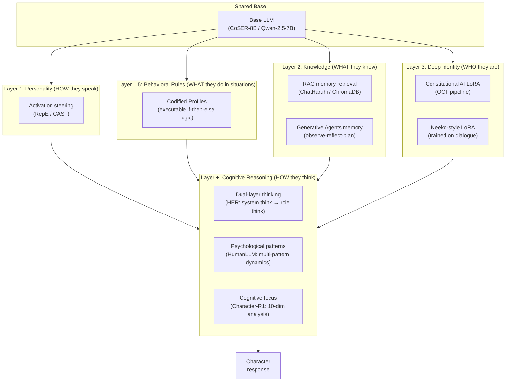

# LLM role-playing survey -- tuning models for game characters

A survey of recent research (2023--2025) on fine-tuning and aligning LLMs for character role-playing and game NPC behavior. Focused on papers with open-source implementations that could inform Rhapsode's character system.

**Selection criteria:** (1) Published 2021--2026, (2) at least 30 citations (or borderline with exceptional relevance), (3) complete open-source code on GitHub, (4) credible institution with track record in NLP/alignment, (5) top-tier venue preferred (ACL, EMNLP, NeurIPS, ICML, ICLR, NAACL, UIST); arXiv-only acceptable from top labs.

## Landscape

The field has rapidly grown since late 2023. Two major surveys map the territory:

- **"Two Tales of Persona in LLMs"** (Tseng et al., EMNLP 2024 Findings) -- distinguishes LLM role-playing (assigning personas to models) from LLM personalization (adapting to user personas). Paper collection at [MiuLab/PersonaLLM-Survey](https://github.com/MiuLab/PersonaLLM-Survey).
- **"From Persona to Personalization"** (Chen et al., TMLR 2024) -- categorizes personas into Demographic, Character, and Individualized types. Most comprehensive taxonomy with coverage of data sourcing, agent construction, and evaluation.

Three main approaches have emerged:

1. **Per-character SFT** -- Fine-tune a separate model for each character on synthetic biographical data (Character-LLM)
2. **Multi-role instruction tuning** -- Fine-tune a single model with role-conditioned instructions across many characters (RoleLLM, CoSER)
3. **Self-alignment** -- Leverage the LLM's own pre-training knowledge to generate role-play training data without proprietary model distillation (DITTO)

An orthogonal concern is **multi-character efficiency** -- serving many characters from a single model via adapter routing (Neeko).

A second wave of research (2024--2026) introduced additional families that avoid fine-tuning entirely or use radically lighter mechanisms:

4. **Activation steering** -- Extract personality trait vectors from the model's activation space and compose them via arithmetic at inference time. Zero training. Built on the Representation Engineering foundation (Zou et al., CAIS+CMU+Berkeley+Stanford, 988 citations). (CAST, PERSONA)
5. **RAG-based character memory** -- Retrieve character-specific memories from a vector/graph database and inject them into the prompt. Zero training. The gold standard for NPC memory is Generative Agents (Park et al., Stanford+Google, 4,781 citations) with its observe-reflect-plan cycle. (ChatHaruhi, RoleRAG)
6. **Constitutional AI for persona** -- Define character identity as a set of natural-language principles ("constitution") and train via DPO on constitution-aligned data. (Open Character Training)
7. **Structured executable profiles** -- Convert character descriptions into code-like behavioral functions that the model executes. Zero training, works with very small models. (Codifying Character Logic)

A third wave (late 2025--2026) focuses on **cognitive simulation** -- training models not just to say what a character says, but to *think* how a character thinks:

8. **Role-aware reasoning** -- Distill structured character-grounded thought traces (emotion, experience, motivation) from a large reasoning model, then train via SFT + DPO/RL. (RAR, Character-R1)
9. **Dual-layer thinking with RL** -- Separate hidden third-person planning (system thinking) from visible first-person inner monologue (role thinking), then optimize with a trained generative reward model. Current state-of-the-art. (HER)
10. **Cognitive pattern simulation** -- Model 244 psychological patterns (personality traits + cognitive biases + social influence mechanisms) as interacting causal forces. Train on scenarios where patterns reinforce, conflict, or modulate each other. 8B models outperform 32B on multi-pattern dynamics. (HumanLLM)

## Papers reviewed (with quality assessment)

### Institutional credibility key

Each paper is assessed on institution, venue, citations, and code quality. Ratings:
- **A**: Top institution + top venue + significant citations
- **B**: Strong institution + top venue, or top institution + decent venue
- **C**: Adequate institution/venue, or too new for citation validation
- **D**: Weak institution, arXiv-only, or no community validation

### Foundational and adjacent work

| Paper | Institution | Venue | Citations | Stars | Quality | Detail page |
|-------|------------|-------|-----------|-------|---------|-------------|
| [Generative Agents](papers/generative-agents.md) | **Stanford + Google** | UIST 2023 | **4,781** | 21,137 | **A** | Seminal NPC memory architecture (observe-reflect-plan) |
| [Representation Engineering](papers/representation-engineering.md) | **CAIS + CMU + Berkeley + Stanford** | arXiv 2023 | **~988** | 970 | **A** | Foundation for all activation steering methods |

### Character role-playing methods

| Paper | Institution | Venue | Citations | Stars | Quality | Detail page |
|-------|------------|-------|-----------|-------|---------|-------------|
| [Character-LLM](papers/character-llm.md) | **Fudan U** + Shanghai AI Lab | EMNLP 2023 | ~100+ | 628 | **A** | Per-character SFT via Experience Reconstruction |
| [RoleLLM](papers/rolellm.md) | Beihang + HKUST + CAS + ETH | ACL 2024F | 54--106 | 522 | **B** | 4-stage framework, RoleBench (168K samples, 100 roles) |
| [DITTO](papers/ditto.md) | **Alibaba** | ACL 2024 | 41--79 | 213 | **A** | Self-alignment, WikiRoleEval benchmark |
| [CoSER](papers/coser.md) | **Fudan U** + JHU + StepFun | ICML 2025 | <30 (new) | 194 | **B** | 17,966 characters from 771 books; state-of-the-art |
| [CharacterGLM](papers/characterglm.md) | **Tsinghua** + Zhipu AI | EMNLP 2024I | ~19 | 499 | **B** | Attribute/behavior decomposition; production-oriented |
| [Neeko](papers/neeko.md) | BIT + USTB + Beihang + CAS | EMNLP 2024 | ~25 | 137 | **C** | Dynamic LoRA for multi-character serving |
| [Codifying Character Logic](papers/codified-profiles.md) | **UC San Diego** | NeurIPS 2025 | New | -- | **B** | Executable character profiles; 1B models can role-play |

### Cognitive simulation methods (third wave)

| Paper | Institution | Venue | Citations | Stars | Quality | Detail page |
|-------|------------|-------|-----------|-------|---------|-------------|
| [HER](papers/her-dual-layer-thinking.md) | **Fudan U** + MiniMax | arXiv 2026 | New | -- | **A** | Dual-layer thinking + RL with trained GRM; state-of-the-art on CoSER |
| [HumanLLM](papers/humanllm.md) | **Fudan U** + JHU | ACL 2026 | New | -- | **A** | 244 psychological patterns as interacting causal forces; 8B beats 32B |
| [Character-R1](papers/character-r1.md) | HIT-SZ + CUHK-SZ + Baidu | arXiv 2026 | New | -- | **B** | 10-dimension cognitive focus + verifiable rewards via GRPO |

### Modular approaches (steering, RAG, constitutional AI)

| Paper | Institution | Venue | Citations | Stars | Quality | Detail page |
|-------|------------|-------|-----------|-------|---------|-------------|
| [Open Character Training](papers/open-character-training.md) | **Cambridge + AI2 + Anthropic** | arXiv 2025 | 4 | 80 | **A** | Constitutional AI for persona; most adversarially robust. Authors are the authority on this topic. |
| [CAST](papers/cast-activation-steering.md) | **IBM Research** | ICLR 2025 Spotlight | -- | 167 | **A** | Conditional context-dependent steering |
| [ChatHaruhi](papers/chatharuhi.md) | Community project | arXiv 2023 | -- | 2,080 | **C** | Most adopted open-source character system; not peer-reviewed |
| [PERSONA](papers/persona-steering.md) | HIT + UHK | ICLR 2026 | ~0 | 11 | **D** | Training-free Big Five steering. Interesting idea but HIT is weak in AI research, brand new, zero community validation. |
| [RoleRAG](papers/rolerag.md) | NTU Singapore | arXiv 2025 | 0 | 3 | **D** | Graph-guided retrieval. Brand new (May 2025), arXiv-only, no validation. |

### Evaluation resources

| Paper | Institution | Venue | Quality | What it provides |
|-------|------------|-------|---------|-----------------|
| [CharacterBox](https://aclanthology.org/2025.naacl-long.323/) | **RUC + MSRA + PKU** | NAACL 2025 | **B** | Simulation sandbox with psychology-grounded agents; fine-tuned evaluator models |
| [PersonaGym](https://aclanthology.org/2025.findings-emnlp.368/) | **Princeton + CMU + GT + UMD** | EMNLP 2025F | **A** | Dynamic evaluation framework with PersonaScore; 200 personas, 10K questions |

## Comparative analysis

### All methods at a glance

| Method | Paper | Layer | Requires training? | Multi-char? | Base model | Quality |
|--------|-------|-------|--------------------|----|------------|---------|
| Observe-reflect-plan memory | Generative Agents | L2 | No | Yes | Any (GPT-3.5/4 in paper) | **A** |
| RepE activation steering | Representation Engineering | L1 | No (extract once) | Yes | Llama-2-13B in paper | **A** |
| Per-character SFT | Character-LLM | L3 | Yes (per char) | No | LLaMA-1 7B | **A** |
| Multi-role instruction tuning | RoleLLM | L3 | Yes (once) | Yes | LLaMA / ChatGLM | **B** |
| Self-alignment SFT | DITTO | L3 | Yes (once) | Yes | Qwen series | **A** |
| Multi-role SFT (literary) | CoSER | L3/Base | Yes (once) | Yes | LLaMA-3.1 8B/70B | **B** |
| Attribute/behavior design | CharacterGLM | Design | Yes (once) | Yes | ChatGLM 6B--66B | **B** |
| Dynamic LoRA routing | Neeko | L3 | Yes (per char) | Yes | LLaMA variants | **C** |
| Codified executable profiles | Codifying Character Logic | L1.5 | No | Yes | Any (1B+) | **B** |
| Constitutional AI LoRA | Open Character Training | L3 | Yes (per char) | No | LLaMA/Qwen/Gemma 4-8B | **A** |
| Conditional steering | CAST | L1 | No (extract once) | Yes | Any (via RepE) | **A** |
| RAG memory retrieval | ChatHaruhi | L2 | No (optional FT) | Yes | Qwen-7B / any | **C** |
| Big Five vector steering | PERSONA | L1 | No | Yes | Qwen/LLaMA 7-8B | **D** |
| Graph-guided RAG | RoleRAG | L2 | No | Yes | Any | **D** |
| Dual-layer thinking + RL | HER | L+ | Yes (once) | Yes | Qwen3-32B | **A** |
| Cognitive pattern simulation | HumanLLM | L+ | Yes (once) | Yes | Qwen3-8B/32B | **A** |
| 10-dim cognitive focus + GRPO | Character-R1 | L+ | Yes (once) | Yes | LLaMA-3.2-3B / Qwen2.5-7B | **B** |

### Training-based methods comparison

| Dimension | Character-LLM | RoleLLM | DITTO | CoSER | Neeko | OCT |
|-----------|--------------|---------|-------|-------|-------|-----|
| Approach | Per-char SFT | Multi-role RoCIT | Self-alignment | Multi-role SFT | Dynamic LoRA | Constitution + DPO |
| Base model | LLaMA-1 7B | LLaMA / ChatGLM | Qwen series | LLaMA-3.1 8B/70B | LLaMA variants | LLaMA/Qwen/Gemma 4-8B |
| Characters | 9 | 100 | 4,000 | 17,966 | Multi-char | 11 personas |
| Multi-char | No | Yes | Yes | Yes | Yes | No (per-persona) |
| GPT dependency | GPT-3.5 (data) | GPT-4 (data) | None (self-align) | GPT-4 (data) | GPT-3.5 (data) | None |
| Adversarial robustness | Not tested | Not tested | Not tested | Not tested | Not tested | **Tested**: F1 0.86-0.95 |
| Training code | Complete | Partial | Eval only | Yes | Yes | Complete |

### Cognitive simulation methods comparison

| Dimension | RAR | Character-R1 | HER | HumanLLM |
|-----------|-----|-------------|-----|----------|
| Core idea | Structured thought traces | Verifiable cognitive focus | Dual-layer thinking + RL | Psychological pattern dynamics |
| What it models | How the character reasons per turn | Which character dimensions matter per turn | How to plan (hidden) + think (visible) | How multiple psychological patterns interact |
| Training signal | SFT + DPO (style contrast) | GRPO with rule-based rewards | SFT + RL (trained GRM) | SFT only |
| Base model | LLaMA-3-8B | LLaMA-3.2-3B / Qwen2.5-7B | Qwen3-32B | Qwen3-8B/32B |
| Key benchmark | CharacterBench 3.69 | CharacterBench 3.81 | CoSER 53.1 (+30.2 over base) | MPD 70.1 (8B beats 32B) |
| Reward model | None | Rule-based (BLEU + exact match) | Trained generative RM (51 principles) | None |
| Anti-collapse | None | Character-conditioned normalization | Balanced construction + diversity rewriting | Pattern-anchored training mixture |
| Open weights | No | No | Yes (32B model + RM) | No |
| Open data | Yes (HuggingFace) | Yes (GitHub) | Yes (HuggingFace) | Not yet |

### Code completeness ranking

1. **HER** -- Full pipeline: model weights (32B), reward model (32B), dataset, training code, data synthesis — the most complete release in the field
2. **Generative Agents** -- Full simulation sandbox, Apache 2.0 (21K stars)
3. **Character-LLM** -- Full pipeline: data generation, training, inference, evaluation, model weights
4. **Representation Engineering** -- RepReading + RepControl libraries, Colab demos, MIT License (970 stars)
5. **CoSER** -- Dataset, training, evaluation, model weights
6. **Open Character Training** -- Full 3-stage pipeline (constitution → DPO → SFT), released training code
7. **CAST** -- General-purpose activation steering library, Apache 2.0, IBM-maintained (167 stars)
8. **Character-R1** -- Training code via EasyR1 framework, dataset on GitHub
9. **Neeko** -- Training and evaluation code with data
10. **CharacterGLM** -- Released model with inference code (no training scripts)
11. **RoleLLM** -- Dataset and evaluation (training pipeline underdocumented)
12. **DITTO** -- Evaluation framework only (training pipeline unreleased)
13. **HumanLLM** -- Not yet released at time of writing (ACL 2026 accepted, code expected)

### Evaluation landscape

No standardized evaluation exists, but two dedicated evaluation frameworks have recently emerged:

| Benchmark / Framework | Paper | Institution | Scope | Method |
|----------------------|-------|-------------|-------|--------|
| **PersonaGym** | PersonaGym | Princeton + CMU + GT | 200 personas, 10K questions | PersonaScore metric across 5 dimensions (action, linguistic, consistency, toxicity) |
| **CharacterBox** | CharacterBox | RUC + MSRA + PKU | Simulation sandbox | Psychology-grounded character + narrator agents; fine-tuned evaluator models |
| Character interview | Character-LLM | Fudan | 9 characters | 5-dimension probe (memorization, values, personality, hallucination, stability) |
| RoleBench | RoleLLM | Beihang + HKUST | 100 characters | 168K QA samples; integrated into OpenCompass |
| WikiRoleEval | DITTO | Alibaba | 4,000 characters | 3 metrics (identity, knowledge, rejection); GPT-4 judge |
| InCharacter + LifeChoice | CoSER | Fudan + JHU | 17K+ characters | Accuracy on character identification tasks |
| Codified benchmark | Codifying Character Logic | UCSD | 83 characters, 5,141 scenes | NLI-based scoring against character traits |
| HumanLLM dual-level checklists | HumanLLM | Fudan + JHU | 244 patterns, 11,359 scenarios | Pattern-level (15 items/pattern) + scenario-level (2-6 items/character); r=0.91 human alignment |
| CoSER Test + MiniMax RPBench | HER | Fudan + MiniMax | 200 conversations × 20 rounds | 4-dimension deduction scoring (SC/AN/CF/SQ); 100-turn self-chat |

HumanLLM's dual-level checklists (ACL 2026, r=0.91 with human experts) are now the best-validated evaluation framework for cognitive character simulation. PersonaGym (Princeton+CMU) remains the best for general persona evaluation. CoSER Test is the primary benchmark for multi-turn role-play quality.

## Key insights for Rhapsode

### Design constraints

Rhapsode's character system operates under two hard constraints:

1. **Local small LLMs only** -- models like Qwen-2.5 (7B), LLaMA-3.1 (8B), or similar quantized models runnable on consumer GPUs. No cloud API dependency for inference.
2. **Modular and adaptive** -- training one model per character is too costly. The system must serve many NPCs from a shared base with minimal per-character overhead.

These constraints eliminate Character-LLM (per-character SFT) and CharacterGLM (tied to ChatGLM family) as direct adoption targets, though their *ideas* remain valuable.

### What to adopt (revised May 2026)

Ordered by implementation priority. Each item maps to a specific paper and layer. The third-wave cognitive simulation papers now occupy the top spots for protagonist companions.

1. **Observe-reflect-plan memory** (from [Generative Agents](papers/generative-agents.md), Layer 2) -- the single highest-value improvement for the *existing* system. Add importance scoring (1-10) at memory creation, recency-weighted retrieval, and periodic reflection generation. Rhapsode already has ChromaDB; the gap is that memories are flat (no importance, no decay, no reflection). This is pure Python-server work, no model training.

2. **Cognitive focus as prompt structure** (from [Character-R1](papers/character-r1.md), Layer +) -- zero-training-cost improvement: before generating a response, the model explicitly identifies which character dimensions (knowledge, emotion, memory, worldview) are relevant to this turn. Character-R1 validates this on Qwen2.5-7B — our exact target model family. Adoptable as a structured prompt template for important NPCs today.

3. **Codified character profiles** (from [Codifying Character Logic](papers/codified-profiles.md), Layer 1.5) -- convert WorldGraph character nodes into executable behavioral functions. Even 1B models can role-play with these. For minor NPCs, this may be all that's needed. Profile generation can be done offline by a larger LLM; execution happens at inference via `check_condition()` calls.

4. **Psychological pattern profiles** (from [HumanLLM](papers/humanllm.md), Layer +) -- annotate major NPC WorldGraph nodes with explicit psychological patterns (e.g., "loss aversion + sunk cost fallacy + loyalty" for a guard who doubles down on a corrupt system). The key insight: standard SFT on dialogue data *degrades* cognitive realism. Pattern-grounded training data is needed as an "anchor" whenever fine-tuning.

5. **Constitutional AI for major NPCs** (from [Open Character Training](papers/open-character-training.md), Layer 3) -- the most adversarially robust method for core characters. Write a constitution, train a LoRA adapter via DPO on constitution-aligned data. **On Qwen 2.5 7B specifically**, this beats activation steering by a 94.4% coherence win rate.

6. **Dual-layer thinking** (from [HER](papers/her-dual-layer-thinking.md), Layer +) -- the most complete cognitive role-play system. For protagonist companions, add a hidden system-thinking stage (character-aware planning) followed by visible role thinking (first-person inner monologue). Requires training (SFT + RL), but HER's full dataset and pipeline are open. **Caveat**: HER trains on 32B; distillation to 7-8B is untested. The system thinking overhead (~580 tokens) adds latency.

7. **Conditional activation steering** (from [CAST](papers/cast-activation-steering.md) / [RepE](papers/representation-engineering.md), Layer 1) -- zero-cost personality modulation for emotional reactivity and situational behavior. Gruff when challenged, warm with allies. Use as supplementary modulation, not as primary personality on Qwen. Based on the RepE foundation (988 citations).

8. **Self-alignment data generation** (from [DITTO](papers/ditto.md)) -- treat role-play as reading comprehension over character profiles. The local LLM reads a WorldGraph profile and generates in-character dialogue for Layer 3 training data. No GPT-4 dependency.

9. **Attribute/behavior profile schema** (from [CharacterGLM](papers/characterglm.md)) -- characters defined through attributes (identity, interests, viewpoints, experiences, relationships) and behaviors (linguistic features, emotional expressions, interaction patterns). This feeds both codified profiles and LoRA training.

10. **Protective experiences** (from [Character-LLM](papers/character-llm.md)) -- training data where characters correctly refuse out-of-scope knowledge. Essential for immersion.

11. **Evaluation with HumanLLM checklists + PersonaGym** -- HumanLLM's dual-level checklists (r=0.91 with human experts) are now the best-validated evaluation framework for cognitive character simulation. PersonaGym (Princeton+CMU) remains the best for general persona evaluation.

### Architecture recommendation

The architecture has evolved from a simple two-tier system (prompt vs. LoRA) to a **four-layer modular architecture** informed by 16 papers. Each layer is independently addressable and maps to specific papers.

### Scaling properties

| NPC count | Layers used | Per-NPC cost | Key papers |
|-----------|-------------|--------------|------------|
| 1--5 protagonist companions | L1 + L1.5 + L2 (reflections) + L3 (phase LoRAs) | ~30-150MB storage, hours training each | OCT, Generative Agents, Codified Profiles |
| 5--15 major NPCs | L1 + L1.5 + L2 (reflections) + L3 (single LoRA) | ~10-50MB per character, hours training | OCT, DITTO, CAST |
| 15--50 important NPCs | L1 + L1.5 + L2 (memories) | Zero training cost | Codified Profiles, RepE, ChatHaruhi |
| 50--200+ minor/background NPCs | L1.5 + L2 (shared lore) | Zero training cost | Codified Profiles |

All tiers share the same base model in memory. LoRA hot-swapping (Neeko-style) adds negligible latency. Total VRAM is dominated by the base model (~6-16GB depending on quantization), not adapters.

### What to watch

- **HER distillation to 7-8B**: HER's 32B results are the best in the field, but Rhapsode needs a 7-8B model. Whether dual-layer thinking survives aggressive distillation is the key open question. The ~580 token system thinking overhead may need length constraints for smaller models.
- **HumanLLM + HER combination**: Both from the same Fudan lab. HumanLLM provides the *what* (psychological patterns to simulate); HER provides the *how* (dual-layer thinking + RL). A combined approach is the obvious next step. No paper has tested this yet.
- **Negative transfer from standard SFT**: HumanLLM's ablation showing that CoSER+OpenThoughts SFT *destroys* cognitive pattern fidelity (-53% IPE) is a critical warning. Any Rhapsode SFT pipeline needs psychologically-grounded data as an anchor.
- **CoSER-8B** (Fudan+JHU, ICML 2025) remains the strongest available base model for role-playing on local hardware.
- **DITTO's training pipeline** was never open-sourced. Reimplementation is the highest-value engineering task.
- **Codified Profiles' `check_condition()` overhead** -- each condition check is a mini-LLM call. Latency may be an issue with complex profiles. Caching or batching may help.
- **Evaluation convergence**: HumanLLM's checklists (r=0.91) are more reliable than holistic metrics (r=0.41-0.62). The field is shifting toward structured, pattern-specific evaluation.
- **LoRA + gating at scale** (Neeko) is validated on a small character set. Degradation with 50+ adapters is untested.

### Revised character architecture (five layers)

The research reveals that the original LoRA-centric architecture was too narrow. The different approaches are **complementary, not competing** -- they solve different aspects of character simulation. The third wave (late 2025--2026) adds a **cognitive reasoning layer (L+)** that sits between context assembly and response generation, teaching the model to *think* in character before speaking:



**Layer 1 -- Personality (zero training, instant)**: Controls *how* the character communicates. Uses RepE-derived activation steering for emotional expression, assertiveness, formality, warmth. CAST adds situational reactivity. Based on the RepE foundation (Zou et al., 988 citations). **Caveat**: OCT found this unreliable on Qwen 2.5 7B specifically.

**Layer 1.5 -- Behavioral Rules (zero training, codified)**: A new layer from the Codified Profiles paper (NeurIPS 2025). Converts character descriptions into executable Python functions with `check_condition(scene, question)` calls. Enforces complete behavioral logic on every response. **Key insight**: even 1B models can role-play well with this structure, meaning minor NPCs can be handled by a tiny model.

**Layer 2 -- Knowledge (zero training, retrieval)**: Controls *what* the character knows. Combines two paradigms:
- **RAG memory** (ChatHaruhi-style): retrieve relevant memories from ChromaDB
- **Generative Agents memory** (observe-reflect-plan): add importance scoring, recency decay, and periodic reflection generation. This is the biggest immediate improvement opportunity.

**Layer 3 -- Deep Identity (lightweight training, optional)**: Controls *who* the character fundamentally is. Uses Constitutional AI LoRA (OCT pipeline: constitution → DPO → introspection SFT). Only needed for major NPCs where Layers 1-2 aren't enough.

**Layer + -- Cognitive Reasoning (training-based, optional)**: Controls *how* the character thinks before responding. Three complementary approaches:
- **Dual-layer thinking** (HER): Hidden system thinking plans the trajectory; visible role thinking generates the character's inner monologue. Trained via SFT + RL with a specialized generative reward model. State-of-the-art results (+30.2 over Qwen3-32B base on CoSER).
- **Psychological patterns** (HumanLLM): 244 cognitive patterns (personality traits + cognitive biases + social influence) modeled as interacting causal forces. SFT on multi-pattern scenarios where traits reinforce, conflict, or modulate each other. 8B models outperform 32B on multi-pattern dynamics — cognitive process simulation is more parameter-efficient than behavior memorization.
- **Cognitive focus** (Character-R1): 10-dimension structured analysis (knowledge, style, worldview, emotion, memory, etc.) enforced via verifiable reward during GRPO training. Validated on Qwen2.5-7B.

### Layer composition for different NPC tiers

| NPC Tier | L1 (Personality) | L1.5 (Behavioral Rules) | L2 (Knowledge) | L3 (Identity) | L+ (Cognition) | Training |
|----------|-----------------|------------------------|----------------|----------------|----------------|----------|
| Background NPCs | Default | None | Shared lore DB | None | None | **Zero** |
| Minor NPCs | Steering vector | Codified profile | Character memories | None | None | **Zero** |
| Important NPCs | Steering + CAST | Codified profile | Memories + reflections | None | Cognitive focus (prompt-only) | **Zero** |
| Major NPCs | Steering + CAST | Codified profile | Full memory + reflections | Constitutional LoRA | Cognitive focus + pattern profile | **Hours** |
| Protagonist companions | Steering + CAST | Codified profile | Full memory + evolving reflections | Phase-based LoRA | Dual-layer thinking + patterns | **Hours** |

**Most NPCs require zero training.** The addition of Codified Profiles (L1.5) and Generative Agents memory (L2 with reflections) significantly raises the quality floor for non-trained characters. Minor NPCs with a codified profile and basic memories may be sufficient for most gameplay interactions.

**L+ is the biggest quality lever for trained characters.** HER shows that adding cognitive reasoning training to a base model provides larger gains (+30.2 on CoSER) than any other single intervention. For protagonist companions, the combination of dual-layer thinking (HER-style) with psychological pattern grounding (HumanLLM-style) should produce the deepest character simulation. The cognitive focus framework (Character-R1) can be applied even without RL training — as a structured prompt template, it improves important NPC responses at zero training cost.

### Papers ranked by relevance to Rhapsode (revised May 2026, with quality tiers)

| Rank | Paper | Layer | Quality | Why |
|------|-------|-------|---------|-----|
| 1 | [HER](papers/her-dual-layer-thinking.md) | L+ | **A** | State-of-the-art cognitive role-play: dual-layer thinking + RL. Full model/data release. Fudan+MiniMax. |
| 2 | [HumanLLM](papers/humanllm.md) | L+ | **A** | 244 psychological patterns as interacting forces. 8B beats 32B. Proves cognitive modeling > behavior imitation. ACL 2026 Main. Fudan+JHU. |
| 3 | [Generative Agents](papers/generative-agents.md) | Memory | **A** | Observe-reflect-plan architecture defines NPC memory. 4,781 citations, Stanford+Google. |
| 4 | [Open Character Training](papers/open-character-training.md) | L3 | **A** | Constitution-based LoRA for major NPCs; most adversarially robust. Cambridge+AI2+Anthropic. |
| 5 | [Codifying Character Logic](papers/codified-profiles.md) | Profile | **B** | Executable character profiles let 1B models role-play. UCSD, NeurIPS 2025. |
| 6 | [Character-R1](papers/character-r1.md) | L+ | **B** | 10-dimension cognitive focus + GRPO. Validated on Qwen2.5-7B (our target). HIT-SZ+Baidu. |
| 7 | [CAST](papers/cast-activation-steering.md) | L1 | **A** | Conditional activation steering from game state. IBM Research, ICLR Spotlight. |
| 8 | [CoSER](papers/coser.md) | Base | **B** | Best available pre-trained base model (LLaMA-3.1 8B). Fudan+JHU, ICML 2025. |
| 9 | [Representation Engineering](papers/representation-engineering.md) | L1 (foundation) | **A** | Foundation for all steering. 988 citations, CAIS+CMU+Berkeley+Stanford. |
| 10 | [DITTO](papers/ditto.md) | Data | **A** | Self-alignment data generation for L3 training. Alibaba, ACL 2024. |
| 11 | [ChatHaruhi](papers/chatharuhi.md) | L2 | **C** | Most adopted RAG-based character system. Community project, not peer-reviewed. |
| 12 | [CharacterGLM](papers/characterglm.md) | Design | **B** | Attribute/behavior profile schema. Tsinghua+Zhipu, EMNLP 2024. |
| 13 | [Character-LLM](papers/character-llm.md) | Data | **A** | Experience Reconstruction, protective experiences. Fudan, EMNLP 2023. |
| 14 | [RAR](papers/rar-thinking-in-character.md) | L+ | **B** | First role-aware reasoning paper (NeurIPS 2025). Superseded by HER and Character-R1. |
| 15 | [Neeko](papers/neeko.md) | L3 | **C** | Dynamic LoRA routing. BIT, EMNLP 2024. Below citation threshold. |
| 16 | [RoleLLM](papers/rolellm.md) | Eval | **B** | RoleBench evaluation. Beihang+HKUST+CAS, ACL 2024. |
| 17 | [PERSONA](papers/persona-steering.md) | L1 | **D** | Interesting Big Five steering idea, but HIT is weak in AI, zero validation. |
| 18 | [RoleRAG](papers/rolerag.md) | L2 | **D** | Graph retrieval idea, but brand new arXiv, no validation. |

**Note on ranking changes (May 2026)**: HER rises to #1 as the most complete cognitive role-play system with full open release. HumanLLM enters at #2 because its 8B-beats-32B finding and cognitive-process paradigm are directly relevant to Rhapsode's local-model constraint. Character-R1 enters at #6 as the only cognitive method validated on Qwen2.5-7B (our target family). RAR drops from implicit inclusion to #14 as it's been superseded by the same group's Character-R1 and by HER.

## Three-method comparison: Steering vs. RAG vs. Constitutional AI

The three second-wave families are complementary, not competing. Each controls a different aspect of character behavior. This section summarizes verified performance data from the respective papers.

### What each method controls

| | Activation Steering (PERSONA) | RAG (ChatHaruhi) | Constitutional AI LoRA (OCT) |
|--|-------------------------------|-------------------|------------------------------|
| **Controls** | Personality traits (Big Five: how the character *feels* and *communicates*) | Knowledge (what the character *knows* and *remembers*) | Behavioral rules (what the character *should and shouldn't do*) |
| **Mechanism** | Add a vector to the model's residual stream during inference | Retrieve relevant memories and inject them into the prompt | Train a LoRA adapter via DPO on constitution-aligned response pairs |
| **Modifies weights?** | No | No | Yes |

### Verified performance (all numbers traced to specific paper tables)

**Activation Steering** -- PERSONA paper, Table 4, on LLaMA-3-8B-Instruct:
- PersonalityBench mean: 9.60 / 10 (SFT upper bound: 9.61). Best training-free method. PersonalityBench measures personality trait expression, not character identity.
- MMLU with steering on Qwen2.5-7B: 0.70 vs. 0.71 without -- negligible capability loss (Table 5).
- Inference overhead: +0.62s per response for PERSONA-FLOW dynamic steering on Qwen2.5-7B / A100 (Table 18).
- Cross-trait interference: ~18% of primary effect magnitude, predictable and linearly composable (Appendix A.11, Table 16).

**RAG** -- ChatHaruhi paper:
- No directly comparable numerical benchmark with the other two methods. Uses plot-recall matching (automatic) and human ratings (alignment + quality).
- 32 characters, 54K dialogues. Local Qwen-7B and Qwen-1.8B fine-tuned versions available. Also works in pure RAG mode without fine-tuning.

**Constitutional AI LoRA** -- Open Character Training paper, on LLaMA 3.1 8B, Qwen 2.5 7B, Gemma 3 4B:
- Adversarial robustness (Table 2, prefill attack F1): LLaMA 0.95, Qwen 0.86, Gemma 0.95.
- Coherence win rate vs. steering (Table 3): LLaMA 78.4%, **Qwen 94.4%**, Gemma 82.1%.
- General capability preserved: Qwen MMLU 74.1 → 74.2 with flourishing persona (Table 4).

### Robustness hierarchy (from OCT paper Section 3.2--3.3)

The OCT paper is the only one that directly compared methods head-to-head. It tested three approaches (system prompts, activation steering, and character training) across three models under adversarial prompting:

```
Character training (DPO + introspection)  >  Activation steering  ≈ System prompts
```

- **System prompts**: brittle across all models.
- **Activation steering**: robust on LLaMA 3.1 8B and Gemma 3 4B, but **poor on Qwen 2.5 7B**.
- **Character training**: most robust across all models.

The coherence comparison reinforces this: activation steering sometimes produces "exaggerated" and incoherent output (the paper shows sarcasm steering on LLaMA producing all-caps ranting), while character training produces contextually appropriate responses.

### Practical cost comparison

| | Add new character | Per-character storage | Inference overhead | Switch characters |
|--|-------------------|----------------------|--------------------|--------------------|
| Activation steering | Minutes (extract or compose vectors) | ~KB | +0.62s/response (PERSONA-FLOW) | Instant (swap vector) |
| RAG | Minutes (populate database) | Varies (database entries) | Retrieval latency + context tokens | Instant (swap collection) |
| Constitutional AI LoRA | Hours (write constitution + DPO + SFT) | ~10-50MB LoRA adapter | Adapter loading at startup | Requires adapter swap |

### Qwen-specific finding

The OCT paper provides a critical finding for Rhapsode: on **Qwen 2.5 7B specifically**, activation steering is unreliable for persona control, while character training works well (F1 0.86, coherence 94.4% win rate vs. steering). This suggests that for Qwen-based Rhapsode:

- **Important NPCs** should use constitutional LoRA rather than relying solely on activation steering for personality
- **Activation steering** may still serve as supplementary trait modulation (e.g., temporary emotional states) but should not be the primary personality mechanism on Qwen
- **RAG** remains essential for knowledge regardless of the personality mechanism used

Note: the PERSONA paper tested its own steering method on Qwen2.5-7B and reports preserved MMLU scores, suggesting the "poor" steering result in the OCT paper may be specific to the steering implementation used there (Vogel 2024 / Chen 2025), not activation steering in general. This is an unresolved question.

### What no paper has tested

No published work has evaluated all three layers combined (steering + RAG + LoRA). Whether PERSONA vectors interact well with LoRA-modified weights, or whether RAG-injected memories conflict with constitution-trained behavioral rules, are open engineering questions for Rhapsode to answer empirically.

## Character evolution: the unsolved problem

All papers reviewed assume **static characters** -- a persona is defined once and maintained throughout interaction. But game characters, especially core companions and antagonists, need to **grow and change** over a playthrough. A timid apprentice becomes a confident mage. A loyal guard becomes disillusioned. A friendly rival turns bitter after a betrayal.

This exposes a fundamental asymmetry in the three-layer architecture: each layer handles change at a different timescale.

### Layer-by-layer update dynamics

| Layer | What changes | Update cost | Granularity |
|-------|-------------|-------------|-------------|
| L1 -- Personality (steering vectors) | Trait coefficients shift | **Zero** (change alpha values) | Continuous, per-turn |
| L2 -- Knowledge (RAG) | New memories added, old ones fade | **Trivial** (database insert) | Discrete, per-event |
| L3 -- Identity (LoRA) | Deep behavioral rules, core voice | **Hours** (retrain adapter) | Static after training |

L1 and L2 evolve naturally. L3 does not. This is the core tension: the layer that encodes the character's deepest identity is the one that cannot change without expensive retraining.

### Possible approaches for L3 evolution

**1. Phase-based LoRA switching**

Pre-train 2-3 LoRA adapters for a core character's major arc phases:

```
Phase A: "loyal_guard" constitution → LoRA_A
Phase B: "questioning_guard" constitution → LoRA_B  
Phase C: "rebel_guard" constitution → LoRA_C
```

Switch adapters at narrative milestones. The transition is abrupt, but if milestones are well-chosen, the player experiences it as a dramatic turning point. Cost: 3x training up front, zero at runtime.

**2. L3 as invariant core; L1+L2 carry the evolution**

Reframe what L3 encodes. A character's *deep* identity -- their speech rhythm, fundamental worldview, the things they'd never do -- is arguably more stable than their personality surface. The constitution captures *who they are underneath*; the steering vectors and memories capture *how they're changing on top*.

Example: a guard becoming disillusioned:
- L3 (unchanged): speaks in clipped sentences, respects competence over rank, carries guilt about a past failure
- L1 (shifted): Agreeableness decreased, Neuroticism increased, Conscientiousness decreased
- L2 (accumulated): new memories of corruption witnessed, broken promises, fellow guards deserting

The character sounds different and knows different things, but their fundamental voice hasn't changed. This approach requires that constitutions are written for the character's *invariant core*, not their current emotional state.

**3. LoRA interpolation between phases**

Given two adapters for phase A and phase B, compute a blended adapter:

```
adapter_current = (1 - t) * adapter_A + t * adapter_B
```

where `t` is a progress variable (0.0 = fully phase A, 1.0 = fully phase B) driven by game state. Linear LoRA weight merging is well-studied in the fine-tuning literature. Whether it produces coherent *intermediate* character personas is untested -- this is speculative.

**4. Periodic offline retraining**

Between play sessions, retrain the LoRA with an updated constitution reflecting the character's current state. Game logs feed into automatic constitution revision (potentially LLM-assisted: "given these events, revise the guard's constitution"). Retraining happens overnight or between chapters.

Cost: hours of GPU per character per update. Viable for a game with handful of core characters and natural session breaks, but doesn't support real-time evolution during play.

### Recommended design for Rhapsode

Combine approaches 1 and 2:

- **Core characters**: write constitutions for the character's *invariant* traits (approach 2). Pre-train 2-3 phase adapters for major arc milestones (approach 1). Let L1 steering and L2 memories handle the gradual evolution between milestones.
- **Important NPCs**: L3 as static core identity. All evolution via L1+L2.
- **Minor NPCs**: no L3. Evolution is entirely L1 (personality drift via steering coefficients) + L2 (accumulated memories).

This means the game designer's job for a core character is:

1. Write an invariant-core constitution (the character's deep voice and values)
2. Identify 2-3 major turning points in the character's arc
3. Write a revised constitution for each turning point
4. Define the L1 coefficient trajectory (how personality traits shift between turning points)
5. Ensure the WorldGraph events that trigger phase transitions are properly flagged

### Open questions

- **Does LoRA interpolation (approach 3) produce coherent intermediate personas?** Nobody has tested this for character evolution. Worth a small experiment.
- **Can L1 steering alone carry meaningful personality change?** The PERSONA paper shows fine-grained control over Big Five traits, but real character growth involves more than trait sliders -- it involves changed *motivations* and *decision patterns* that might need L3.
- **How does the player perceive phase transitions?** An abrupt LoRA swap at a milestone could feel jarring if the adjacent L1/L2 state doesn't bridge it smoothly. Needs playtesting.
- **Can constitution revision be automated?** Given a character's initial constitution and a log of significant events, can an LLM generate the next-phase constitution? This would reduce designer burden for large casts.

## Caveats

- **Citation counts are approximate.** Semantic Scholar and Google Scholar diverge (Google Scholar counts are typically 1.5--2x higher). Ranges reported where both available.
- **All approaches use synthetic training data.** Quality is bounded by the generating model. DITTO is the exception (self-alignment).
- **None of these papers target interactive game NPCs specifically.** They focus on static role-play dialogue. Adapting to interactive, state-evolving game characters requires additional work on memory integration, world-state awareness, and multi-turn consistency beyond what these papers address.
- **Evaluation is immature.** Cross-paper comparisons are unreliable. Community convergence on benchmarks is still ongoing.
- **LoRA + gating at scale is underexplored.** Neeko validated on a small character set. Whether the gating network degrades with 50+ adapters is an open question.
