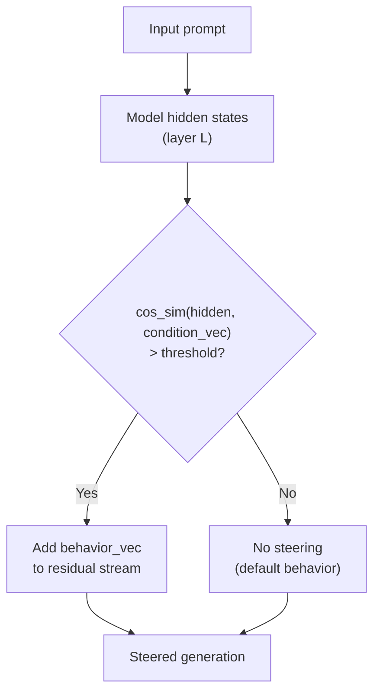

# CAST: Conditional Activation Steering

Lee et al., ICLR 2025 (Spotlight) | [arXiv](https://arxiv.org/abs/2409.05907) | [GitHub](https://github.com/IBM/activation-steering) (167 stars) | Apache 2.0

## Why this matters for Rhapsode

CAST solves a problem that basic activation steering doesn't: **context-dependent behavior**. A game character shouldn't be gruff in every situation -- they should be gruff when challenged but softer with allies. CAST enables rules like "if the player is hostile, steer toward aggression; otherwise, maintain baseline personality." This transforms activation steering from a blunt instrument into a nuanced character behavior system.

## Core idea

Standard activation steering applies a behavior vector unconditionally to all inputs. CAST introduces **conditional steering** using two vectors:

1. **Condition vector** -- detects whether the input matches a specific context (e.g., "player is being hostile")
2. **Behavior vector** -- the desired behavioral change (e.g., "respond aggressively")

At inference, the model's hidden states are compared against the condition vector. The behavior vector is applied **only when the condition is met**.



## How it works technically

### Vector extraction

Both condition and behavior vectors are extracted from contrastive prompt pairs, same as PERSONA:

```
Condition vector (detect hostility):
  Positive: "The player insults the character and demands..."
  Negative: "The player politely asks the character about..."
  → condition_vec = mean(positive_activations) - mean(negative_activations)

Behavior vector (aggressive response):
  Positive: "Respond with anger and intimidation..."
  Negative: "Respond calmly and helpfully..."
  → behavior_vec = mean(positive_activations) - mean(negative_activations)
```

### Conditional application

At each forward pass, compute cosine similarity between the current hidden state and the condition vector. If similarity exceeds a threshold, add the behavior vector to the residual stream. Otherwise, pass through unchanged.

### Logical composition

CAST supports composing multiple condition-behavior rules:

```python
rules = [
    # If hostile → aggressive
    (hostility_condition, aggression_behavior),
    # If asking about secrets → evasive
    (secret_topic_condition, evasion_behavior),
    # If ally → warm
    (ally_condition, warmth_behavior),
]
```

Multiple rules can fire simultaneously, and their behavior vectors are combined additively.

## The library

IBM's `activation-steering` is a production-quality Python library:

- Extract steering vectors from contrastive datasets
- Apply unconditional or conditional steering
- Compose multiple steering rules
- Supports major transformer architectures (LLaMA, Qwen, Mistral, etc.)
- Colab demo notebooks included
- Apache 2.0 license

## Practical application for Rhapsode

### Situation-reactive NPCs

Combine CAST with Rhapsode's WorldGraph to create NPCs that dynamically adjust behavior based on game context:

```
Character: Grizzled Guard Captain

Base personality: PERSONA vector (stoic, dutiful)

Conditional rules:
  IF player is a known criminal → steer toward suspicion, hostility
  IF player is a trusted ally   → steer toward warmth, candor
  IF topic is the king's secret → steer toward evasion, deflection
  IF under attack              → steer toward urgency, command
  DEFAULT                      → stoic, professional
```

These conditions can be derived from WorldGraph state (player reputation, relationship edges, active plot nodes) and translated into condition vectors.

### Complementarity with PERSONA

PERSONA provides the **static personality baseline** (Big Five trait composition). CAST provides **dynamic situational modulation** on top of that baseline. Together:

```
Final steering = PERSONA_base_personality + 危(CAST_conditional_rules)
```

This is the most parameter-efficient character behavior system possible: zero training, kilobytes of storage per character, instant switching, and context-aware personality expression.

### Limitations

- Condition detection via cosine similarity is approximate -- not as reliable as explicit game-state checks
- Behavior vector strength needs careful calibration to avoid model degradation
- Complex multi-rule compositions can interact unpredictably
- Less robust to adversarial prompting than fine-tuned approaches

For Rhapsode, the condition detection could be augmented with **explicit game state**: instead of relying solely on cosine similarity to detect hostility, the game engine knows the player's reputation score and can select which rules to apply programmatically.

## Citation

```bibtex
@inproceedings{lee2025cast,
  title     = {Programming Refusal with Conditional Activation Steering},
  author    = {Lee, Bruce W. and Padhi, Inkit and Ramamurthy, Karthikeyan
               Natesan and others},
  booktitle = {ICLR},
  year      = {2025}
}
```
