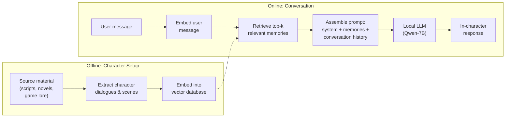

# ChatHaruhi: RAG-Based Character Role-Playing

Li et al., 2023 | [arXiv](https://arxiv.org/abs/2308.09597) | [GitHub](https://github.com/LC1332/Chat-Haruhi-Suzumiya) (2,080 stars) | Apache 2.0

## Why this matters for Rhapsode

ChatHaruhi is the most battle-tested open-source character role-playing system. It uses **retrieval-augmented generation** rather than fine-tuning, which means zero training cost and instant character creation. It already supports **local Qwen-7B and Qwen-1.8B** models. Its architecture maps directly to Rhapsode's existing WorldGraph + ChromaDB infrastructure.

## Core idea

Instead of training the model to "be" a character, give it the character's memories at inference time. For each user message:

1. Search a vector database for the most relevant character memories (past dialogues, scenes, backstory)
2. Inject those memories into the prompt as context
3. The LLM generates a response that is consistent with the retrieved memories

The character's identity comes from **what it remembers**, not from model weights.



## How it works in detail

### Character memory extraction

From source material (scripts, novels, game documentation), extract:

- **Dialogue lines** -- what the character actually said in canonical sources
- **Scene descriptions** -- situations the character was in
- **Relationship interactions** -- how the character behaved with specific other characters
- **Internal monologue** -- if available, the character's thoughts

Each extracted segment is embedded and stored in a vector database with metadata (source, scene, other characters present).

### Retrieval at inference

When a user sends a message, the system:

1. Embeds the user message
2. Retrieves the top-k (typically 3-5) most semantically similar character memories
3. Assembles a prompt:

```
System: You are {character_name}. You must respond in character,
        using the same tone and mannerisms shown in the examples below.

[Retrieved Memory 1 - most relevant scene/dialogue]
[Retrieved Memory 2]
[Retrieved Memory 3]

Conversation history:
User: {previous messages}
{character_name}: {previous responses}

User: {current message}
{character_name}:
```

The retrieved memories serve as few-shot examples that ground the model's response in the character's actual speech patterns and knowledge.

### Dataset

| Metric | Value |
|--------|-------|
| Characters | 32 (Chinese and English TV/anime) |
| Total dialogues | 54,000+ (expanded to 118K) |
| Languages | Chinese, English |
| Sources | Anime scripts, TV shows, novels |

Available on HuggingFace: `silk-road/ChatHaruhi-RolePlaying`

### Local model support

ChatHaruhi provides fine-tuned versions of:
- Qwen-7B (ChatHaruhi-Qwen-7B)
- Qwen-1.8B (for resource-constrained environments)
- Also works with any instruction-following model in pure RAG mode (no fine-tuning)

## Strengths and weaknesses for game NPCs

### Strengths

**Zero training for new characters.** To add a new NPC:
1. Write their backstory, key dialogues, and relationship descriptions
2. Embed into the vector database
3. Done. The character is immediately available.

**Knowledge accuracy.** Retrieved memories provide grounded, factual responses. The character "remembers" specific events because those events are literally retrieved from the database.

**Scalability.** The cost of adding the 100th character is the same as the 1st. No model training, no adapter storage -- just database entries.

**Incremental updates.** As the game progresses and new events happen, add new memories to the database. The character dynamically incorporates new experiences.

### Weaknesses

**Personality depth is shallow.** RAG injects knowledge but doesn't deeply alter the model's generation style. The character sounds like the base model speaking with character facts, not like the character speaking naturally. Compare to LoRA or activation steering which modify the generation process itself.

**Retrieval quality is critical.** If the retrieval fails to find relevant memories, the model falls back to its default behavior. Poor embeddings or sparse memory databases lead to generic responses.

**Prompt length pressure.** Each retrieved memory consumes context tokens. With 3-5 memories plus conversation history plus system prompt, the context fills up fast on a 7B model with limited context window.

**No adversarial robustness.** Since the personality comes entirely from the prompt, a sufficiently crafty user can override the character with adversarial prompting.

## How it maps to Rhapsode

ChatHaruhi's architecture is nearly isomorphic to what Rhapsode already has:

| ChatHaruhi component | Rhapsode equivalent |
|---------------------|-------------------|
| Character memory database | ChromaDB (already integrated) |
| Memory extraction from scripts | WorldGraph character nodes + scene history |
| Vector embedding | Embedding model in `memory_system` |
| Retrieval at inference | `MemorySystem::retrieve_relevant()` |
| Prompt assembly | `build_merged_prompt()` in `prompt.py` |

The key insight: **Rhapsode is already partially implementing ChatHaruhi's approach** through its memory system and prompt builder. The gap is that Rhapsode doesn't yet structure character memories as retrievable few-shot examples -- it uses memories for world context but not for character voice grounding.

### Adaptation for Rhapsode

To adopt ChatHaruhi's approach:

1. **Structure character memories as dialogue examples** -- not just facts, but actual example dialogues showing how the character speaks in various situations
2. **Retrieve character-specific memories** when generating NPC dialogue, not just general world memories
3. **Separate character memory collections** in ChromaDB -- one per character or per character type
4. **Include relationship context** in retrieved memories -- how this character talks to *this specific* other character

This is a **Tier 1 enhancement** -- it requires no model training and can be implemented entirely in the Python server layer.

## Citation

```bibtex
@article{li2023chatharuhi,
  title   = {ChatHaruhi: Reviving Anime Character in Reality via
             Large Language Model},
  author  = {Cheng Li and others},
  year    = {2023},
  journal = {arXiv preprint arXiv:2308.09597}
}
```
