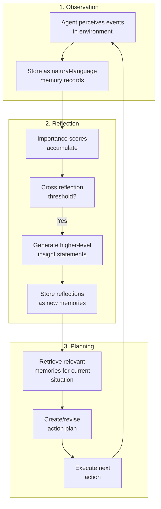

# Generative Agents: Interactive Simulacra of Human Behavior

Park et al., UIST 2023 | [Paper](https://dl.acm.org/doi/10.1145/3586183.3606763) | [arXiv](https://arxiv.org/abs/2304.03442) | [GitHub](https://github.com/joonspk-research/generative_agents) (21,137 stars) | Apache 2.0

## Institutional credibility

**Stanford University** (Percy Liang, Michael Bernstein) + **Google Research / Google DeepMind** (Carrie Cai, Meredith Ringel Morris). Percy Liang leads Stanford's Center for Research on Foundation Models (CRFM). This is the most cited paper in our survey by a large margin (**4,781 citations**).

## Why this matters for Rhapsode

This paper defines the architecture for believable autonomous NPCs. It introduces the **observe-reflect-plan** memory cycle that every subsequent NPC agent system builds on. The memory retrieval system (recency + importance + relevance scoring) is directly applicable to Rhapsode's WorldGraph + ChromaDB pipeline.

## Core architecture

The paper creates 25 agents in a Sims-like sandbox that autonomously live their lives -- waking up, cooking, going to work, forming opinions, having conversations, and planning social events. From a single seed ("Isabella wants to throw a Valentine's Day party"), agents autonomously spread invitations, make acquaintances, coordinate attendance.

### Three-component memory system



**Observation**: Agents perceive events and store them as natural-language memory records with timestamps.

**Reflection**: When accumulated importance scores cross a threshold, the agent synthesizes higher-level insights from recent memories. Example: from individual memories about a neighbor, the agent might reflect "I think my neighbor is going through a tough time."

**Planning**: The agent retrieves memories relevant to the current situation using a scoring function:

```
score(memory) = 伪 * recency(memory) + 尾 * importance(memory) + 纬 * relevance(memory, context)
```

- **Recency**: exponential decay from the time of the memory
- **Importance**: scored 1-10 by the LLM at creation time (mundane: 1, life-changing: 10)
- **Relevance**: cosine similarity between memory embedding and current context embedding

## Key results

- In a two-day simulation, agents exhibited emergent social behaviors: spreading information, forming new relationships, coordinating group activities.
- Human evaluators rated generative agents as more believable than agents without the memory/reflection system.
- Ablation showed each component (observation, reflection, planning) contributes meaningfully. Removing reflection caused the largest drop in believability.

## How it maps to Rhapsode

| Generative Agents component | Rhapsode equivalent | Gap |
|------------------------------|--------------------|----|
| Memory stream (observations) | ChromaDB memory store | Rhapsode stores but doesn't distinguish observation types |
| Importance scoring (1-10) | Not implemented | Need LLM-scored importance at memory creation |
| Reflection generation | Not implemented | Need periodic synthesis of higher-level insights |
| Retrieval scoring (recency + importance + relevance) | `MemorySystem::retrieve_relevant()` uses embedding similarity | Missing recency decay and importance weighting |
| Planning from retrieved memories | Director's `focus_payload_json()` | Director provides context but NPCs don't plan autonomously |

The biggest gap: Rhapsode retrieves memories for prompt context but doesn't generate **reflections** -- higher-level syntheses that compress experience into reusable insights. Adding reflection generation would let NPCs develop opinions and attitudes over time, which connects directly to the character evolution problem.

### Practical adoption path

1. Add importance scoring to memory creation (LLM rates each memory 1-10)
2. Implement retrieval scoring with recency decay + importance weighting + relevance
3. Add periodic reflection generation for core NPCs (synthesize recent memories into insights)
4. Store reflections as new memories that can themselves be retrieved

This is a Tier 1/Tier 2 enhancement -- no model training required, implemented entirely in the Python server layer.

## Limitations

- The paper uses GPT-3.5/4 as the backbone, not local models. Whether the observe-reflect-plan cycle works as well on 7B models is untested.
- The 25-agent simulation ran for 2 days. Long-term consistency over weeks/months of play is unaddressed.
- Each agent call is expensive (multiple LLM queries per action). For real-time game NPCs, latency budgets are much tighter.

## Citation

```bibtex
@inproceedings{park2023generative,
  title     = {Generative Agents: Interactive Simulacra of Human Behavior},
  author    = {Park, Joon Sung and O'Brien, Joseph C. and Cai, Carrie Jun
               and Morris, Meredith Ringel and Liang, Percy and Bernstein, Michael S.},
  booktitle = {UIST},
  year      = {2023}
}
```
