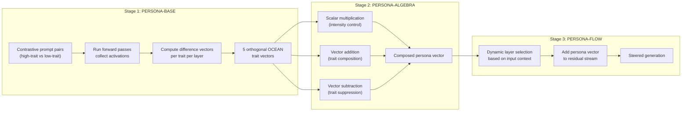

# PERSONA: Inference-Time Personality Control via Activation Vector Algebra

Feng et al., ICLR 2026 | [Paper](https://openreview.net/pdf?id=QZvGqaNBlU) | [GitHub](https://github.com/xcfcode/persona) (11 stars, new) | [HuggingFace vectors](https://huggingface.co/datasets/xiachongfeng/persona)

## Why this matters for Rhapsode

PERSONA eliminates training entirely for personality control. Instead of fine-tuning a LoRA adapter per character archetype, you extract a few steering vectors once and compose them at inference time via arithmetic. The cost of adding a new personality profile drops from hours of GPU training to minutes of vector extraction. Works on Qwen and LLaMA -- our target models.

## Core idea

Personality traits exist as **extractable, approximately orthogonal directions** in an LLM's activation space. You can:

- **Extract** a vector for each Big Five trait (Openness, Conscientiousness, Extraversion, Agreeableness, Neuroticism)
- **Scale** vectors to control intensity: `+0.8 * Extraversion` = very extraverted, `-0.3 * Agreeableness` = somewhat disagreeable
- **Compose** vectors via addition: `warrior_persona = -Agreeableness + Extraversion - Openness`
- **Suppress** traits via subtraction

No gradient updates. No adapter files. Just vector arithmetic applied to activations during forward passes.

## Three-stage framework



### Stage 1: PERSONA-BASE -- vector extraction

For each Big Five trait, create contrastive prompt pairs:

- **High Extraversion:** "You are an outgoing, energetic person who thrives in social situations..."
- **Low Extraversion:** "You are a reserved, quiet person who prefers solitude..."

Run both prompts through the model, collect activations at each layer, compute the difference. The resulting vector captures the "direction" of that trait in activation space. This needs to be done **once per model** -- the extracted vectors are reusable across all characters.

### Stage 2: PERSONA-ALGEBRA -- composition

Combine trait vectors via arithmetic to create arbitrary personality profiles:

```python
# Gruff warrior: low agreeableness, high extraversion, low openness
warrior = -0.8 * agreeableness + 0.6 * extraversion - 0.3 * openness

# Wise elder: high openness, high conscientiousness, moderate agreeableness
elder = 0.9 * openness + 0.7 * conscientiousness + 0.4 * agreeableness

# Scheming noble: low agreeableness, low conscientiousness, high extraversion
noble = -0.6 * agreeableness - 0.5 * conscientiousness + 0.7 * extraversion
```

The trait vectors are approximately orthogonal -- the paper's Appendix A.11 shows secondary cross-trait effects are about 18% of the primary effect magnitude and compose linearly (predictable but non-zero).

### Stage 3: PERSONA-FLOW -- dynamic application

During inference, the composed persona vector is added to the model's residual stream at selected layers. PERSONA-FLOW adds context-awareness: the steering intensity can vary based on the input (e.g., steer more strongly when the character is provoked, less when they're calm).

## Key results

| Method | PersonalityBench Mean | Variance | Training Required |
|--------|----------------------|----------|-------------------|
| PAS (attention-head probing) | 6.93 | 1.71 | None |
| ActAdd (residual-stream addition) | 8.20 | 2.10 | None |
| Simple Prompt (single adjective) | 8.39 | 0.96 | None |
| P2 (model-generated descriptions) | 9.43 | 0.83 | None |
| NPTI (neuron manipulation) | 9.43 | 0.49 | None |
| **PERSONA-BASE (this paper)** | **9.60** | **0.74** | **None** |
| SFT with LoRA (upper bound) | 9.61 | 0.49 | Hours per persona |

*All results on LLaMA-3-8B-Instruct. Mean = sum of scores for opposing trait poles (max 10). Source: Table 4 of the paper.*

On this benchmark, PERSONA-BASE is the best training-free method, matching the SFT upper bound (9.60 vs 9.61) while requiring zero gradient updates. On the PERSONA-Evolve benchmark, PERSONA-FLOW achieves up to 91% win rates across Qwen, LLaMA, and Mistral model families.

## What it controls and what it doesn't

This is critical to understand:

| Controls well | Does NOT control |
|--------------|-----------------|
| Personality traits (Big Five) | Character-specific knowledge (facts, backstory) |
| Emotional expression patterns | Vocabulary and catchphrases |
| Communication style (formal/casual, verbose/terse) | Memory of past events |
| Assertiveness, warmth, curiosity | World-specific rules and lore |

PERSONA steers **how** the character communicates, not **what** they know. For knowledge, you need RAG (see [ChatHaruhi](chatharuhi.md)) or context injection. For deep stylistic patterns, you need fine-tuning (LoRA or Constitutional AI).

## Practical considerations for Rhapsode

### Extraction cost

Extracting trait vectors requires ~100 contrastive prompt pairs per trait, one forward pass each. On a 7B model this takes minutes, not hours. The vectors are **model-specific but character-agnostic** -- extract once per base model, reuse for all characters.

### Storage

Each persona profile is a composed vector -- a few kilobytes. Compare to LoRA adapters (10-50MB) or full model copies (14GB). You can store thousands of personality profiles at negligible cost.

### Inference overhead

Adding a vector to the residual stream adds near-zero latency. No adapter loading, no weight merging. Switching between characters is instantaneous -- just swap the vector being added.

### Limitations

- **Trait granularity**: Big Five gives you 5 dimensions. Real characters are more nuanced than 5 sliders. You may need to extract custom trait vectors beyond OCEAN (e.g., "sarcasm," "formality," "menace").
- **Intensity calibration**: The scalar multipliers need tuning. Too high and the model degrades; too low and the steering is imperceptible. The paper reports an inverted-U curve for effectiveness vs. coefficient strength.
- **Adversarial robustness**: Activation steering is less robust than fine-tuning. A sufficiently adversarial user prompt can override the steering. [Open Character Training](open-character-training.md) specifically found that Constitutional AI training is more robust.
- **No knowledge injection**: PERSONA cannot teach a character facts about their world. Must be combined with RAG or context injection.

### How it fits Rhapsode's architecture

PERSONA slots into **Tier 1** (prompt-based, all NPCs) as a personality enhancer:

```
Tier 1 (enhanced):
  Base model (CoSER-8B or Qwen-2.5-7B)
  + Character profile in context (knowledge, facts, relationships)
  + PERSONA steering vector (personality, emotional style)
  = Character-consistent NPC with personality
  = Zero training, instant character switching
```

For Tier 2 (important NPCs), PERSONA composes with LoRA:

```
Tier 2 (layered):
  Base model
  + LoRA adapter (deep style, trained on character dialogue)
  + PERSONA vector (personality intensity modulation)
  + RAG-retrieved memories (knowledge accuracy)
  = Full-fidelity important NPC
```

## Pre-extracted resources

The authors provide pre-extracted OCEAN vectors on HuggingFace for 4 models, plus SFT datasets across 8 trait categories. Check if Qwen-2.5-7B or LLaMA-3.1-8B is included before extracting your own.

## Citation

```bibtex
@inproceedings{feng2026persona,
  title     = {{PERSONA}: Dynamic and Compositional Inference-Time Personality
               Control via Activation Vector Algebra},
  author    = {Feng, Xiachong and Zhao, Liang and Zhong, Weihong and others},
  booktitle = {ICLR},
  year      = {2026}
}
```
