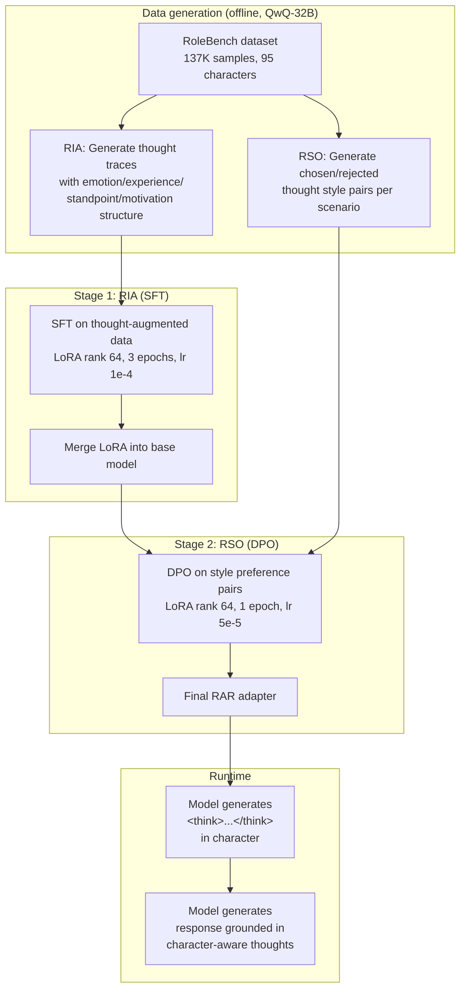

# Thinking in Character: Role-Aware Reasoning for Role-Playing Agents

Tang et al., NeurIPS 2025 | [PDF](https://proceedings.neurips.cc/paper_files/paper/2025/file/aacca7b6a20d157112205a44f42821c8-Paper-Conference.pdf) | [GitHub](https://github.com/Toyhom/thinking_in_character) (1 star) | [Training data on HuggingFace](https://huggingface.co/datasets/Toyhom/thinking_in_character_datas)

## Quality assessment

**Rating: B** (solid method, top venue, but institutional backing is weaker than A-tier)

- **Venue**: NeurIPS 2025 -- top-tier machine learning conference, peer-reviewed.
- **Institutions**: Harbin Institute of Technology (Shenzhen campus) + Baidu. HIT is a strong engineering school but not a leading AI research institution. Baidu provides industry credibility.
- **Citations**: Too new to have significant citations.
- **Code**: Fully open-sourced with training data on HuggingFace. However, 1 star / 0 forks -- essentially unreproduced by the community. The code has hardcoded relative paths and assumes a specific directory structure (see [Reproducibility](#reproducibility) below).

## The core problem

Existing role-playing methods train models on **what a character says** (dialogue SFT, as in Neeko/Character-LLM) or **what rules a character follows** (constitutional DPO, as in OCT). Neither teaches the model **how a character thinks**.

When you give a reasoning model (like DeepSeek-R1 or QwQ) a role-playing task, two things go wrong:

1. **Attention diversion**: The model forgets its character and reverts to generic problem-solving mode. It thinks "1. Acknowledge the query. 2. State the event. 3. Provide factual details." -- a helpful AI assistant's thought pattern, not Peter Parker's.

2. **Style drift**: Even when the model stays in character, its internal reasoning is rigid and formal ("First, considering the context... Second, analyzing the implications...") rather than matching the character's voice ("Balancing? It's like trying to juggle homework, a lab report, and a crook fleeing the scene...").

## Method: Role-Aware Reasoning (RAR)

RAR has two sequential training stages, each targeting one of these problems.

### Stage 1: Role Identity Activation (RIA) -- fixes attention diversion

**Goal**: Teach the model to think from the character's perspective before generating a response.

**How it works**:

1. Take the RoleBench training dataset (137K role-playing samples across 95 characters from film/TV).
2. For each sample, prompt a Large Reasoning Model (QwQ-32B in the paper) with an RIA instruction that forces it to reason through four character-specific dimensions:

```
I am {character}, {character_profile}.
The person just said: {user_input}.
I'm thinking about how to respond:
First, I feel... (Reflect emotion)
Second, based on my experience/knowledge/stance... (Reflect background/knowledge)
Then, I need to consider... (Reflect goals/motivations)
So, I'm planning to... (Initial conclusion)
```

3. Collect the generated `<think>...</think>` + response pairs.
4. Train a LoRA adapter on the base 8B model using standard SFT on these thought-augmented samples.

The result: the student model learns to generate an internal monologue in the four RIA dimensions (emotion, experience, standpoint, motivation) before responding. The thought process is character-specific, not generic.

**Training signal**: Standard SFT (cross-entropy loss on the thought trace + response).

### Stage 2: Reasoning Style Optimization (RSO) -- fixes style drift

**Goal**: Teach the model to adapt its thinking style to the scenario -- logical for analytical moments, vivid/emotional for dramatic moments.

**How it works**:

1. Classify the RoleBench data into two scenario types:
   - **General** (XLogic): lighthearted, casual, or analytical scenarios
   - **Specific** (XStory): emotional, dramatic, or character-revealing scenarios

2. Define two style prompts:
   - **CFact**: "Style Core: Rigorous and logical. Focus: pragmatic considerations. Language: concise and direct."
   - **CKnow**: "Style Core: Emotionally resonant. Focus: emotional reactions, past experiences. Language: rich in detail, specific metaphors."

3. Generate **chosen** and **rejected** pairs by applying the matching vs. mismatching style:
   - Chosen: logical style for logical scenarios + vivid style for dramatic scenarios
   - Rejected: vivid style for logical scenarios + logical style for dramatic scenarios

4. Train using DPO (sigmoid loss, beta=0.1) on the chosen/rejected pairs. This teaches the model a boundary between appropriate and inappropriate reasoning styles per context.

**Training signal**: DPO preference optimization (contrastive).

### Full pipeline diagram



## Experimental results

### Base model and setup

- **Base model**: LLaMA-3-8B (4-bit quantized)
- **Teacher model**: QwQ-32B (Qwen's reasoning model, used only for data generation)
- **Hardware**: 8x H20 GPUs (NVIDIA China-export variant, 96GB each)
- **Training time**: ~20 hours for RAR (both stages), ~5 hours for non-reasoning baselines
- **LoRA config**: rank 64, alpha 16, dropout 0.1
- **Framework**: LLaMA-Factory

### CharacterBench results (Table 1 in paper)

13-dimensional evaluation across memory, knowledge, persona, emotion, morality, and believability:

| Method | Avg. score (1-5) |
|--------|-----------------|
| Vanilla (base SFT) | 3.19 |
| + RAG (few-shot) | 3.24 |
| Distill (naive reasoning) | 3.57 |
| + MoreThink | 3.05 |
| Neeko | 3.19 |
| CharacterGLM | 3.21 |
| **RAR** | **3.69** |

RAR outperforms all baselines. Notably:
- **Neeko scores identically to Vanilla** (3.19) on this benchmark. The dynamic LoRA routing doesn't help with character depth -- only with multi-character efficiency.
- **MoreThink degrades performance** (3.05 < 3.57). Unguided extended reasoning actively hurts role-playing. This validates RAR's argument that you need *structured* role-aware reasoning, not just more thinking.
- RAR's biggest gains are in **Persona consistency** (Attribute Consistency 4.23 vs Neeko's 3.64) and **Believability** (Human Likeness 2.78 vs Neeko's 2.56).

### SocialBench results (Table 2 in paper)

Social intelligence evaluation across role knowledge, style, emotion detection, memory, and social preferences:

| Method | Avg. score |
|--------|-----------|
| Vanilla | 57.2 |
| Distill | 61.1 |
| Neeko | 58.7 |
| CharacterGLM | 60.0 |
| **RAR** | **65.4** |

RAR's largest gains are in social preferences (Neu: 83.1, Pos: 84.8, Neg: 68.5), suggesting that the character-grounded reasoning helps the model make more consistent social judgments.

### Ablation study (Table 3)

| Variant | Avg. |
|---------|------|
| Full RAR | 3.69 |
| w/o RSO (RIA only) | 3.60 |
| w/o RIA (RSO only) | 3.49 |

Both components contribute. RIA is more important (removing it causes a bigger drop), but RSO adds meaningful value, especially for Human Likeness and Engagement.

### Reasoning trace quality (Table 4)

GPT-4o-judged quality of the internal thought traces:

| Method | Coherence | Role Relevance | Effectiveness | Conciseness |
|--------|-----------|---------------|---------------|-------------|
| RAR | **2.86** | **3.83** | **3.92** | 1.81 |
| Distill | 2.71 | 3.54 | 3.84 | 2.06 |
| MoreThink | 2.53 | 3.56 | 3.64 | 1.86 |

RAR trades some conciseness for significantly better role relevance and effectiveness. Human annotators agree (Pearson r=0.76 with GPT-4o scores).

## Practical analysis for Rhapsode

### What RAR gives us

RAR introduces an **internal monologue layer** between memory retrieval and response generation. In Rhapsode's companion system, this maps to:

1. The companion retrieves relevant memories (L2)
2. The companion **thinks about** those memories in character (RAR's contribution)
3. The companion generates a response grounded in that thinking

The four RIA dimensions (emotion, experience, standpoint, motivation) are a natural match for Rhapsode's L2 observe-reflect-plan cycle. A reflection like "I can't trust this new merchant -- reminds me of what happened in Thornwall" is exactly the kind of thought RAR trains the model to produce.

### How RAR compares to OCT and Neeko for our use case

| Dimension | Neeko (SFT) | OCT (DPO) | RAR (SFT + DPO) |
|-----------|-------------|-----------|-----------------|
| What it trains | What the character says | What rules the character follows | How the character thinks |
| Character depth | Shallow (surface imitation) | Medium (behavioral boundaries) | Deep (internal reasoning) |
| Adversarial robustness | Unknown (not tested) | Best (paper shows this) | Unknown (not tested) |
| Runtime latency | Fast (response only) | Fast (response only) | Slower (thought + response) |
| Training complexity | Low (SFT only) | High (DPO + introspection) | Medium (SFT then DPO) |
| Training framework | Any LoRA trainer | OpenRLHF | LLaMA-Factory |
| Evolution potential | Retrain on new dialogue | Revise constitution, retrain | Retrain with new thoughts |

### Runtime latency consideration

RAR generates a `<think>` block before every response. On a local 7B model at ~30 tokens/sec:

| Thought length | Extra latency |
|---------------|---------------|
| 50 tokens | ~1.7 seconds |
| 100 tokens | ~3.3 seconds |
| 200 tokens | ~6.7 seconds |

For routine dialogue ("Let's make camp"), the thought overhead may be unnecessary. For emotionally charged scenes (betrayal, moral dilemmas), the pause could actually enhance the narrative -- the companion "pauses to think" before responding. Rhapsode could conditionally enable/disable the thought block based on scene importance.

The `<think>` block is hidden from the player -- only the response after `</think>` is shown. But it occupies context window space in the conversation history. Options:
- Strip thought blocks from history after each turn (saves context but loses the reasoning chain)
- Keep them (preserves reasoning continuity but fills the window faster)

### Qwen compatibility

The paper uses LLaMA-3-8B. Our experiment trains on Qwen 2.5 7B instead. Key compatibility notes:
- LLaMA-Factory handles the model-specific formatting via the `template` field
- LoRA config (rank 64, alpha 16) is model-agnostic
- The RoleBench training data is plain text -- no model-specific tokens embedded
- Results may differ from the paper's numbers since Qwen has different base capabilities

The OCT paper found that Qwen 2.5 specifically has problems with activation steering but works well with weight-level training (DPO). RAR's Stage 2 uses DPO, which should be compatible.

## Reproducibility

### What works

- Full training pipeline code is released
- Pre-generated training data (2.39 GB) is on HuggingFace, so you can skip the expensive QwQ-32B data generation
- LLaMA-Factory configs are provided for both stages
- Inference examples for both vLLM and Transformers

### What doesn't

- **Hardcoded relative paths**: `dataset_info.json` uses `../../data/` paths that assume you've copied it into LLaMA-Factory's submodule directory. Running from the repo root fails. Fix: `sed -i 's|../../data/||g' data/dataset_info.json`
- **Missing generated file**: The `contrastive_sft` file used in Stage 1 is not in the HuggingFace dataset -- it must be generated by running `scripts/data_dpo_convert_sft.py` on the downloaded contrastive data.
- **Peter Parker hardcode**: `long_reason_example.py` line 73 filters to only process Peter Parker examples (`if role_name != "Peter Parker": continue`). This is clearly a debug artifact left in the released code.
- **No pre-trained adapter released**: Unlike OCT (which releases 33 adapters on HuggingFace), RAR provides no trained weights. You must train from scratch.
- **PyTorch/CUDA version sensitivity**: The RunPod PyTorch 2.4 template (CUDA 12.4) does not support Blackwell GPUs (sm_120). Requires upgrading to PyTorch with CUDA 12.8+.

### Hardware requirements

The paper uses 8x H20 GPUs (768 GB total VRAM). For single-GPU reproduction:

| GPU VRAM | SFT (Stage 1) | DPO (Stage 2) | Notes |
|----------|--------------|---------------|-------|
| 24 GB | Works with gradient checkpointing | Tight -- may need reduced seq_len | RTX 3090/4090 |
| 32 GB | Comfortable | Works | RTX 5090, RTX PRO 4500 |
| 48 GB+ | Comfortable | Comfortable | A6000, A100 |

Training time on a single GPU (estimated): 8-12 hours for Stage 1, 2-4 hours for Stage 2.

## Key RIA and RSO prompts (from paper appendix)

### RIA prompt (Figure 4)

```
I am {character}, {character_profile}.
The person just said: {user_input}.
I'm thinking about how to respond:
First, I feel... (Reflect emotion)
Second, based on my experience/knowledge/stance... (Reflect background/knowledge)
Then, I need to consider... (Reflect goals/motivations)
So, I'm planning to... (Initial conclusion)
```

### RSO prompt for logical scenarios (Figure 5)

```
Style Core: Vivid and imaginative / Rigorous and logical / Intuition-driven and associative
Focus: personal values / pragmatic considerations / peculiar associations.
Language Features: concise and direct / hesitant tone / specific slang.
Context Matching: thoughts can be simple and associative in a lighthearted context.
```

### RSO prompt for vivid/dramatic scenarios (Figure 6)

```
Style Core: Vivid and imaginative / Emotionally resonant / Intuition-driven and associative
Focus: emotional reactions / personal values / past experiences / peculiar associations.
Language Features: rich in detail / assertive tone / specific metaphors.
Context Matching: thoughts can be deeper analysis is needed in a serious situation.
```

## Citation

```bibtex
@inproceedings{tang2025thinking,
  title     = {Thinking in Character: Advancing Role-playing Agents
               with Role-Aware Reasoning},
  author    = {Tang, Yihong and Chen, Kehai and Yang, Muyun and Niu, Zhengyu
               and Li, Jing and Zhao, Tiejun and Zhang, Min},
  booktitle = {Advances in Neural Information Processing Systems 38
               (NeurIPS 2025)},
  year      = {2025}
}
```
