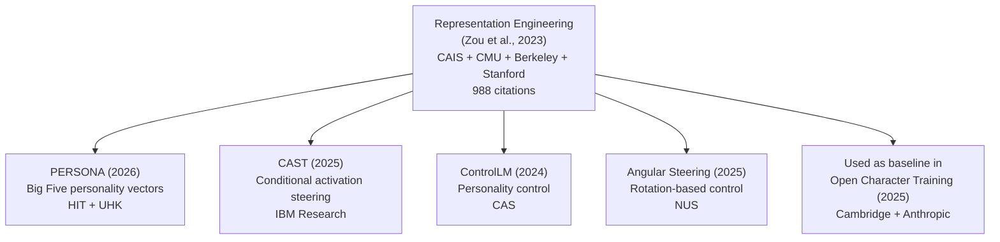

# Representation Engineering: A Top-Down Approach to AI Transparency

Zou et al., 2023 | [arXiv](https://arxiv.org/abs/2310.01405) | [GitHub](https://github.com/andyzoujm/representation-engineering) (970 stars) | [Website](https://ai-transparency.org) | MIT License

## Institutional credibility

**Center for AI Safety** + **Carnegie Mellon University** + **UC Berkeley** + **Stanford University**. Dan Hendrycks (CAIS director), Matt Fredrikson (CMU), Andy Zou (CMU PhD). ~**988 citations** as of 2026. This is the foundational paper that all activation steering methods build on, including PERSONA and CAST.

## Why this matters for Rhapsode

Every steering-based character method in our survey (PERSONA, CAST, ControlLM, Angular Steering) is a descendant of RepE. Understanding the foundation tells you what's actually proven and what's speculative extension. The paper also directly demonstrates steering for personality-adjacent properties (honesty, harmlessness, emotions) using the same technique that PERSONA later applied to Big Five traits.

## Core idea

High-level cognitive properties (honesty, morality, emotions, power-seeking) are encoded as **linear directions in activation space**. You can:

1. **Read** them (RepReading): probe activations to detect whether a model is being honest, emotional, etc.
2. **Control** them (RepControl): add or subtract direction vectors to steer behavior.

The key insight is population-level: instead of analyzing individual neurons or circuits, treat the model's hidden states as a population and extract directions via contrastive analysis across many examples.

### Extraction method

For a target concept (e.g., "honesty"):
1. Create contrastive prompt pairs: one that elicits honest behavior, one that elicits dishonest behavior
2. Run both through the model, collect activations at each layer
3. Compute the difference in mean activations
4. The resulting vector is the "honesty direction"

To steer: add `alpha * direction_vector` to the residual stream at the target layer during inference.

## What the paper demonstrated

The paper shows RepControl working on 8 high-level concepts:

| Concept | What steering does |
|---------|-------------------|
| Honesty | Makes the model more/less truthful |
| Morality | Increases/decreases moral reasoning |
| Fairness | Adjusts bias in outputs |
| Harmlessness | Controls willingness to generate harmful content |
| Happiness | Shifts emotional tone |
| Fear | Induces/suppresses fearful language |
| Power-seeking | Controls ambition/dominance in responses |
| Memorization | Controls regurgitation of training data |

These were tested on Llama-2-13B-chat. The paper shows that steering generalizes across prompts -- a direction extracted from one set of prompts works on novel prompts the model hasn't seen.

## Relationship to character methods



All downstream methods inherit RepE's core assumption: that concepts are linearly represented and steerable. The OCT paper's finding that activation steering is less robust than character training (Section 3.2) is a finding about RepE-derived methods specifically.

## Practical relevance for Rhapsode

RepE provides the **library** (RepReading + RepControl) that any steering-based character system would build on. The GitHub repo includes:

- `RepReading`: probing pipeline for detecting concepts in activations
- `RepControl`: steering pipeline for modifying behavior
- Pre-built support for HuggingFace models (Llama, etc.)
- Colab demos for adding refusal and chain-of-thought behaviors

If Rhapsode implements activation steering for personality (Layer 1), the implementation would use RepE's extraction method or a descendant of it.

### Limitations for character use

- The paper focuses on safety-relevant concepts (honesty, harmlessness), not character personality. PERSONA extended it to Big Five traits, but that extension is from HIT with ~0 citations.
- Linear representation is an assumption, not a proven fact. The paper shows it works empirically, but doesn't prove that all personality traits are linearly encoded.
- The OCT paper found that RepE-style steering is unreliable on Qwen 2.5 7B and less coherent than fine-tuning. This is a limitation of the foundational method itself.

## Citation

```bibtex
@article{zou2023representation,
  title   = {Representation Engineering: A Top-Down Approach to AI Transparency},
  author  = {Zou, Andy and Phan, Long and Chen, Sarah and others},
  year    = {2023},
  journal = {arXiv preprint arXiv:2310.01405}
}
```
