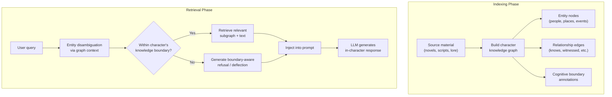

# RoleRAG: Graph-Guided Retrieval for Character Role-Playing

Wang et al., 2025 | [arXiv](https://arxiv.org/abs/2505.18541) | [GitHub](https://github.com/AnonymousSub123/RoleRAG) (3 stars, new/anonymous)

## Why this matters for Rhapsode

RoleRAG addresses two specific failures that plain RAG (ChatHaruhi-style) suffers from: **entity ambiguity** (the character "Caesar" could mean Julius Caesar or Caesar from Planet of the Apes) and **cognitive boundary violation** (the character answering questions they shouldn't know about). It does this by building a **knowledge graph per character** -- which maps directly to Rhapsode's WorldGraph.

## Core idea

Instead of a flat vector database per character, build a structured knowledge graph that captures:

- **Character experiences** -- events the character participated in
- **Character relationships** -- connections to other characters with typed edges
- **Character knowledge boundaries** -- what this character knows and doesn't know

At retrieval time, use the graph structure for entity disambiguation and boundary-aware retrieval.



## Two key innovations

### 1. Entity disambiguation via graph context

Plain vector retrieval can't distinguish between "Tell me about the battle" when:
- Character A was in Battle of Thermopylae
- Character B was in Battle of Hogwarts

A flat embedding search might retrieve the wrong battle. RoleRAG's graph structure connects each character to their specific experiences, ensuring the retrieval is character-scoped.

### 2. Boundary-aware retrieval

For each character, the knowledge graph explicitly marks what they should and shouldn't know. When a user asks about something outside the character's cognitive boundary, the retriever returns a "boundary violation" signal instead of hallucinated content. The LLM then generates an appropriate in-character deflection ("I know nothing of such matters" rather than making something up).

This directly addresses the "protective experiences" concept from [Character-LLM](character-llm.md), but at the retrieval level rather than the training level.

## Relevance to Rhapsode

RoleRAG's architecture is conceptually close to what Rhapsode's WorldGraph already provides:

| RoleRAG concept | Rhapsode equivalent |
|----------------|-------------------|
| Character knowledge graph | WorldGraph with typed edges (Related, Supersedes, Contradicts, CausedBy) |
| Entity nodes | WorldGraph Node objects |
| Relationship edges | WorldGraph EdgeData with confidence and timestamps |
| Cognitive boundaries | Node visibility / active flags per character |
| Graph-guided retrieval | `neighbors_within()` BFS on WorldGraph |

The gap: Rhapsode's WorldGraph is currently used for plot management (Director), not for character-scoped knowledge retrieval. Adapting it for RoleRAG-style retrieval would require:

1. **Character-scoped graph views** -- filter the WorldGraph to show only nodes/edges a specific character should know about
2. **Boundary metadata** -- annotate nodes with which characters have knowledge of them
3. **Retrieval integration** -- use graph-filtered results to augment the character prompt

### Limitations

- Very new paper (May 2025), anonymous submission, only 3 GitHub stars -- low community validation
- Building per-character knowledge graphs requires significant preprocessing
- Graph quality depends on source material quality

### Value proposition

RoleRAG's specific value over ChatHaruhi is **structured retrieval with boundary awareness**. For Rhapsode, the practical takeaway is: use WorldGraph edges to scope what each character can know, and feed graph-structured context (not just flat memory chunks) into the character prompt.

## Citation

```bibtex
@article{wang2025rolerag,
  title   = {RoleRAG: Enhancing LLM Role-Playing via Graph Guided Retrieval},
  author  = {Wang, Yongjie and Leung, Jonathan and Shen, Zhiqi},
  year    = {2025},
  journal = {arXiv preprint arXiv:2505.18541}
}
```
